# 通用工业企业能碳 SaaS 平台需求规格说明书

> Markdown 备份来源：`通用工业企业能碳SaaS平台需求规格说明书_20260818.docx`。
> 转换日期：2026-08-19。本文档按原始 DOCX 的正文顺序转换，保留标题、列表、表格及内嵌图片引用；原 Word 目录中的页码不作为 Markdown 内容复刻。
> 说明：这是需求原文的 Markdown 化备份，不对业务规则作擅自改写；项目实现时仍应同时遵循 `docs/` 下的专项约束与验收文档。

成都协鑫数智科技责任有限公司

通用工业企业能碳SaaS平台 需求规格说明书

| 文件状态： [ ]草稿 [ ]正式发布 [✓]正在修改 | 当前版本： | V1.1 |
| --- | --- | --- |
|  | 作 者： | 高银 |
|  | 密 级： | 内部公开 |

## 文档修订

| 日期 | 版本 | 修改人 | 描述 |
| --- | --- | --- | --- |
| 2026.07.20 | V1.0 | 高银 | 创建V1.0版本 |
| 2026.07.29 | V1.1 | 产品组 | 基于通用工业企业最新原型和研发评审版功能清单重构功能范围、数据关系、交互及约束。 |

目录

文档修订 2

1. Introduction 简介 5

1.1. Purpose 目的 5

1.2. Scope 范围 5

1.3. List of abbreviations 缩略语清单 5

1.4. User role description 用户角色描述 6

2. General Description 总体概述 6

2.1. About the Product 产品介绍 6

2.2. Environment of Product 产品环境 6

2.3. Architecture Description 软件架构 7

3. Functional Requirements 功能需求 7

3.1. 能源监测与分析 7

3.1.1. 能耗查询 8

3.1.2. 能耗指标（页面显示：能耗强度指标） 12

3.1.3. 能效对标 15

3.1.4. 能流分析 19

3.2. 碳排放核算与合规 22

3.2.1. 碳排放核算 22

3.2.1.1. 碳排放预览 23

3.2.1.2. 碳核算清单 26

3.2.1.3. 碳核查支撑 31

3.2.1.4. 碳排报告 35

3.2.2. 碳因子与参数库 38

3.2.3. 供应链碳管理 41

目录（续）

3.2.3.1. 供应商数据采集 42

3.2.3.2. 碳足迹交付管理 45

3.2.3.3. 碳足迹核算（规划中） 48

3.3. 能碳资产运营与策略 48

3.3.1. 能效平衡与优化 49

3.3.2. 用能分析与策略推荐 52

3.3.3. 用能与碳排放预算管理 55

3.3.4. 碳资产管理 59

3.4. 数据管理 63

3.4.1. 用能单元 64

3.4.2. 能源品种 67

3.4.3. 重点设备 70

3.4.4. 能源数据 74

3.4.5. 运营数据 78

4. Performance Requirements 性能需求 81

5. Quality Attributes 质量需求 81

6. Other Requirements 其他需求 81

7. External Interface 外部接口 82

8. Appendix 附录 82

附录A：核心公式与口径 82

附录B：数据与状态说明 83

附录C：页面功能结构树 83

附录D：功能清单关联说明 84

## 1. Introduction 简介

### 1.1. Purpose 目的

本文档结合通用工业企业能碳SaaS最新产品原型、《通用工业企业能碳SaaS研发评审版功能清单V1.1》及适用的能源与温室气体核算规则，详细描述平台各模块的功能定义、页面交互、输入输出、数据来源、计算与校验逻辑、异常和边界场景。本文档是产品、研发、测试、运维和业务人员的核心沟通依据，用于指导功能设计与开发实现、接口与数据模型设计、测试方案和测试用例编制，以及后续版本验收。

### 1.2. Scope 范围

本文档覆盖能源监测与分析、碳排放核算与合规、能碳资产运营与策略、数据管理四大业务领域。本次页面一致性对照范围为16个页面/子模块：能源监测4页、碳排放核算3页、能碳资产运营与策略4页、数据管理5页；碳排放报告和碳因子参数页面保留原有需求说明，但不纳入本次页面对照与修改范围。文档同时保留功能性需求、主要交互、数据约束、异常处理、版本边界和非功能要求。 本期不包含硬件设备部署、现场控制系统改造、碳交易撮合、第三方认证结论以及碳足迹核算完整功能。

### 1.3. List of abbreviations 缩略语清单

| 简称 | 名称 | 含义 |
| --- | --- | --- |
| AD | 活动数据 Activity Data | 参与能源或排放计算的消耗量、产量、热量等数据。 |
| EF | 排放因子 Emission Factor | 单位活动数据对应的温室气体排放量。 |
| NCV | 低位发热量 Net Calorific Value | 燃料单位质量或体积对应的低位热值。 |
| CC | 单位热值含碳量 Carbon Content | 单位热值燃料的含碳量。 |
| OF | 碳氧化率 Oxidation Factor | 燃料碳被氧化的比例。 |
| GWP | 全球变暖潜势 Global Warming Potential | 将不同温室气体折算为CO₂e的系数。 |
| CCER | 国家核证自愿减排量 | 在适用规则下可用于履约抵销的自愿减排资产。 |
| tce | 吨标准煤 | 能源折标后的统一计量单位。 |
| CO₂e | 二氧化碳当量 | 按GWP折算后的温室气体统一单位。 |
| energyUnitId | 用能单元标识 | 能源和运营数据归属及分析对象匹配的稳定标识。 |

### 1.4. User role description 用户角色描述

| 用户角色 | 角色说明 | 相关功能 |
| --- | --- | --- |
| 能源数据维护人员 | 维护用能单元、能源品种、能源量、能源成本、能源转换、运营数据和重点设备档案。 | 数据管理、能耗强度缺失补录 |
| 能源管理人员 | 查询能耗、强度、对标和能流结果，查看能效平衡、用能策略和预算执行。 | 能源监测与分析、能碳资产运营与策略 |
| 碳核算人员 | 创建核算任务、维护核算清单、选择因子参数、确认正式清单并生成报告。 | 碳排放预览、碳核算清单、碳因子与参数库、碳排报告 |
| 核查与审核人员 | 查看正式核算结果、数据来源和支撑材料，准备核查资料。 | 碳核查支撑、碳排报告、资产凭证 |
| 供应链数据人员 | 下载和上传供应商数据模板，维护供应商记录和产品碳数据交付。 | 供应商数据采集、碳足迹交付管理 |
| 能碳决策人员 | 查看预算、履约风险和AI辅助建议，制定管理策略。 | 预算管理、碳资产管理、AI分析报告 |
| 系统管理员 | 维护用户、角色、权限、字典、规则和系统配置。 | 全平台管理与审计 |

## 2. General Description 总体概述

### 2.1. About the Product 产品介绍

通用工业企业能碳SaaS平台面向制造业及其他通用工业企业，围绕能源基础数据、能耗分析、组织温室气体核算、预算与碳资产管理，提供从数据维护、结果计算、来源追溯到辅助决策的数字化能力。平台采用“数据管理作为底座、能源分析和碳核算形成结果、资产策略模块承接结果”的业务闭环。

一期以人工维护、结构化Mock和现有业务数据联动为主要实现边界；文件上传用于供应商数据和证明材料。DCS、ERP、MES、IoT、API/SQL等外部数据接入作为统一数据结构下的后续扩展能力，不在本期前端菜单中单独建设数据采集模块。

### 2.2. Environment of Product 产品环境

平台采用B/S架构，支持主流桌面浏览器访问，重点适配1440px至1920px宽度的企业办公场景。后端服务可部署于企业内部服务器或云平台，数据存储使用关系型数据库并结合文件存储服务。平台预留与DCS、ERP、MES、IoT、API/SQL及统一身份认证系统的对接能力。

### 2.3. Architecture Description 软件架构

平台采用分层架构设计，业务数据通过稳定ID和版本进行关联，避免按显示名称或页面状态维护重复结果。

| 层级 | 主要组成 | 职责 |
| --- | --- | --- |
| 数据接入层 | 人工录入、文件上传、API/SQL、IoT/前置机预留 | 接收能源、运营、供应链和证明材料数据；统一进入数据服务层。 |
| 数据服务层 | 主数据、能源数据、运营数据、因子参数、核算快照、文件与审计日志 | 提供清洗、校验、存储、版本、权限和查询聚合能力。 |
| 业务应用层 | 能源监测与分析、碳排放核算与合规、能碳资产运营与策略、数据管理 | 按统一数据口径完成分析、核算、预算、资产和主数据管理。 |
| 展现与智能层 | 企业级Web界面、图表、台账、报告、AI辅助分析 | 提供统一交互、可视化、报告导出和可解释建议。 |

## 3. Functional Requirements 功能需求

页面一致性基线：本次修订以 reference/screenshots、reference/new 原型及 src/pages/newPrototype 当前交互为准；页面截图中的筛选条件、摘要卡、图表/结构区、表格字段、状态标签、详情侧栏和跨模块入口均纳入对应功能需求，未在页面呈现的碳排放报告和碳因子参数页面不作新增说明。

### 3.1. 能源监测与分析

能源监测与分析模块包含能耗查询、能耗指标、能效对标和能流分析四个子模块，统一使用数据管理中的用能单元、能源品种、能源数据和运营数据。

#### 3.1.1. 能耗查询

##### 3.1.1.1. Introduce 介绍

提供按月度/年度、统计时间和用能单元查询企业能源消费数据的功能，展示综合能耗、同比/环比、能源结构及能耗明细，并支持明细下钻查看月度或日度数据来源。当前页面以折标量（tce）作为跨能源品种的统一分析口径，同时保留能源消费实物量及原始计量单位。

##### 3.1.1.2. UI Design UI设计

页面由查询筛选区、综合能耗摘要、能源消费趋势、能源结构和能源消费明细组成。

查询筛选区包含：

- 统计周期：月度 / 年度；
- 时间：月度模式选择年月，年度模式选择年份；
- 用能单元：全厂、生产车间 A、生产车间 B、公辅系统等已配置范围；
- 查询、重置操作。

用户修改筛选项后，页面先保留为待查询条件；点击“查询”后，摘要、图表、明细和下钻统一使用新的已生效条件。年度视图展示近五年年度趋势；当查询当前年度时，当前年度按已上报月份累计并在趋势标题中标注截止月份。月度视图展示当前年度从 1 月至所选月份的逐月趋势。

页面明细区提供“导出明细台账”入口。当前原型完成按钮和反馈交互，实际 Excel 文件生成与下载属于后续实现范围。

图：当前前端原型——能耗查询（默认月度、全厂、2026 年 6 月；截图时间：2026-08-19）

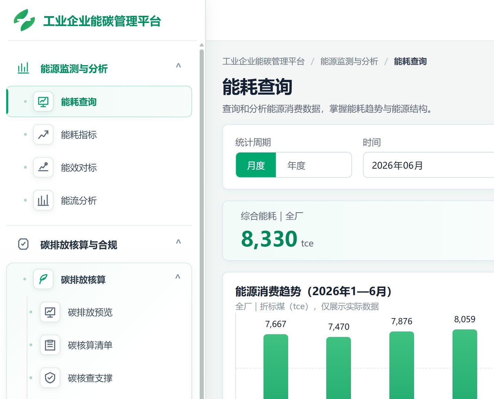

##### 3.1.1.3. 查询与分析范围

###### 3.1.1.3.1. Inputs 输入

| 输入项 | 类型 | 是否必填 | 范围 | 备注 |
| --- | --- | --- | --- | --- |
| 统计周期 | 单选组 | 是 | 月度/年度 | 决定趋势和明细下钻粒度；修改后需点击查询生效 |
| 时间 | 月份/年份选择器 | 是 | 当前年度及历史年度 | 月度模式选择年月，年度模式选择年份；当前年度年度查询按已上报月份累计 |
| 用能单元 | 下拉框 | 是 | 全厂及已配置用能单元 | 当前原型默认全厂 |
| 查询 | 按钮 | — | — | 使用当前筛选条件刷新页面 |
| 重置 | 按钮 | — | — | 恢复默认查询条件 |
| 导出明细 | 按钮 | — | Excel | 导出当前筛选条件下的明细 |

###### 3.1.1.3.2. Process 处理

1. 进入“能源监测与分析 > 能耗查询”页面。

2. 选择统计周期、时间和用能单元。

3. 点击“查询”，系统将待查询条件设为已生效条件，并统一刷新摘要、趋势、能源结构和明细。

4. 点击“重置”，恢复默认条件：月度、当前页面默认月份、全厂，并立即应用默认条件。

5. 页面各区域使用同一组已生效的筛选条件，不因局部操作产生不同统计口径。

###### 3.1.1.3.3. Output 输出

输出综合能耗摘要、同比/环比、能耗趋势、能源结构及能耗明细汇总。明细列表展示序号、用能单元（全厂查询时显示）、能源类别、能源品种、实物量、计量单位、折标量、占比、同比/环比及“查看明细”操作。单个用能单元查询时隐藏用能单元列。能源结构当前按能源品种聚合展示折标量、占比和 tce 值，能源类别仍在明细列表中展示。

###### 3.1.1.3.4. Usage Limitation 约束与限制

- 全页摘要、图表、明细和导出必须使用同一筛选条件。
- 待查询条件未点击“查询”前，不得改变当前已展示结果的统计口径。
- 无数据时展示“暂无数据”或“--”，不得按 0 参与统计。
- 当前年度年度查询只统计已上报月份，未上报月份不静默补 0，也不按年度值平均分摊到月份。
##### 3.1.1.4. 结果摘要与趋势

###### 3.1.1.4.1. Inputs 输入

| 输入项 | 类型 | 是否必填 | 范围 | 备注 |
| --- | --- | --- | --- | --- |
| 页面筛选条件 | 系统参数 | 否 | 承接当前页面已选择的分析年度和对象类型 | 展示类功能无独立输入 |

###### 3.1.1.4.2. Process 处理

1. 进入“能源监测与分析 > 能耗查询”页面。

2. 点击“查询”应用条件；系统按当前已生效的统计周期、时间和用能单元读取能源消费数据。

3. 展示综合能耗、同比/环比及月度或年度变化趋势。

4. 图表展示当前已生效结果；图表悬停展示期间、折标量和单位。修改筛选条件不会自动刷新，需点击“查询”。

###### 3.1.1.4.3. Output 输出

根据当前已生效的统计周期、时间和用能单元读取结果。

展示综合能耗、同比；月度模式额外展示环比。

年度模式展示近五年能耗趋势；查询当前年度时，当前年度展示截至已上报月份的累计值，并明确标注截止月份。

月度模式展示当前年度 1 月至所选月份的逐月能耗趋势。

图表悬停展示期间、折标量和单位。

###### 3.1.1.4.4. Usage Limitation 约束与限制

- 全页摘要、图表、明细和导出必须使用同一筛选条件。
- 无数据时展示“暂无数据”或“--”，不得按 0 参与统计。
##### 3.1.1.5. 能源结构分析

###### 3.1.1.5.1. Inputs 输入

| 输入项 | 类型 | 是否必填 | 范围 | 备注 |
| --- | --- | --- | --- | --- |
| 页面筛选条件 | 系统参数 | 否 | 承接当前页面已选择的时间、范围和对象 | 展示类功能无独立输入 |

###### 3.1.1.5.2. Process 处理

1. 进入“能源监测与分析 > 能耗查询”页面。

2. 系统根据当前已生效的用能单元、统计周期和时间条件聚合能源消费结果。

3. 按能源品种展示折标量、占比和 tce 值；能源类别在能耗明细中作为分组字段展示。能源结构与当前用能单元、统计周期和时间条件联动。

4. 结构图与当前筛选联动，无数据时显示明确空状态。

###### 3.1.1.5.3. Output 输出

结构图与当前筛选联动，无数据时显示明确空状态。

###### 3.1.1.5.4. Usage Limitation 约束与限制

- 全页摘要、图表、明细和导出必须使用同一筛选条件。
- 无数据时展示“暂无数据”或“--”，不得按 0 参与统计。
##### 3.1.1.6. 明细下钻与导出

###### 3.1.1.6.1. Inputs 输入

| 输入项 | 类型 | 是否必填 | 范围 | 备注 |
| --- | --- | --- | --- | --- |
| 能耗明细记录 | 系统参数 | 是 | 当前列表记录 | 用于查看下钻明细 |
| 当前查询条件 | 系统参数 | 是 | 当前已生效筛选条件 | 用于保持明细口径一致 |
| 导出操作 | 按钮 | — | Excel | 导出当前明细 |

###### 3.1.1.6.2. Process 处理

1. 在能耗明细列表中点击“查看明细”。

2. 年度模式下，展开当前能源记录的月度明细；完整年度展示 1—12 月，当前年度仅展示截至已上报月份的明细。

3. 月度模式下，展开当前月份的每日明细。

4. 明细弹窗展示用能单元、能源类别、能源品种、统计期间、实物量、折标量、同比/环比、数据状态及数据来源。年度下钻提供月度消费趋势和月度消费分解；月度下钻在具备日度计量数据时提供日度消费趋势和日度消费明细。

5. 点击“导出明细”，导出当前已生效筛选条件下的明细数据。

###### 3.1.1.6.3. Output 输出

点击查看打开弹窗或抽屉；导出沿用当前筛选条件。

###### 3.1.1.6.4. Usage Limitation 约束与限制

- 全页摘要、图表、明细和导出必须使用同一筛选条件。
- 无数据时展示“暂无数据”或“--”，不得按 0 参与统计。
- 导出功能保留页面入口，本期完成交互占位；Excel 文件生成及下载列入 P1。
- 导出内容必须与当前页面筛选条件、任务版本和数据权限一致。
- 当前原型仅对已接入日度计量的能源品种提供日度下钻；没有日度数据时展示明确空状态，并说明月度汇总仍可正常使用。
- 明细中的“偏高/偏低”用于消费波动提示：月度下钻按月度平均折标量判断，日度下钻按当月日均折标量判断，不替代异常诊断。
#### 3.1.2. 能耗指标

##### 3.1.2.1. Introduce 介绍

能耗指标页面按分析对象自动匹配对应范围的能源数据和运营数据，计算并展示全厂、用能单元、产品和重点设备的能耗指标结果。

页面重点展示指标值、计算状态、计算依据、数据来源及缺失数据补录入口；环比/同比变化主要在月度指标明细和重点设备指标结果中展示。能源消费量、产品产量、供气量、蒸汽产量等数据仅作为指标计算依据，不作为本页面的主要分析结果。

产品 Tab 按已维护的产品主数据逐行展示产品对象。系统根据产品关联的生产用能单元匹配能源数据，并结合产品产量和已配置的能源分配结果计算单位产品综合能耗；产品计量单位不一致或缺少关联关系时不生成指标值。

##### 3.1.2.2. UI Design UI设计

页面包含全厂、一级用能单元、产品、重点设备分析对象 Tab；筛选区包含分析年度，并按对象类型联动显示具体一级用能单元、具体产品或具体设备。页面主体按对象类型展示：全厂为指标结果表，一级用能单元按生产类/非生产类分组展示对象指标，产品为产品对比表，重点设备为设备指标表；下方提供月度指标趋势/明细和计算口径说明。

分析对象 Tab 包括：全厂、用能单元、产品、重点设备。

结果区域按对象类型展示指标名称、指标值、单位、环比、同比和操作入口：全厂展示单位产品综合能耗、单位产值综合能耗、单位增加值综合能耗 3 项指标；用能单元按对象展示适用的生产类或非生产类指标；产品按产品对象展示单位产品综合能耗；重点设备展示设备、所属用能单元、指标名称、指标值、环比、同比和操作。

页面不把能源消费趋势作为主结果；用户查看指标详情或选择指标后，可展开当前指标的月度趋势与明细。月度明细展示指标值、分子/分母业务数据、环比、同比和数据状态，缺少对应月份时显示“—”。

不同 Tab 使用各自适用的数据范围、指标集合、对象筛选和结果展示方式。切换 Tab 后自动切换当前对象类型并重置不适用的具体对象筛选；点击“查询”后应用年度、层级和对象条件，结果区、月度明细和详情内容同步更新。

重点设备结果表展示环比和同比；月度指标明细展示指标值、环比和同比。全厂指标结果表、用能单元分组表和产品对象对比表均展示当前指标值及变化值。缺少对应对比数据时显示“—”；详情可提示暂无对应期间数据，但不得伪造变化率。

能耗指标页面原型（全厂、产品和重点设备 Tab）：

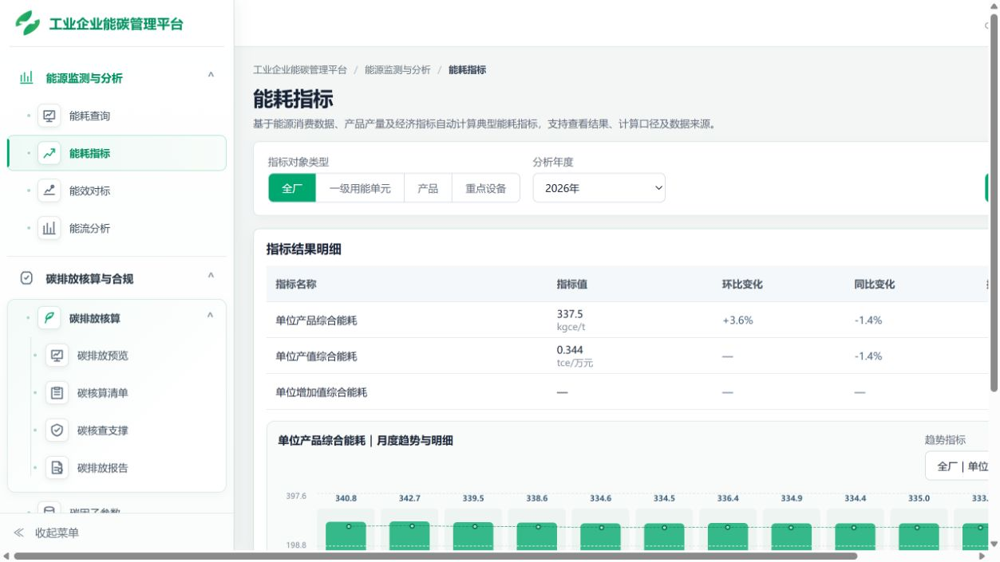

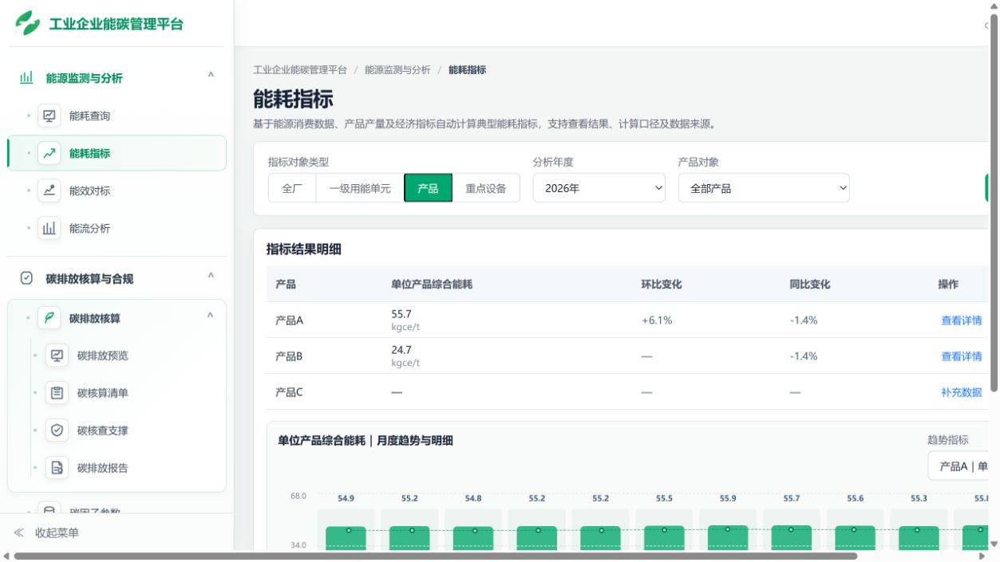

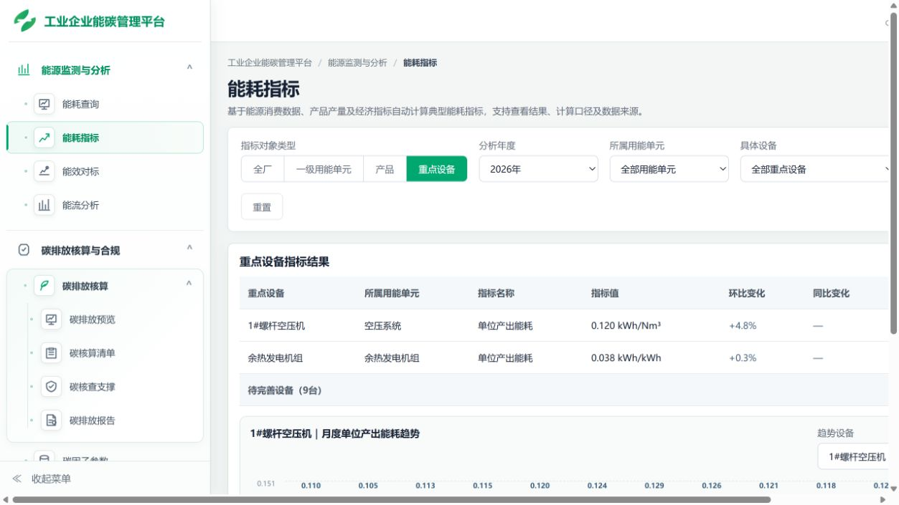

##### 3.1.2.3. 对象与数据自动匹配

###### 3.1.2.3.1. Inputs 输入

| 输入项 | 类型 | 是否必填 | 范围 | 备注 |
| --- | --- | --- | --- | --- |
| 分析年度 | 下拉选择框 | 是 | 当前年度及历史年度 | 默认显示当前年度，可选择当前年度及系统已维护的历史年度。 |
| 分析对象类型 | Tab | 是 | 全厂/用能单元/产品/重点设备 | Tab切换后立即刷新结果 |
| 用能单元层级 | 固定筛选 | 用能单元Tab使用 | 一级用能单元 | 当前页面按一级用能单元展示，来自用能单元主数据。 |
| 具体用能单元 | 下拉框 | 否 | 全部一级用能单元或具体一级用能单元 | 选择“全部”时展示当前层级下的全部用能单元。 |
| 具体产品 | 下拉框 | 产品Tab使用，非必填 | 全部产品或已维护的产品主数据 | 按产品对象筛选结果。 |
| 所属用能单元 | 下拉框 | 重点设备Tab使用，非必填 | 重点设备所属用能单元 | 系统读取重点设备主数据、设备级能源数据和设备指标计算参数，并按设备 ID、分析年度和指标编码进行匹配 |
| 具体设备 | 下拉框 | 重点设备Tab使用，非必填 | 全部重点设备或按所属用能单元过滤的具体设备 | 选项来自重点设备主数据，系统按设备 ID、分析年度和指标编码匹配。 |

###### 3.1.2.3.2. Process 处理

1. 进入“能源监测与分析 > 能耗指标”页面。

2. 选择分析年度和分析对象Tab。

3. 系统根据当前Tab读取对应数据范围：

全厂：读取企业层级能源数据；

用能单元：读取当前用能单元能源数据及关联产品产量；

产品：读取产品关联生产用能单元的能源数据、产品产量及能源分配关系，并汇总同一计量单位的年度产品产量。

重点设备：读取设备级能源数据、设备指标模板、设备计算参数及必要的能源转换数据。

4. 用户点击“查询”或切换分析对象 Tab 后，系统重新匹配数据并刷新结果摘要、指标结果表、月度指标趋势和数据状态。用户修改筛选条件后，点击“查询”才应用新的筛选条件。

5. 数据匹配必须使用租户ID、对象ID和分析年度，不得仅通过名称字符串匹配。

6. 产品 Tab 按产品对象计算单位产品综合能耗；系统读取产品关联生产用能单元的能源数据及已配置的能源分配结果，不将企业总能耗直接解释为任一产品的独立能耗。

###### 3.1.2.3.3. Output 输出

查询后展示当前分析对象对应的指标结果、指标值、单位、计算状态、操作入口、计算依据和数据来源；已选择指标时进一步展示月度指标趋势与明细。不同 Tab 展示内容如下：

全厂：展示 3 项全厂指标：单位产品综合能耗、单位产值综合能耗、单位增加值综合能耗；

用能单元：按生产类和非生产类用能单元展示适用指标，包括单位产品综合能耗、单位供气电耗、单位蒸汽综合能耗、单位供能量综合能耗、单位建筑面积综合能耗、单位物流作业量综合能耗及按运营分母配置的单位运行能耗等；

产品：按产品对象展示单位产品综合能耗；

重点设备：统一按已绑定的设备指标模板展示“单位产出能耗”，设备可配置能源消耗、产出口径、分母来源及计量单位；未绑定模板时显示配置入口。

结果展示字段按对象类型适配：全厂结果表展示指标名称、指标值、单位、环比、同比和查看/补充数据；用能单元分组表及产品对比表展示对象、适用指标、指标值、单位、环比、同比和查看/补充数据；重点设备表展示设备、所属用能单元、指标名称、指标值、环比、同比和操作。

环比或同比缺少对应数据时，统一显示“—”。

###### 3.1.2.3.4. Usage Limitation 约束与限制

- 分子和分母必须属于同一租户、同一年度及规定的数据范围。
- 全厂指标只读取企业层级能源数据，不汇总下级用能单元和重点设备数据；当前页面不展示单位营业收入电耗。
- 用能单元指标只读取当前用能单元能源数据及其关联运营数据，不跨层级重复汇总；
- 产品指标按产品关联生产用能单元匹配能源数据，并使用能源分配关系计算；缺少可汇总的产品产量、产品计量单位不一致、产品产量为0或关联关系不完整时，不生成指标值，并显示具体缺失原因。
- 产品Tab按产品主数据展示多个产品对象，不直接展示企业产品综合口径作为唯一对象。
- 用能单元产品产量缺失或为0时，不生成单位产品指标。
- 重点设备能源数据未达到完整年度数据要求时，不生成正式年度指标。
- 重点设备没有适用指标模板时，显示“暂不可计算”和具体原因；
- 月度指标趋势和明细只展示真实可计算的指标值，缺少数据的月份显示“—”；月度明细中的分子、分母、环比、同比及数据状态必须与当前指标计算结果一致；
- 本页面不展示目标值、排名、达标判断或其他对标结论；“已计算/待完善/暂不可计算”仅表示数据和计算条件状态，不等同于能效达标结论，对标内容由后续能效对标页面负责。
##### 3.1.2.4. 指标计算与状态判断

###### 3.1.2.4.1. Inputs 输入

| 输入项 | 类型 | 是否必填 | 范围 | 备注 |
| --- | --- | --- | --- | --- |
| 页面筛选条件 | 系统参数 | 否 | 当前年度、Tab和对象筛选条件 | 展示类功能无独立输入。 |
| 设备计算参数 | 用户补充参数 | 重点设备缺少产出数据时必填 | 按设备指标模板配置的设备产出量及计量单位 | 不写入设备档案和能源消费记录，按设备 ID、分析年度和指标编码独立保存。 |
| 能源转换数据 | 系统数据或补录数据 | 设备指标分母来自能源转换产出时必填 | 转换产出量及相关能源折标参数 | 用于设备单位产出能耗计算。 |

###### 3.1.2.4.2. Process 处理

1. 系统根据当前Tab确定指标对象和数据范围。

2. 按指标模板读取分子和分母数据。

3. 根据对象类型执行对应计算：

全厂：计算3项企业级指标：单位产品综合能耗、单位产值综合能耗、单位增加值综合能耗；

用能单元：按生产类或非生产类用能单元的适用运营分母计算单位产品、单位供能量、单位建筑面积、单位物流作业量或单位运行能耗等指标；

产品：按产品关联生产用能单元和能源分配关系确定分子，分母为同一计量单位的年度产品产量汇总；

重点设备：按绑定的设备指标模板计算“单位产出能耗”，公式为设备能源消耗 ÷ 配置的设备产出；分母可来自运营数据或能源转换产出。

4. 能源数据未达到12/12月或设备产出参数缺失时，不生成正式指标值。分母缺失、为0、产品计量单位不一致或产品关联关系不完整时，不计算并显示明确原因。

5. 重点设备能源数据不足12个月时，允许补充计算参数，但不生成正式年度指标。

###### 3.1.2.4.3. Output 输出

页面展示指标名称、指标值、单位、计算状态和操作入口。

页面结果状态为：已计算、待完善、暂不可计算、数据缺失；其中“待完善”表示已有指标口径但能源数据、运营数据、设备参数或转换数据不完整，“暂不可计算”表示当前对象不满足适用条件或缺少必要关联关系，“数据缺失”表示企业级经济指标等关键基础数据缺少。

已计算：指标值已成功生成；

待完善：指标模板存在，但能源数据、运营数据、设备参数或转换数据不完整；

暂不可计算：当前对象没有适用的指标模板，或产品/用能单元等业务关联条件不满足计算要求。

月度指标明细额外展示月份、指标值、计算所需分子/分母业务数据、环比、同比和月度数据状态；部分月份缺失时保留月份行并显示“—”。

###### 3.1.2.4.4. Usage Limitation 约束与限制

- 运营分母缺失或为0时，不得显示0值。
- 产品Tab不得将未按产品关联关系匹配的企业总能耗直接解释为某个产品的独立能耗。
- 产品指标公式为：产品关联生产用能单元分配后的综合能耗（tce）×1000÷该产品年度产量；
- 产品产量汇总必须使用同一计量单位；
- 锅炉指标必须先将天然气消费量按折标系数转换为折标综合能耗，再除以蒸汽产量；
- 能源转换设备指标必须使用真实的能源输入和能源输出数据计算；
- 重点设备能源数据必须达到完整年度要求且计算参数完整，才生成正式年度指标；
- 环比为当前月份指标值与上月指标值的变化率；
- 同比为当前月份指标值与上年度同月指标值的变化率；
- 缺少上月或上年度同期数据时，环比或同比显示“—”；
- 页面不显示“暂无同比数据”等额外提示。
###### 3.1.2.4.5 指标变化计算

- 环比计算公式：（本月指标值 - 上月指标值）÷ 上月指标值 × 100%
- 同比计算公式：（本月指标值 - 上年度同月指标值）÷ 上年度同月指标值 × 100%
- 计算规则：
- 首个月份没有上月数据时，环比显示“—”；
- 没有上年度同月数据时，同比显示“—”；
- 对比期指标值为 0 时，不计算变化率，显示“—”；
- 当前指标值缺失时，环比和同比均显示“—”；
- 变化率为正时显示“+”号；
- 变化率为负时显示负号；
- 变化方向只表示指标数值变化，不直接解释为节能或不节能，也不作为达标判断依据。
##### 3.1.2.5. 结果详情与来源

###### 3.1.2.5.1. Inputs 输入

| 输入项 | 类型 | 是否必填 | 范围 | 备注 |
| --- | --- | --- | --- | --- |
| 指标记录 | 系统参数 | 是 | 当前结果明细中的指标 | 指标记录必须包含当前对象 ID、对象类型、指标编码、分析年度和指标状态。 |

###### 3.1.2.5.2. Process 处理

1. 用户点击指标结果或“查看详情”。

2. 系统打开“指标计算详情”弹窗。

3. 普通指标详情弹窗统一展示：指标结果、计算依据、计算公式；查看源数据入口。

4. 重点设备使用独立的“设备指标详情”弹窗，展示：指标结果、计算依据、计算公式、编辑参数入口。

5. 详情展示真实分子、分母、单位换算、数据来源和记录数量。

6. 已计算的重点设备指标支持“编辑参数”。

7. 缺少基础数据时，不打开空白详情弹窗，改为打开数据待完善弹窗，并提供对应补录入口。

###### 3.1.2.5.3. Output 输出

普通指标详情弹窗展示：

- 指标结果：分析对象、指标名称、计算结果、统计期间、计算状态；
- 计算依据：分子数据、分子来源、分母数据、分母来源
- 计算公式：只展示当前指标实际使用的一套公式
- 数据来源：展示能源数据来源、运营数据来源和记录数量；
- 查看源数据：通过“查看源数据”按钮进入能源数据或运营数据页面，不在详情正文中展示追溯信息。
产品指标详情必须展示当前产品对象、关联能源数据、产品产量、实际计算公式及数据来源，并说明结果基于产品关联生产用能单元和能源分配关系计算。

重点设备指标详情弹窗为：

- 指标结果：设备名称、所属用能单元、指标名称、指标结果、统计期间；
- 计算依据：
- 设备能源消耗：按绑定模板展示能源品种、年度能源消费量及来源；
- 设备产出：展示配置的产出口径、年度产出量、计量单位及来源；分母来自能源转换产出时展示对应转换数据；
- 计算公式：只展示当前指标实际使用的一套公式
- 数据来源：展示设备能源数据、设备参数或能源转换数据来源；
- 编辑参数：通过“编辑参数”按钮进入参数数据编辑页面。
###### 3.1.2.5.4. Usage Limitation 约束与限制

- 产品指标详情必须与当前产品关联关系和实际计算数据一致，展示实际使用的能源数据、产量及公式。
- 设备指标详情必须展示实际使用的能源消耗、设备产出、来源及完整公式；分母为能源转换产出时展示转换数据及相关折标参数；
- 缺少基础数据时，不打开空白详情弹窗，应打开数据待完善弹窗并提供补充入口。
- 详情弹窗中的计算依据必须与当前指标实际使用的数据保持一致。
##### 3.1.2.6. 缺失补录联动

###### 3.1.2.6.1. Inputs 输入

| 输入项 | 类型 | 是否必填 | 范围 | 备注 |
| --- | --- | --- | --- | --- |
| 缺失项 | 系统参数 | 是 | 能源数据/运营数据/产品产量/主产主数据关联/设备参数/能源转换数据 | 系统自动识别 |
| 对象ID | 系统参数 | 是 | 当前指标对象 | 用于跳转定位 |
| 分析年度 | 系统参数 | 是 | 当前分析年度 | 用于筛选 |
| 能源品种 | 系统参数 | 重点设备能源补录时必填 | 当前设备能源品种 | 用于能源数据页面定位 |
| 指标编码 | 系统参数 | 重点设备补录或编辑参数时必填 | 当前设备指标编码 | 用于匹配指标模板和参数 |

###### 3.1.2.6.2. Process 处理

1. 系统根据指标状态识别缺失数据类型。

2. 能源数据缺失或未完整时，打开能源数据待完善弹窗，展示：

重点设备；

分析年度；

能源品种；

当前数据进度；

已录入月份；

缺失月份。

3. 点击“去补充能源数据”后跳转至“数据管理—能源数据—重点设备”。

4. 跳转时携带设备ID、分析年度和能源品种筛选条件。

5. 缺少产品产量时，跳转至运营数据或产品主数据对应页面。

6. 缺少设备分母参数时，打开设备参数弹窗。

7. 缺少能源转换数据时，跳转至能源转换数据维护入口。

8. 补录完成返回后，保留原Tab和筛选条件，并自动重新读取数据和更新指标。

###### 3.1.2.6.3. Output 输出

根据不同缺失状态提供对应操作：

已计算：查看详情；

待完善，能源数据未/部分录入：补充能源数据；

待完善，缺少供气量/蒸汽产量/其他设备分母参数：补充计算参数

暂不可计算：查看原因或配置适用指标口径。

补录完成后系统重新读取当前对象和年度数据，刷新指标状态、指标值、月度趋势、环比和同比结果；用能单元总览中的待完善对象默认收起，可由用户展开查看具体原因和完善入口。

###### 3.1.2.6.4. Usage Limitation 约束与限制

- 能源数据录入入口必须跳转至数据管理页面，不在能耗指标页面重新开发能源录入表单。
- 设备计算参数按设备ID、分析年度和指标编码独立保存。
- 计算参数不得写入设备基础档案或能源消费记录。
- 能源数据不足12个月时，仅允许保存计算参数，不生成正式年度指标。
- 返回能耗指标页面后必须保留原Tab、年度和对象筛选条件。
- 产品Tab不提供能源分配关系的配置入口；分配关系由产品主数据及相关能源数据配置维护。
- 补录后的指标必须重新校验分子、分母、计算参数和数据完整性；
- 月度指标趋势中的环比、同比无对应数据时显示“—”；
- 能耗指标页面不提供目标值、排名、达标判断等对标功能，对标由后续对标页面负责。
#### 3.1.3. 能效对标

##### 3.1.3.1. Introduce 介绍

将全厂、一级用能单元、产品或重点设备的已计算能效指标与年度目标值进行对比，展示当前值、目标值、差距、相对偏差、达标状态及趋势。目标值未配置时展示“未配置目标”，不参与达标判断。

##### 3.1.3.2. UI Design UI设计

页面顶部包含分析年度和对象类型筛选，以及查询/重置操作。对象类型支持“全厂/一级用能单元/产品/设备”；切换对象类型后立即刷新对应结果。主体包含五项指标摘要、实际值与目标值趋势图、月度达标状态（具备完整月度数据且已配置月度目标时展示）和对标结果明细。趋势图区域提供指标分类、对象或趋势指标联动选择；目标值通过摘要卡中的“配置目标/调整目标”入口维护。页面不提供独立的对标对象、指标、时间粒度筛选，也不提供导出入口。

图：当前前端原型——能效对标（全厂对象、2026 年）

##### 3.1.3.3. 对标条件与对象

###### 3.1.3.3.1. Inputs 输入

| 输入项 | 类型 | 是否必填 | 范围 | 备注 |
| --- | --- | --- | --- | --- |
| 分析年度 | 年份选择器 | 是 | 当前年份及历史年份 |  |
| 对象类型 | 单选组 | 是 | 全厂/一级用能单元/产品/设备 | “全厂”仅展示企业级指标，不是其他对象类型的汇总 |

###### 3.1.3.3.2. Process 处理

1. 进入“能源监测与分析 > 能效对标”页面；从重点设备页面进入时，可通过设备对象参数直接定位设备对标。

2. 修改分析年度后点击“查询”才应用新年度；点击对象类型后立即切换到对应类型，并重置为该类型的首个可用对象/指标。

3. 按分析年度和对象类型读取当前年度可用的已计算指标。全厂仅读取企业级指标；一级用能单元仅读取一级用能单元；产品和设备分别读取产品级、设备级指标。

4. 在趋势图区域切换指标分类、一级用能单元、产品指标或设备指标时，同步刷新摘要、趋势和月度状态；结果明细行也可切换当前选中指标。

###### 3.1.3.3.3. Output 输出

输出当前类型下可计算对象的摘要、趋势和明细；当前无可计算指标时，展示“暂无可计算指标”及原因。一级用能单元明细仅展示一级用能单元；产品明细支持点击产品行联动上方趋势；设备明细额外展示所属用能单元、数据完整度和设备级提示。

###### 3.1.3.3.4. Usage Limitation 约束与限制

- 仅展示具备可计算指标的对象；无数据时展示明确原因。设备无设备级能源计量记录时不生成有效设备对标结果。
- 产品级指标必须建立产品、所属用能单元、能源消费和产品产量的关系。
- 设备级能源消费必须来自设备ID关联的独立设备能源记录，不使用所属用能单元总量替代，也不重复计入组织汇总；缺少运行时长、产量或供气量等分母时不虚构设备效率指标。
- 本功能版本边界：一期核心 / P0；研发范围：前端联动｜后端查询。
##### 3.1.3.4. 对标目标配置

###### 3.1.3.4.1. Inputs 输入

| 输入项 | 类型 | 是否必填 | 范围 | 备注 |
| --- | --- | --- | --- | --- |
| 目标年度 | 系统参数 | 是 | 当前分析年度 | 与当前页面年度一致，不在弹窗中编辑 |
| 对象类型 | 系统参数 | 是 | 全厂/一级用能单元/产品/设备 | 当前选中对象类型，只读 |
| 对标对象 | 系统参数 | 是 | 当前选中对象 | 只读 |
| 指标名称 | 系统参数 | 是 | 当前选中指标 | 只读 |
| 年度目标值 | 数字输入 | 是 | 大于0 | 单位随指标显示 |
| 月度目标值 | 12个月数字输入 | 否 | 每月大于0 | 可选；可按年度目标批量填充 |

###### 3.1.3.4.2. Process 处理

1. 进入“能源监测与分析 > 能效对标”页面，先选择可计算指标。

2. 点击摘要卡中的“配置目标”或“调整目标”，填写年度目标；可展开配置12个月目标。

3. 保存时校验目标值为大于0的数值；月度目标启用时必须完整填写12个月且每月大于0。

4. 保存后刷新当前指标及明细；年度目标用于年度结果判断，月度目标优先用于月度趋势目标线和月度达标状态。指标方向沿用指标定义，不在当前页面单独维护。

###### 3.1.3.4.3. Output 输出

输出当前对象和指标的年度目标配置状态，以及可选的12个月目标配置结果。

###### 3.1.3.4.4. Usage Limitation 约束与限制

- 目标配置仅从当前选中且可计算的指标进入；没有能源或运营数据时不能配置目标。
- 当前实现未提供目标来源、有效期、停用和独立权限管理字段；目标按对象、指标、年度持久化。
- 本功能版本边界：一期核心 / P0；研发范围：目标值配置｜月度目标配置｜结果刷新。
##### 3.1.3.5. 结果摘要与趋势

###### 3.1.3.5.1. Inputs 输入

| 输入项 | 类型 | 是否必填 | 范围 | 备注 |
| --- | --- | --- | --- | --- |
| 页面筛选条件 | 系统参数 | 否 | 承接当前页面已选择的时间、范围和对象 | 展示类功能无独立输入 |

###### 3.1.3.5.2. Process 处理

1. 进入“能源监测与分析 > 能效对标”页面。

2. 选择目标对象或结果，执行对应查看或处理操作。

3. 展示当前值、目标值、差距、相对偏差、对标状态和趋势；摘要卡共展示当前值、目标值、差距、相对偏差、对标状态五项。

4. 指标切换后摘要、趋势、月度达标状态和明细选中行同步刷新；目标线与实际值使用同一指标单位。具备完整真实月度数据时绘制月度趋势，否则仅展示年度值并标注当前仅按年度对标。

###### 3.1.3.5.3. Output 输出

输出当前选中指标的五项摘要、实际值/目标值趋势、可用的月度达标状态及与当前对象类型一致的明细。

###### 3.1.3.5.4. Usage Limitation 约束与限制

- 能耗强度类指标按实际值不高于目标值判定达标，效率类指标按实际值不低于目标值判定达标；未配置目标时显示“未配置目标”。
- 产品级指标必须建立产品、所属用能单元、能源消费和产品产量的关系。
- 本功能版本边界：一期核心 / P0；研发范围：规则计算｜图表。
##### 3.1.3.6. 空状态、数据来源与跨模块联动

###### 3.1.3.6.1. Inputs 输入

| 输入项 | 类型 | 是否必填 | 范围 | 备注 |
| --- | --- | --- | --- | --- |
| 当前对标条件 | 系统参数 | 是 | 页面已选择年度、对象类型和指标 |  |
| 跨模块对象参数 | 系统参数 | 否 | 设备对象ID等 | 从数据管理页面进入时使用 |

###### 3.1.3.6.2. Process 处理

1. 进入“能源监测与分析 > 能效对标”页面。

2. 选择对象类型、趋势指标或明细行，查看当前对象的对标结果；缺少目标时进入目标配置。

3. 展示不可计算原因、指标可用性/数据完整度和设备、产品等对象的计算口径提示。

4. 缺少数据时展示明确原因；设备空状态提供“新增重点设备”入口，不生成伪结果。

###### 3.1.3.6.3. Output 输出

输出空状态原因、目标配置入口、当前类型对标明细和必要的跨模块入口；不提供当前页面导出。

###### 3.1.3.6.4. Usage Limitation 约束与限制

- 月度趋势和月度达标状态仅使用真实完整月度数据；缺失数据时不补造趋势或达标结论。
- 产品级指标必须建立产品、所属用能单元、能源消费和产品产量的关系。
- 设备消费量来自重点设备独立能源记录；不具备运行时长、产量或供气量等分母时，仅展示可形成的设备消费量指标。
- 本功能版本边界：一期简化 / P1；研发范围：空状态｜跨模块联动｜数据完整度提示。
#### 3.1.4. 能流分析

##### 3.1.4.1. Introduce 介绍

按当前分析条件展示企业边界能源输入、能源转换、厂内可供分配能源、一级用能单元分配、外部输出及未分配/未归属量，提供四项流向 KPI、能流图、能源平衡表、流向明细和流向追溯。 一期固定展示全厂一级用能单元分配视图，不支持单个一级用能单元、多对象组合、二级用能单元及设备级展开；当前页面不提供重点用能单元 TOP5 模块。

##### 3.1.4.2. UI Design UI设计

页面顶部提供分析年度、时间粒度和月份筛选。时间粒度支持月度和年度；选择月度时显示月份选择器。 一期分析范围固定为全厂，页面主分析口径固定为折标量（tce）；流向明细及数据追溯中同时展示原始实物量、原始单位、折标量和折标系数。 主体采用“能流图、能源平衡表、流向明细”三个 Tab。 能流图按“企业边界输入—能源转换—厂内可供分配能源—一级用能单元—外部输出/未分配”的管理口径展示能源流向；页面不展示 TOP5 排名。能流图支持节点悬停提示、节点选中高亮及跳转流向明细。

图：当前前端原型——能流分析（全厂、月度、2026 年 6 月）

##### 3.1.4.3. 分析范围与口径

###### 3.1.4.3.1. Inputs 输入

| 输入项 | 类型 | 是否必填 | 范围 | 备注 |
| --- | --- | --- | --- | --- |
| 分析年度 | 年份选择器 | 是 | 当前年份及历史年份 | 默认当前年度 |
| 时间粒度 | 下拉框 | 是 | 月度/年度 | 默认月度 |
| 分析月份 | 月份选择器 | 条件必填 | 1-12月 | 仅时间粒度为月度时显示 |
| 分析范围 | 系统固定参数 | 是 | 全厂 | 一期默认且仅支持全厂 |
| 页面统计口径 | 系统固定参数 | 是 | 折标量（tce） | 能流图、KPI和平衡表统一使用折标量 |
| 明细展示口径 | 系统固定参数 | 否 | 实物量+折标量 | 在能流图节点提示、流向明细及追溯抽屉中显示 |

###### 3.1.4.3.2. Process 处理

1. 进入“能源监测与分析 > 能流分析”页面。

2. 选择分析年度、时间粒度；当时间粒度为月度时，继续选择分析月份。

3. 点击“查询”，系统根据当前筛选条件生成全厂能流分析结果。

4. 系统以折标量（tce）为统一分析口径，生成四项顶部 KPI、一级能流图、能源平衡表和流向明细；流向明细及追溯保留实物量和折标信息。四项 KPI 中第四项页面显示为“转换折标差额”，用于提示转换投入与产出的折标差异，不等同于已确认的物理转换损失。

5. 切换“能流图、能源平衡表、流向明细”Tab时，仅切换展示视图，不重新改变分析条件。

6. 能流图、顶部 KPI、平衡表和流向明细必须来自同一批分析结果。

7. 悬停能流图节点展示节点名称、类型、折标量和占比；点击节点后高亮相关流线，并可联动流向明细。

8. 点击“重置”后恢复默认年度、月度及月份条件。

###### 3.1.4.3.3. Output 输出

系统输出与当前年度、时间粒度和月份一致的能流分析结果，包括：

1. 能源输入量、内部分配量、未分配量和转换折标差额四项 KPI；已确认转换损失在能源平衡表及相关说明中单独展示。

2. 企业边界输入、能源转换、厂内可供分配能源、一级用能单元、外部输出及未分配节点组成的一级能流图；

3. 按能源品种展示能源平衡表，表格按“能源来源、能源去向、核对结果”分组：能源来源包括外部输入、自产/回收能源及来源合计；能源去向包括能源转换投入、用能单元消耗、对外输出、已确认转换损失、未分配能源、超分配能源及去向合计；核对结果展示核对差异。

4. 流向明细采用记录列表形式，左侧通过合并单元格增加“流向分组”列，归纳输入流、转换流、分配流、输出流和未归属；支持按能流阶段、能源品种、来源/去向关键词及“仅看异常或差额”筛选。

5. 流向数据的来源记录、转换关系、实物量、折标量、折标系数和管理差额说明；

6. 当前平衡表导出结果及流向明细导出入口。

###### 3.1.4.3.4. Usage Limitation 约束与限制

- 一期分析范围固定为全厂，不支持单个一级用能单元、多对象组合、二级用能单元和设备级展开。
- 一期页面主分析口径固定为折标量（tce），不提供能流图、平衡表和流向明细之间的实物量/折标量切换。
- 原始实物量、计量单位和折标系数在能流图节点提示、流向明细及数据追溯中展示；能流图和平衡表仍以 tce 为主分析口径。
- 能源转换产出不得再次计为企业外购输入，避免重复统计。
- 未分配量表示管理口径下尚未归属到一级用能单元的差额，不等同于物理损失。
- 能流图、KPI、平衡表和明细必须使用同一分析数据集。
- 本功能版本边界：一期核心 / P0；研发范围：前端页面、后端查询、管理口径聚合及统一数据集生成。
##### 3.1.4.4. 能流图生成与交互

###### 3.1.4.4.1. Inputs 输入

| 输入项 | 类型 | 是否必填 | 范围 | 备注 |
| --- | --- | --- | --- | --- |
| 分析年度 | 页面参数 | 是 | 当前年度及历史年度 | 承接页面筛选条件 |
| 时间粒度 | 页面参数 | 是 | 月度/年度 | 承接页面筛选条件 |
| 分析月份 | 页面参数 | 条件必填 | 1-12月 | 月度分析时承接 |
| 分析范围 | 页面固定参数 | 是 | 全厂 | 一期固定 |
| 分析数据集 | 系统参数 | 是 | 当前查询结果 | 能流图不得自行重新计算 |

###### 3.1.4.4.2. Process 处理

进用户设置年度、时间粒度和月份后点击“查询”。

系统基于当前分析数据集生成桑基图。

桑基图按以下阶段生成节点和流线：

能源输入；

能源转换；

厂内可供分配能源；

一级用能单元分配；

外部输出；

未分配。

当同一能源存在外购输入、内部回收或转换产出时，系统按管理规则汇总至厂内可供分配能源，不重复计入企业外购输入。

缺少来源、去向或分配关系时，不推断具体关系；无有效关系时不生成流线。

悬停节点展示节点名称、节点类型、折标量及占比。

点击节点后高亮相关流线，并展示“查看流向明细”入口；页面通过选中提示条承载当前节点选择状态。

点击“查看流向明细”后，进入流向明细 Tab，并按当前节点自动筛选相关记录；点击未分配/未归属节点时默认筛选对应差额记录。

###### 3.1.4.4.3. Output 输出

输出与当前分析条件一致的一级能流桑基图。 节点展示能源名称、节点类型、折标量和占比；流线展示能源流向及折标量。 用户可通过悬停查看节点信息、点击节点高亮相关流线，并联动流向明细。

###### 3.1.4.4.4. Usage Limitation 约束与限制

- 一期仅支持全厂一级用能单元分配视图。
- 不支持二级用能单元、设备级和多对象组合。
- 不根据能源品种或用能单元名称推断未维护的分配关系。
- 转换产出不得再次计入企业外购输入。
- 未分配量仅表示管理口径差额，不代表实际能量损失。
- 桑基图中的负值流线不得生成；当下级利用量超过一级分配量时，应标记为层级异常并提示核验。
##### 3.1.4.5. 节点选择与跨Tab联动

###### 3.1.4.5.1. Inputs 输入

| 输入项 | 类型 | 是否必填 | 范围 | 备注 |
| --- | --- | --- | --- | --- |
| 页面筛选条件 | 系统参数 | 否 | 承接当前页面的分析年度、时间粒度、月份、分析范围和统一分析数据集。 | 展示类功能无独立输入 |

###### 3.1.4.5.2. Process 处理

1. 系统读取当前分析条件下的一级能流图节点、流线及流向明细数据。

2. 用户悬停节点时，系统展示节点名称、节点类型、折标量、原始能源量及其在当前去向中的占比。

3. 用户点击节点时，系统高亮相关流线，并显示“查看流向明细”入口。

4. 用户取消选择后恢复全图；切换 Tab 不改变当前分析条件，查询或重置会清除节点选择。

5. 进入流向明细后，系统按当前节点自动带入来源/去向或差额条件，用户可继续筛选和查看追溯。

###### 3.1.4.5.3. Output 输出

输出能流图节点交互结果，包括：

节点名称、节点类型、折标量及占比提示；

选中节点后的相关流线高亮；

查看流向明细入口及对应的自动筛选结果。

###### 3.1.4.5.4. Usage Limitation 约束与限制

- 一期仅支持全厂一级能流图，不支持二级用能单元、设备级和多对象组合。
- 能流图主展示统一采用折标量口径，原始实物量在悬停提示、流向明细和数据追溯中补充展示。
- 未维护来源、去向或分配关系时不生成推断流线。
- 能源转换产出不得重复计入企业外购输入。
##### 3.1.4.6. 能源平衡与流向明细

###### 3.1.4.6.1. Inputs 输入

| 输入项 | 类型 | 是否必填 | 范围 | 备注 |
| --- | --- | --- | --- | --- |
| 当前分析条件 | 系统参数 | 是 | 年度、时间粒度、月份、全厂范围 | 与能流图一致 |
| 能流阶段 | 下拉框 | 否 | 全部、输入、转换、分配、外部输出、未分配 | 明细筛选 |
| 能源品种 | 下拉框 | 否 | 当前结果中的能源品种 | 明细筛选 |
| 来源/去向关键词 | 文本框 | 否 | 来源或去向名称 | 明细筛选 |
| 异常筛选 | 复选框 | 否 | 仅看异常或差额 | 明细筛选 |
| 导出格式 | 系统参数 | 否 | Excel/CSV | 能源平衡表支持当前结果导出；流向明细保留当前筛选条件下的导出入口 |

###### 3.1.4.6.2. Process 处理

用户在“能源平衡表”Tab查看当前分析条件下各能源品种的来源、去向及核对关系。

能源平衡表按“能源来源、能源去向、核对结果”分组展示。能源来源包括外部输入、自产/回收能源和来源合计；能源去向包括能源转换投入、用能单元消耗、对外输出、已确认转换损失、未分配能源、超分配能源和去向合计；页面顶部同步展示当前平衡状态摘要。

核对关系为：

外部输入 + 自产/回收能源 = 能源转换投入 + 用能单元消耗 + 对外输出 + 未分配能源 + 超分配能源。转换损失作为已知转换过程结果单独说明，不单独判定为能源分配异常；核对差异用于管理口径核对，不等同于物理损失或工艺热平衡损失。

点击未分配能源数值或顶部“查看异常来源”入口，可跳转至“流向明细”Tab，并自动筛选对应差额阶段。

用户在“流向明细”Tab中按能流阶段、能源品种、来源/去向关键词及“仅看异常或差额”筛选。

流向明细按输入流、转换流、分配流、输出流和未归属分组展示，列表字段包括流向分组、能源阶段、来源、去向、能源品种、流量（tce）和操作。点击“查看追溯”或“查看说明”后，在详情中展示来源记录、转换关系、原始实物量、原始单位、折标量、折标系数及管理差额说明。

点击“导出当前明细”时，页面按当前分析条件和明细筛选条件显示导出反馈；当前页面的流向明细导出入口尚未生成实际下载文件。能源平衡表导出按钮生成当前结果的 CSV 文件。

能源平衡表、能流图和流向明细必须来自同一分析数据集。

###### 3.1.4.6.3. Output 输出

输出以下结果：

1. 按能源来源、能源去向和核对结果分组展示的能源平衡表；

2. 按输入流、转换流、分配流、输出流和未归属归纳的能源流向明细；

3. 流向数据追溯信息，包括原始实物量、原始单位、折标量、折标系数和管理差额说明；

4. 当前分析条件下的能源平衡表导出文件；流向明细提供按当前条件导出的操作入口。

能源平衡表、能流图和流向明细中的统计结果必须保持一致。导出内容必须与当前年度、时间粒度、月份、分析范围、明细筛选条件和数据权限一致。

###### 3.1.4.6.4. Usage Limitation 约束与限制

- 一期仅支持全厂一级用能单元分配平衡，不支持二级用能单元、设备级和多对象组合。
- 页面主分析口径为折标量（tce）；原始实物量、原始单位和折标系数在能流图节点提示、流向明细及追溯详情中展示。
- 能源转换产出不得再次计入企业外购输入。
- 未分配量为管理口径差额，不等同于物理损失。
- 当下级利用量超过上级分配量时，标记为层级异常，不生成负值流线。
- 导出内容必须与当前页面筛选条件、明细筛选条件和数据权限一致。
- 本功能版本边界：一期核心 / P0；研发范围：规则计算、明细查询、数据追溯和能源平衡表导出；流向明细实际文件导出仍需补齐。
### 3.2. 碳排放核算与合规

碳排放核算与合规模块包括碳排放核算、碳因子与参数库和供应链碳管理。碳排放核算下设碳排放预览、碳核算清单、碳核查支撑和碳排报告。

#### 3.2.1. 碳排放核算

碳排放核算以核算任务和版本为主线，由草稿清单生成、数据及因子维护、完整性校验、正式快照、预览、核查支撑和报告构成完整闭环。

#### 3.2.1.1. 碳排放预览

##### 3.2.1.1.1. Introduce 介绍

基于当前核算任务的正式核算清单，展示温室气体排放总量、按排放范围的构成、近年排放趋势、主要排放源排行及本次核算汇总，为用户提供核算结果总览和结果导出入口。页面只读取“碳核算清单”已确认的正式清单，不展示草稿或编辑副本结果。页面不直接编辑排放源和活动数据，排放源维护、因子选择、数据补充等操作在“碳核算清单”页面完成。

##### 3.2.1.1.2. UI Design UI设计

页面包含以下区域：

1. 当前核算任务及正式清单依据标准；

2. 排放结果摘要卡，包括温室气体排放总量、范围一直接排放、范围二购入能源间接排放和范围三其他间接排放，并展示各范围占比；

3. 排放构成图，按排放范围展示直接排放、购入能源间接排放和其他间接排放；

4. 近 5 年排放趋势，柱顶展示年度排放总量，柱体按范围一、范围二和范围三堆叠展示构成；非零的小占比范围须保证最小可见高度；

5. 主要排放源 TOP5 排行；

6. 本次核算排放汇总表，按排放范围和排放类别展示排放量及占比；

7. 正式清单操作：导出核算结果，或返回“碳核算清单”维护数据。

图：当前前端原型——碳排放预览（2026 年度核算任务）

##### 3.2.1.1.3. 任务上下文与结果摘要

###### 3.2.1.1.3.1. Inputs 输入

| 输入项 | 类型 | 是否必填 | 范围 | 备注 |
| --- | --- | --- | --- | --- |
| 当前核算任务 | 系统上下文/下拉框 | 是 | 默认加载当前企业当前有效核算任务 |  |
| 核算年度 | 系统字段 | 是 | 从当前核算任务带入，不在页面独立编辑 |  |
| 正式清单版本 | 系统字段 | 是 | 当前任务已确认的正式清单 | 页面只读，不展示草稿或编辑副本 |
| 核算标准 | 系统字段 | 是 | 从当前任务带入 | 顶部单行展示 |

###### 3.2.1.1.3.2. Process 处理

1. 用户进入“碳排放核算与合规 > 碳排放核算 > 碳排放预览”页面；

2. 系统加载当前核算任务及对应结果快照；

3. 页面顶部单行展示当前任务和核算标准，不重复展示组织管理中的组织名称、行业和组织边界信息；

4. 页面始终加载当前任务已确认的正式核算快照；正式清单尚未生成时展示空状态并引导前往碳核算清单；

5. 页面统一生成摘要卡、构成图、趋势图、TOP5 排行和汇总表；

6. 用户返回碳核算清单维护数据或导出当前正式核算结果。

7. 当前核算任务发生变化后，页面重新加载该任务对应的完整结果数据，所有摘要、图表、排行和汇总表必须同步更新。

###### 3.2.1.1.3.3. Output 输出

切换任务后全页刷新，并明确区分草稿、正式清单和待核查修改状态；正式结果导出内容与当前页面汇总一致。

###### 3.2.1.1.3.4. Usage Limitation 约束与限制

- 全页必须引用同一task_id和version。
- 仅正式核算快照可作为正式报告、核查支撑和履约分析基准。
- 本功能版本边界：一期核心 / P0；研发范围：前端页面｜后端聚合｜版本控制。
##### 3.2.1.1.4. 构成、趋势与排行

###### 3.2.1.1.4.1. Inputs 输入

| 输入项 | 类型 | 是否必填 | 范围 | 备注 |
| --- | --- | --- | --- | --- |
| 页面筛选条件 | 系统参数 | 否 | 承接当前页面已选择的时间、范围和对象 | 展示类功能无独立输入 |

###### 3.2.1.1.4.2. Process 处理

1. 进入“碳排放核算与合规 > 碳排放核算 > 碳排放预览”页面。

2. 系统展示排放构成、近年趋势和主要排放源排行；趋势图同时展示年度总量和按范围构成，不提供口径切换。

3. 图表和排行引用同一核算版本。

###### 3.2.1.1.4.3. Output 输出

图表、排行和汇总表引用同一正式核算版本；趋势图中的年度总量必须等于三个排放范围之和，小占比但非零的范围仍须可辨识。

###### 3.2.1.1.4.4. Usage Limitation 约束与限制

- 全页必须引用同一task_id和version。
- 仅正式核算快照可作为正式报告、核查支撑和履约分析基准。
- 本功能版本边界：一期核心 / P0；研发范围：后端聚合｜图表。
##### 3.2.1.1.5. 明细与下游联动

###### 3.2.1.1.5.1. Inputs 输入

| 输入项 | 类型 | 是否必填 | 范围 | 备注 |
| --- | --- | --- | --- | --- |
| 当前核算任务和版本 | 系统参数 | 是 | 页面当前上下文 |  |

###### 3.2.1.1.5.2. Process 处理

1. 进入“碳排放核算与合规 > 碳排放核算 > 碳排放预览”页面。

2. 在汇总表中查看各排放范围及排放类别的排放量和占比，并查看主要排放源 TOP5。

3. 需要维护排放源、活动数据或因子时，进入“碳核算清单”；需要材料或报告处理时，通过对应业务页面进入“碳核查支撑”或“碳排报告”。

4. 仅正式快照可作为正式报告和履约分析基准。

###### 3.2.1.1.5.3. Output 输出

仅正式快照可作为正式报告和履约分析基准。

###### 3.2.1.1.5.4. Usage Limitation 约束与限制

- 全页必须引用同一task_id和version。
- 仅正式核算快照可作为正式报告、核查支撑和履约分析基准。
- 本功能版本边界：一期核心 / P1；研发范围：明细查询｜跨模块联动。
#### 3.2.1.2. 碳核算清单

##### 3.2.1.2.1. Introduce 介绍

创建组织温室气体核算任务，根据核算边界和上游数据生成草稿清单，支持活动数据、因子和参数编辑、排放计算、完整性校验，并确认形成只读正式清单快照。

##### 3.2.1.2.2. UI Design UI设计

页面以当前核算任务上下文为主，顶部单行展示当前任务和依据标准，不重复展示组织管理中的组织名称、行业和组织边界信息；下方提供排放源/因子/参数关键词搜索、排放类别筛选、按“排放范围 > 排放类别”两级分组的核算清单表格，以及查看详情、编辑、删除和新增排放源入口。排放范围展示范围小计，排放类别支持折叠并展示类别小计。正式清单状态下提供导出和发起修订；修订状态下提供查看本次修改、取消本次修改和确认更新正式清单。新建任务、核算设置等入口不作为当前清单页的常驻操作项。

图：当前前端原型——碳核算清单（正式清单状态）

##### 3.2.1.2.3. 任务与草稿清单生成

###### 3.2.1.2.3.1. Inputs 输入

| 输入项 | 类型 | 是否必填 | 范围 | 备注 |
| --- | --- | --- | --- | --- |
| 当前核算任务 | 系统上下文/下拉框 | 是 | 当前企业已有核算任务 | 当前页面展示任务名称，任务切换能力由任务上下文提供 |
| 核算年度 | 系统字段 | 是 | 当前任务年度 | 从任务上下文带入 |
| 核算方法/标准 | 系统字段 | 是 | 当前任务适用标准 | 页面只读展示 |
| 核算组织 | 系统字段 | 是 | 当前任务组织 | 页面只读展示 |
| 组织边界 | 系统字段 | 是 | 当前任务组织边界 | 页面只读展示 |

###### 3.2.1.2.3.2. Process 处理

1. 进入“碳排放核算与合规 > 碳排放核算 > 碳核算清单”页面。

2. 页面加载当前任务对应的草稿或正式清单，并展示任务状态。

3. 草稿清单由能源数据等上游模块关联记录和已有排放源记录生成；系统记录保留上游来源ID，人工排放源通过“新增排放源”补充。

4. 草稿数据在当前任务范围内保存；重复进入页面不重复生成同一条上游关联记录。

###### 3.2.1.2.3.3. Output 输出

生成当前任务的草稿清单，并保留每条记录的来源模块、来源记录和生成类型。

###### 3.2.1.2.3.4. Usage Limitation 约束与限制

- 系统生成记录必须保留上游来源ID；人工记录与系统记录采用不同删除逻辑。
- 正式快照锁定活动数据、因子参数、来源版本、计算公式和排放量。
- 本功能版本边界：一期核心 / P0；研发范围：上游数据联动｜草稿生成｜状态管理。新建任务和任务设置属于任务管理入口，不在当前清单页常驻展示。
##### 3.2.1.2.4. 清单汇总与人工新增

###### 3.2.1.2.4.1. Inputs 输入

| 输入项 | 类型 | 是否必填 | 范围 | 备注 |
| --- | --- | --- | --- | --- |
| 关键词 | 搜索框 | 否 | 排放源、排放源类型、因子或参数 | 页面提示“搜索排放源、因子或参数” |
| 排放类别 | 下拉框 | 否 | 当前清单中的排放类别 | 默认“全部” |
| 排放范围 | 下拉框 | 否 | 范围一、范围二、范围三、其他排放、特殊排放 | 人工新增时必填，并先于排放类别选择 |
| 新增排放类别 | 级联下拉框 | 否 | 当前排放范围包含的排放类别 | 人工新增时必填；切换排放范围后重置为该范围的首个类别 |
| 人工新增核算对象 | 文本框 | 否 | 1-100字符 | 新增时必填 |
| 活动数据单位 | 文本输入 | 否 | 与因子/参数兼容的单位 | 新增时必填 |

###### 3.2.1.2.4.2. Process 处理

1. 进入“碳排放核算与合规 > 碳排放核算 > 碳核算清单”页面。

2. 点击相应新增、编辑、配置或录入入口，填写并校验输入项。

3. 清单先按排放范围分层，再按排放类别分组；范围层显示范围排放量小计，类别分组支持展开/折叠并显示类别排放量小计。

4. 范围一：直接排放包含化石燃料燃烧排放、生产过程排放、废弃物处理处置排放、逸散排放；范围二：间接排放包含购入的电力与热力产生的排放；范围三：其他间接排放包含交通运输产生的排放、所使用的产品和服务隐含的排放、所生产的产品和服务的排放；其他排放和特殊排放分别包含同名排放类别。

5. 新增排放源时先选择排放范围，再选择排放类别；排放类别选项只展示所选范围包含的类别。切换范围时同步重置排放类别、温室气体源类型和排放源名称，避免保留不属于新范围的旧值。

6. 表格展示温室气体源类型、排放源、活动数据、碳排放因子、排放量和操作列；人工新增按排放类别和排放源类型展示。

###### 3.2.1.2.4.3. Output 输出

分项合计与总量一致，人工新增按排放源类型展示字段。

###### 3.2.1.2.4.4. Usage Limitation 约束与限制

- 系统生成记录必须保留上游来源ID；人工记录与系统记录采用不同删除逻辑。
- 正式快照锁定活动数据、因子参数、来源版本、计算公式和排放量。
- 本功能版本边界：一期核心 / P0；研发范围：前端表格｜CRUD｜规则配置。
##### 3.2.1.2.5. 活动数据与因子编辑

###### 3.2.1.2.5.1. Inputs 输入

| 输入项 | 类型 | 是否必填 | 范围 | 备注 |
| --- | --- | --- | --- | --- |
| 活动数据 | 数字输入 | 是 | 按排放源类型 |  |
| 活动数据单位 | 下拉框 | 是 | 与计算规则兼容 |  |
| 数据来源 | 系统关联/文本 | 是 | 上游记录或核算清单在线录入 | 页面详情中展示来源 |
| 计算因子/参数 | 选择器 | 是 | 碳因子与参数库 |  |
| 覆盖说明 | 多行文本 | 否 | 0-500字符 | 覆盖系统值时建议填写 |

###### 3.2.1.2.5.2. Process 处理

1. 进入“碳排放核算与合规 > 碳排放核算 > 碳核算清单”页面。

2. 选择目标对象或结果，执行对应查看或处理操作。

3. 在详情抽屉中编辑活动数据、单位、来源信息及因子/参数；因子/参数可从碳因子与参数库选择。

4. 系统记录修改保留原值和覆盖值，因子选择后真正写回。

###### 3.2.1.2.5.3. Output 输出

系统记录修改保留原值和覆盖值，因子选择后真正写回。

###### 3.2.1.2.5.4. Usage Limitation 约束与限制

- 系统生成记录必须保留上游来源ID；人工记录与系统记录采用不同删除逻辑。
- 正式快照锁定活动数据、因子参数、来源版本、计算公式和排放量。
- 本功能版本边界：一期核心 / P0；研发范围：复杂表单｜来源追溯｜因子选择。
##### 3.2.1.2.6. 排放计算与完整性校验

###### 3.2.1.2.6.1. Inputs 输入

| 输入项 | 类型 | 是否必填 | 范围 | 备注 |
| --- | --- | --- | --- | --- |
| 当前草稿清单 | 系统参数 | 是 | 当前任务全部有效清单项 |  |

###### 3.2.1.2.6.2. Process 处理

1. 进入“碳排放核算与合规 > 碳排放核算 > 碳核算清单”页面。

2. 选择目标对象或结果，执行对应查看或处理操作。

3. 自动计算分项排放量，并在正式确认前校验关键数据。

4. 缺失活动数据、因子、单位或参数时阻断正式确认。

###### 3.2.1.2.6.3. Output 输出

缺失活动数据、因子、单位或参数时阻断正式确认。

###### 3.2.1.2.6.4. Usage Limitation 约束与限制

- 系统生成记录必须保留上游来源ID；人工记录与系统记录采用不同删除逻辑。
- 正式快照锁定活动数据、因子参数、来源版本、计算公式和排放量。
- 本功能版本边界：一期核心 / P0；研发范围：规则计算｜校验规则。
##### 3.2.1.2.7. 删除、移除与审计

###### 3.2.1.2.7.1. Inputs 输入

| 输入项 | 类型 | 是否必填 | 范围 | 备注 |
| --- | --- | --- | --- | --- |
| 清单项 | 系统参数 | 是 | 当前选中记录 |  |
| 操作类型 | 系统参数 | 是 | 删除可维护记录 | 系统生成的能源关联记录不提供删除 |
| 确认操作 | 确认框 | 是 | 确认/取消 |  |

###### 3.2.1.2.7.2. Process 处理

1. 进入“碳排放核算与合规 > 碳排放核算 > 碳核算清单”页面。

2. 选择目标记录，点击删除并进行二次确认；正式清单需先发起修订。

3. 人工新增记录支持删除；能源消费等上游关联记录不提供删除，废弃物处理处置排放等允许维护的记录可按页面规则删除。

4. 保留删除人、时间、来源类型；不删除上游源数据。

###### 3.2.1.2.7.3. Output 输出

保留删除人、时间、来源类型；不删除上游源数据。

###### 3.2.1.2.7.4. Usage Limitation 约束与限制

- 系统生成记录必须保留上游来源ID；人工记录与系统记录采用不同删除逻辑。
- 正式快照锁定活动数据、因子参数、来源版本、计算公式和排放量。
- 本功能版本边界：一期核心 / P0；研发范围：审计留痕｜删除确认｜引用保护。删除不影响能源、运营等上游模块原始数据。
##### 3.2.1.2.8. 正式快照与联动

###### 3.2.1.2.8.1. Inputs 输入

| 输入项 | 类型 | 是否必填 | 范围 | 备注 |
| --- | --- | --- | --- | --- |
| 当前草稿版本 | 系统参数 | 是 | 已通过完整性校验的草稿 |  |
| 确认操作 | 确认框 | 是 | 确认生成正式清单/取消 |  |

###### 3.2.1.2.8.2. Process 处理

1. 进入“碳排放核算与合规 > 碳排放核算 > 碳核算清单”页面。

2. 正式清单状态下点击“发起修订”，系统基于当前正式清单创建编辑副本；修订状态下可查看本次修改或取消本次修改。

3. 完善并通过活动数据、单位、因子/参数和排放量校验后，点击“确认更新正式清单”。首个正式清单和新建任务的生成应通过任务创建/草稿生成流程完成。

4. 确认后生成新的正式版本，正式状态下提供清单导出；预览、核查支撑和报告联动使用正式快照。

###### 3.2.1.2.8.3. Output 输出

正式快照锁定活动数据、因子、公式和结果，不受后续源数据变化影响。

###### 3.2.1.2.8.4. Usage Limitation 约束与限制

- 系统生成记录必须保留上游来源ID；人工记录与系统记录采用不同删除逻辑。
- 正式快照锁定活动数据、因子参数、来源版本、计算公式和排放量。
- 本功能版本边界：一期核心 / P0；研发范围：修订副本｜后端快照｜版本控制｜导出｜跨模块。
- 导出内容必须与当前页面筛选条件、任务版本和数据权限一致。
#### 3.2.1.3. 碳核查支撑

##### 3.2.1.3.1. Introduce 介绍

基于正式核算清单整理核算基础材料和排放源支撑材料，建立活动数据来源与证据文件的关联，支撑企业内部复核和第三方核查准备。

##### 3.2.1.3.2. UI Design UI设计

页面顶部单行展示核算标准和核算年度选择器。当前页面以当前组织和正式核算清单为系统上下文，但不重复展示组织名称、行业、组织边界、核算任务名称和正式清单来源。核算基础材料与排放源支撑材料在同一页面上下分区展示，共用关键字和材料状态筛选；核算主体身份与组织边界合并为“核算主体与组织边界”材料事项，集中维护主体证明、组织架构、边界说明及设施清单。排放源支撑材料按排放范围、排放类别分层，展示温室气体源类型、排放源、活动数据项、支撑材料、材料状态，并提供查看、上传和删除操作；详情侧栏展示正式清单中的核算数据（只读），支持维护支撑文件和备注。

图：当前前端原型——碳核查支撑（核算基础材料/排放源支撑材料）

##### 3.2.1.3.3. 年度上下文与同页材料分区

###### 3.2.1.3.3.1. Inputs 输入

| 输入项 | 类型 | 是否必填 | 范围 | 备注 |
| --- | --- | --- | --- | --- |
| 核算年度 | 下拉框 | 是 | 页面提供的年度选项 | 查询后刷新当前页面上下文 |
| 当前核算任务/组织 | 系统上下文 | 是 | 当前组织及其核算任务 | 页面展示，不在本页单独切换 |
| 正式核算清单 | 系统上下文 | 是 | 当前年度对应的正式清单 | 作为排放源支撑数据来源 |
| 材料分区 | 页面分区 | 是 | 核算基础材料、排放源支撑材料 | 两个分区在同一页面展示 |

###### 3.2.1.3.3.2. Process 处理

1. 进入“碳排放核算与合规 > 碳排放核算 > 碳核查支撑”页面。

2. 选择核算年度并点击“查询”，加载该年度的当前正式核算清单及支撑材料。

3. 使用公共关键字和材料状态条件筛选两个材料分区中的记录。

4. 基于当前年度正式清单，在同一页面展示核算基础材料和排放源支撑材料；两个分区使用独立字段和数据集。

5. 对记录执行查看、上传或删除操作；排放源记录可进入详情侧栏查看只读核算数据并维护支撑材料和备注。

###### 3.2.1.3.3.3. Output 输出

页面展示当前年度、组织及标准信息；核算基础材料按材料事项展示，排放源支撑材料按排放类别分组展示温室气体源类型、排放源、活动数据项、支撑材料、材料状态和操作入口。页面材料状态以“已上传/待补充”展示；正式清单中的“待确认”状态在支撑列表中归入待补充处理。

###### 3.2.1.3.3.4. Usage Limitation 约束与限制

- 核查支撑引用当前年度正式核算清单，不直接使用动态草稿；页面当前不提供正式版本的独立切换入口。
- 材料管理不得修改正式排放量和因子。
- 本功能版本边界：一期核心 / P0；研发范围：前端页面｜后端查询｜版本控制。
##### 3.2.1.3.4. 活动数据来源匹配

| 功能编号 | 研发范围 | 版本 / 优先级 |
| --- | --- | --- |
| CA-03-02 | 规则映射｜来源追溯 | 一期核心 / P0 |

###### 3.2.1.3.4.1. Inputs 输入

| 输入项 | 类型 | 是否必填 | 范围 | 备注 |
| --- | --- | --- | --- | --- |
| 页面筛选条件 | 系统参数 | 否 | 承接当前页面已选择的时间、范围和对象 | 展示类功能无独立输入 |

###### 3.2.1.3.4.2. Process 处理

1. 进入“碳排放核算与合规 > 碳排放核算 > 碳核查支撑”页面。

2. 选择目标对象或结果，执行对应查看或处理操作。

3. 排放源记录从正式核算清单带入活动数据、活动数据来源、排放因子和排放量；页面按排放类别及排放源类型组织展示，支撑文件保留其关联来源说明。

4. 来源信息随正式清单记录动态展示，不使用固定文案；当前页面不提供单独的来源确认或调整表单。

###### 3.2.1.3.4.3. Output 输出

排放源支撑记录与活动数据来源、支撑文件关联来源说明；用户可在详情侧栏查看当前正式清单中的活动数据，并通过材料和备注补充核查依据。

###### 3.2.1.3.4.4. Usage Limitation 约束与限制

- 核查支撑引用指定正式快照，不直接使用动态草稿。
- 材料管理不得修改正式排放量和因子。
- 本功能版本边界：一期核心 / P0；研发范围：规则映射｜来源追溯。
##### 3.2.1.3.5. 材料管理与状态

| 功能编号 | 研发范围 | 版本 / 优先级 |
| --- | --- | --- |
| CA-03-03 | 文件上传｜文件管理｜状态判断 | 一期核心 / P0 |

###### 3.2.1.3.5.1. Inputs 输入

| 输入项 | 类型 | 是否必填 | 范围 | 备注 |
| --- | --- | --- | --- | --- |
| 支撑文件 | 文件 | 是 | PDF/Excel/Word/图片/ZIP | 支持多文件 |
| 材料备注 | 多行文本 | 否 | 0-500字符 |  |

###### 3.2.1.3.5.2. Process 处理

1. 进入“碳排放核算与合规 > 碳排放核算 > 碳核查支撑”页面。

2. 选择目标对象或结果，执行对应查看或处理操作。

3. 在记录的查看对话框或支撑材料详情侧栏中查看材料列表；支持多文件上传、下载、删除文件及维护备注，并展示已上传/待补充状态。当前原型不提供文件预览和材料建议清单的独立功能。

4. 材料操作只影响证据包，不修改正式核算结果。

###### 3.2.1.3.5.3. Output 输出

材料操作只影响证据包，不修改正式核算结果。

###### 3.2.1.3.5.4. Usage Limitation 约束与限制

- 核查支撑引用指定正式快照，不直接使用动态草稿。
- 材料管理不得修改正式排放量和因子。
- 本功能版本边界：一期核心 / P0；研发范围：文件上传｜文件管理｜状态判断。
- 文件类型、大小、权限和失败重试规则由统一文件服务控制，当前原型未在前端单独实现这些校验。
##### 3.2.1.3.6. 材料导出与结果保护

| 功能编号 | 研发范围 | 版本 / 优先级 |
| --- | --- | --- |
| CA-03-04 | 文件导出｜权限｜版本保护 | 一期简化 / P1 |

###### 3.2.1.3.6.1. Inputs 输入

| 输入项 | 类型 | 是否必填 | 范围 | 备注 |
| --- | --- | --- | --- | --- |
| 导出范围 | — | — | — | 当前碳核查支撑页无独立导出入口 |
| 文件格式 | — | — | — | 当前碳核查支撑页无独立导出入口 |

###### 3.2.1.3.6.2. Process 处理

1. 进入“碳排放核算与合规 > 碳排放核算 > 碳核查支撑”页面。

2. 在当前页面查看或维护支撑材料；核查资料包导出入口位于碳排放预览/报告相关流程，不属于本页独立操作。

3. 如需导出，沿碳排放预览/报告页面的资料包导出流程生成材料目录和核查凭证材料。

4. 导出内容绑定当前核算任务、年度及当前正式清单；修改核算数据需回到碳核算清单并走修订流程。

###### 3.2.1.3.6.3. Output 输出

本页负责维护证据材料，不直接导出；跨页面导出的资料包绑定当前核算任务、年度和正式清单，修改核算数据需走修订流程。

###### 3.2.1.3.6.4. Usage Limitation 约束与限制

- 核查支撑引用指定正式快照，不直接使用动态草稿。
- 材料管理不得修改正式排放量和因子。
- 本页独立导出能力暂不展开；资料包导出沿碳排放预览/报告流程复用，研发范围为跨页面导出｜权限｜正式清单版本保护。
- 导出内容必须与当前页面筛选条件、任务版本和数据权限一致。
- 文件类型、大小、权限和失败重试规则由统一文件服务控制。
#### 3.2.1.4. 碳排报告

##### 3.2.1.4.1. Introduce 介绍

根据正式核算快照生成组织温室气体排放报告，支持在线预览、版本追溯及Word/PDF和附表导出。

##### 3.2.1.4.2. UI Design UI设计

页面包含任务和报告版本筛选、报告历史记录、报告正文预览及生成、导出操作。报告内容由正式核算结果和报告模板组成。

图：当前前端原型——碳排放报告（报告历史、预览及导出）

| 原型参考 | CA-04｜以最新高保真原型及前端实现为准 |
| --- | --- |

##### 3.2.1.4.3. 报告生成与预览

| 功能编号 | 研发范围 | 版本 / 优先级 |
| --- | --- | --- |
| CA-04-01 | 报告模板｜后端生成｜预览 | 一期简化 / P0 |

###### 3.2.1.4.3.1. Inputs 输入

| 输入项 | 类型 | 是否必填 | 范围 | 备注 |
| --- | --- | --- | --- | --- |
| 核算任务 | 下拉框 | 是 | 存在正式快照的任务 |  |
| 核算版本 | 下拉框 | 是 | 正式版本 |  |

###### 3.2.1.4.3.2. Process 处理

1. 进入“碳排放核算与合规 > 碳排放核算 > 碳排报告”页面。

2. 选择当前记录或结果，点击查看、详情、生成或导出操作。

3. 基于正式核算快照生成并预览组织碳排放报告。

4. 无正式版本或关键缺失时不可生成正式报告。

###### 3.2.1.4.3.3. Output 输出

无正式版本或关键缺失时不可生成正式报告。

###### 3.2.1.4.3.4. Usage Limitation 约束与限制

- 无正式核算快照或存在关键缺失时不得生成正式报告。
- 报告版本必须绑定对应核算版本。
- 本功能版本边界：一期简化 / P0；研发范围：报告模板｜后端生成｜预览。
##### 3.2.1.4.4. 版本与导出

| 功能编号 | 研发范围 | 版本 / 优先级 |
| --- | --- | --- |
| CA-04-02 | 版本控制｜Word/PDF导出 | 一期简化 / P1 |

###### 3.2.1.4.4.1. Inputs 输入

| 输入项 | 类型 | 是否必填 | 范围 | 备注 |
| --- | --- | --- | --- | --- |
| 报告版本 | 下拉框 | 是 | 已生成报告版本 |  |
| 导出格式 | 单选 | 是 | Word/PDF/附表 |  |

###### 3.2.1.4.4.2. Process 处理

1. 进入“碳排放核算与合规 > 碳排放核算 > 碳排报告”页面。

2. 选择当前记录或结果，点击查看、详情、生成或导出操作。

3. 维护报告与核算版本关系，并导出Word/PDF及附表。

4. 导出内容与预览一致，文件包含版本和生成时间。

###### 3.2.1.4.4.3. Output 输出

导出内容与预览一致，文件包含版本和生成时间。

###### 3.2.1.4.4.4. Usage Limitation 约束与限制

- 无正式核算快照或存在关键缺失时不得生成正式报告。
- 报告版本必须绑定对应核算版本。
- 本功能版本边界：一期简化 / P1；研发范围：版本控制｜Word/PDF导出。
- 导出内容必须与当前页面筛选条件、任务版本和数据权限一致。
##### 3.2.1.4.5. 报告状态说明

| 功能编号 | 研发范围 | 版本 / 优先级 |
| --- | --- | --- |
| CA-04-03 | 状态管理｜文案约束 | 一期简化 / P1 |

###### 3.2.1.4.5.1. Inputs 输入

| 输入项 | 类型 | 是否必填 | 范围 | 备注 |
| --- | --- | --- | --- | --- |
| 页面筛选条件 | 系统参数 | 否 | 承接当前页面已选择的时间、范围和对象 | 展示类功能无独立输入 |

###### 3.2.1.4.5.2. Process 处理

1. 进入“碳排放核算与合规 > 碳排放核算 > 碳排报告”页面。

2. 选择当前记录或结果，点击查看、详情、生成或导出操作。

3. 展示草稿、待确认和已生成等平台流程状态。

4. 状态不表达第三方核查或认证结论。

###### 3.2.1.4.5.3. Output 输出

状态不表达第三方核查或认证结论。

###### 3.2.1.4.5.4. Usage Limitation 约束与限制

- 无正式核算快照或存在关键缺失时不得生成正式报告。
- 报告版本必须绑定对应核算版本。
- 本功能版本边界：一期简化 / P1；研发范围：状态管理｜文案约束。
#### 3.2.2. 碳因子与参数库

##### 3.2.2.1. Introduce 介绍

统一维护公共排放因子、GWP值、基础核算参数和企业实测参数，为碳核算清单提供可筛选、可追溯、可锁定版本的因子与参数。

##### 3.2.2.2. UI Design UI设计

页面包含关键词和多维筛选、类别和状态概览、因子与参数明细列表、详情抽屉、企业实测参数维护及核算清单选择回写能力。

图：当前前端原型——碳因子参数（筛选、参数列表及详情维护）

| 原型参考 | CA-05｜以最新高保真原型及前端实现为准 |
| --- | --- |

##### 3.2.2.3. 查询与分类

| 功能编号 | 研发范围 | 版本 / 优先级 |
| --- | --- | --- |
| CA-05-01 | 前端页面｜后端查询 | 一期核心 / P0 |

###### 3.2.2.3.1. Inputs 输入

| 输入项 | 类型 | 是否必填 | 范围 | 备注 |
| --- | --- | --- | --- | --- |
| 关键词 | 搜索框 | 否 | 名称、来源或版本 |  |
| 对象类型 | 下拉框 | 否 | 排放因子/GWP/基础参数/企业参数 |  |
| 活动类型 | 下拉框 | 否 | 燃烧/电力/热力/逸散/工艺等 |  |
| 来源类型 | 下拉框 | 否 | 公共/企业实测/外部发布 |  |
| 有效状态 | 下拉框 | 否 | 有效/待生效/过期/停用/待复核 |  |

###### 3.2.2.3.2. Process 处理

1. 进入“碳排放核算与合规 > 碳因子与参数库”页面。

2. 设置本功能所需的筛选条件，点击“查询”或切换相应条件。

3. 按对象类型、活动类型、气体、来源、版本和状态查询因子与参数。

4. 支持公共因子、企业参数等类别和状态切换。

###### 3.2.2.3.3. Output 输出

支持公共因子、企业参数等类别和状态切换。

###### 3.2.2.3.4. Usage Limitation 约束与限制

- 公共因子和已被引用版本不得物理删除。
- 企业实测参数需记录适用对象、期间、检测依据和有效期。
- 本功能版本边界：一期核心 / P0；研发范围：前端页面｜后端查询。
##### 3.2.2.4. 明细与详情

| 功能编号 | 研发范围 | 版本 / 优先级 |
| --- | --- | --- |
| CA-05-02 | 主数据查询｜详情抽屉 | 一期核心 / P0 |

###### 3.2.2.4.1. Inputs 输入

| 输入项 | 类型 | 是否必填 | 范围 | 备注 |
| --- | --- | --- | --- | --- |
| 因子或参数记录 | 系统参数 | 是 | 当前选中记录 |  |

###### 3.2.2.4.2. Process 处理

1. 进入“碳排放核算与合规 > 碳因子与参数库”页面。

2. 选择目标对象或结果，执行对应查看或处理操作。

3. 展示因子数值、单位、来源、版本、适用期、公式和质量说明。

4. 详情区分单因子计算与多参数计算。

###### 3.2.2.4.3. Output 输出

详情区分单因子计算与多参数计算。

###### 3.2.2.4.4. Usage Limitation 约束与限制

- 公共因子和已被引用版本不得物理删除。
- 企业实测参数需记录适用对象、期间、检测依据和有效期。
- 本功能版本边界：一期核心 / P0；研发范围：主数据查询｜详情抽屉。
##### 3.2.2.5. 企业参数与选择回写

| 功能编号 | 研发范围 | 版本 / 优先级 |
| --- | --- | --- |
| CA-05-03 | CRUD｜文件依据｜跨模块回写 | 一期简化 / P1 |

###### 3.2.2.5.1. Inputs 输入

| 输入项 | 类型 | 是否必填 | 范围 | 备注 |
| --- | --- | --- | --- | --- |
| 参数名称 | 文本/下拉框 | 是 | 企业实测参数类型 |  |
| 参数值 | 数字输入 | 是 | 按参数定义 |  |
| 适用对象和期间 | 下拉框/日期 | 是 | 企业、能源品种或排放源 |  |
| 检测依据 | 文本 | 是 | 报告或方法说明 |  |
| 证明文件 | 文件 | 否 | PDF/图片/Excel |  |

###### 3.2.2.5.2. Process 处理

1. 进入“碳排放核算与合规 > 碳因子与参数库”页面。

2. 选择目标对象或结果，执行对应查看或处理操作。

3. 维护企业实测参数，并向核算清单回写因子或参数。

4. 选择后写回ID、数值、单位、来源和版本并触发重算。

###### 3.2.2.5.3. Output 输出

选择后写回ID、数值、单位、来源和版本并触发重算。

###### 3.2.2.5.4. Usage Limitation 约束与限制

- 公共因子和已被引用版本不得物理删除。
- 企业实测参数需记录适用对象、期间、检测依据和有效期。
- 本功能版本边界：一期简化 / P1；研发范围：CRUD｜文件依据｜跨模块回写。
- 文件类型、大小、权限和失败重试规则由统一文件服务控制。
##### 3.2.2.6. 引用、启停与删除保护

| 功能编号 | 研发范围 | 版本 / 优先级 |
| --- | --- | --- |
| CA-05-04 | 引用追溯｜权限｜版本保护 | 一期核心 / P0 |

###### 3.2.2.6.1. Inputs 输入

| 输入项 | 类型 | 是否必填 | 范围 | 备注 |
| --- | --- | --- | --- | --- |
| 因子或参数记录 | 系统参数 | 是 | 当前选中记录 |  |
| 操作类型 | 系统参数 | 是 | 查看引用/启用/停用/删除 |  |

###### 3.2.2.6.2. Process 处理

1. 进入“碳排放核算与合规 > 碳因子与参数库”页面。

2. 选择目标记录，点击删除、停用或其他状态操作，并进行二次确认。

3. 查看因子引用，停用过期记录并保护历史版本。

4. 公共因子和已引用版本不得物理删除。

###### 3.2.2.6.3. Output 输出

公共因子和已引用版本不得物理删除。

###### 3.2.2.6.4. Usage Limitation 约束与限制

- 公共因子和已被引用版本不得物理删除。
- 企业实测参数需记录适用对象、期间、检测依据和有效期。
- 本功能版本边界：一期核心 / P0；研发范围：引用追溯｜权限｜版本保护。
#### 3.2.3. 供应链碳管理

供应链碳管理包含供应商数据采集、碳足迹交付管理和碳足迹核算规划入口。供应商数据以模板文件和支撑材料为主要载体，下游交付按每次交付记录留痕。

#### 3.2.3.1. 供应商数据采集

##### 3.2.3.1.1. Introduce 介绍

通过标准模板收集供应商企业信息、材料用量、能源消费、可选运输数据和支撑材料，并统一管理上传记录和校验结果。

##### 3.2.3.1.2. UI Design UI设计

页面包含年度、状态和关键词筛选，采集记录列表，模板下载、文件上传、校验结果、详情及支撑凭证管理。

当前版本为规划中的供应链碳管理入口，暂无可用前端原型图；待页面设计和实现完成后补充。

| 原型参考 | CA-06｜以最新高保真原型及前端实现为准 |
| --- | --- |

##### 3.2.3.1.3. 记录列表与模板

| 功能编号 | 研发范围 | 版本 / 优先级 |
| --- | --- | --- |
| CA-06-01 | 前端页面｜模板下载 | 一期核心 / P0 |

###### 3.2.3.1.3.1. Inputs 输入

| 输入项 | 类型 | 是否必填 | 范围 | 备注 |
| --- | --- | --- | --- | --- |
| 年度 | 年份选择器 | 否 | 当前年份及历史年份 |  |
| 采集状态 | 下拉框 | 否 | 待上传/已上传/校验异常等 |  |
| 关键词 | 搜索框 | 否 | 供应商或记录名称 |  |

###### 3.2.3.1.3.2. Process 处理

1. 进入“碳排放核算与合规 > 供应链碳管理 > 供应商数据采集”页面。

2. 选择目标对象或结果，执行对应查看或处理操作。

3. 管理供应商采集记录并下载标准填报模板。

4. 模板版本与后续上传解析规则一致。

###### 3.2.3.1.3.3. Output 输出

模板版本与后续上传解析规则一致。

###### 3.2.3.1.3.4. Usage Limitation 约束与限制

- 供应商数据不强制使用企业内部用能单元层级。
- 上传文件必须校验模板版本、格式和必填项。
- 本功能版本边界：一期核心 / P0；研发范围：前端页面｜模板下载。
##### 3.2.3.1.4. 文件上传、解析与校验

| 功能编号 | 研发范围 | 版本 / 优先级 |
| --- | --- | --- |
| CA-06-02 | 文件上传｜Excel解析｜校验规则 | 一期核心 / P0 |

###### 3.2.3.1.4.1. Inputs 输入

| 输入项 | 类型 | 是否必填 | 范围 | 备注 |
| --- | --- | --- | --- | --- |
| 供应商填报文件 | 文件 | 是 | Excel | 应使用对应版本模板 |

###### 3.2.3.1.4.2. Process 处理

1. 进入“碳排放核算与合规 > 供应链碳管理 > 供应商数据采集”页面。

2. 选择目标对象或结果，执行对应查看或处理操作。

3. 上传供应商文件，校验格式、模板版本、必填项和记录匹配。

4. 错误定位到表和行，异常记录不进入正式使用。

###### 3.2.3.1.4.3. Output 输出

错误定位到表和行，异常记录不进入正式使用。

###### 3.2.3.1.4.4. Usage Limitation 约束与限制

- 供应商数据不强制使用企业内部用能单元层级。
- 上传文件必须校验模板版本、格式和必填项。
- 本功能版本边界：一期核心 / P0；研发范围：文件上传｜Excel解析｜校验规则。
- 文件类型、大小、权限和失败重试规则由统一文件服务控制。
##### 3.2.3.1.5. 数据详情与凭证

| 功能编号 | 研发范围 | 版本 / 优先级 |
| --- | --- | --- |
| CA-06-03 | 详情查询｜文件管理 | 一期核心 / P1 |

###### 3.2.3.1.5.1. Inputs 输入

| 输入项 | 类型 | 是否必填 | 范围 | 备注 |
| --- | --- | --- | --- | --- |
| 采集记录 | 系统参数 | 是 | 当前选中记录 |  |
| 支撑凭证 | 文件 | 否 | PDF/图片/Excel/Word/ZIP |  |

###### 3.2.3.1.5.2. Process 处理

1. 进入“碳排放核算与合规 > 供应链碳管理 > 供应商数据采集”页面。

2. 选择目标对象或结果，执行对应查看或处理操作。

3. 查看解析结果、原文件和供应商支撑凭证。

4. 一期以文件解析展示为主，不做复杂在线编辑。

###### 3.2.3.1.5.3. Output 输出

一期以文件解析展示为主，不做复杂在线编辑。

###### 3.2.3.1.5.4. Usage Limitation 约束与限制

- 供应商数据不强制使用企业内部用能单元层级。
- 上传文件必须校验模板版本、格式和必填项。
- 本功能版本边界：一期核心 / P1；研发范围：详情查询｜文件管理。
- 文件类型、大小、权限和失败重试规则由统一文件服务控制。
#### 3.2.3.2. 碳足迹交付管理

##### 3.2.3.2.1. Introduce 介绍

面向下游客户管理每次产品碳数据或报告交付记录，关联产品、期间、报告版本、交付材料和交付凭证。

##### 3.2.3.2.2. UI Design UI设计

页面包含年度、状态和关键词筛选，交付记录台账，新建交付记录、材料和凭证管理、发送或线下交付记录及导出。

当前版本为规划中的碳足迹交付管理入口，暂无可用前端原型图；待页面设计和实现完成后补充。

| 原型参考 | CA-07｜以最新高保真原型及前端实现为准 |
| --- | --- |

##### 3.2.3.2.3. 交付记录台账

| 功能编号 | 研发范围 | 版本 / 优先级 |
| --- | --- | --- |
| CA-07-01 | 前端页面｜后端查询 | 一期核心 / P0 |

###### 3.2.3.2.3.1. Inputs 输入

| 输入项 | 类型 | 是否必填 | 范围 | 备注 |
| --- | --- | --- | --- | --- |
| 年度 | 年份选择器 | 否 | 当前年份及历史年份 |  |
| 交付状态 | 下拉框 | 否 | 待交付/已交付等 |  |
| 关键词 | 搜索框 | 否 | 产品或接收方 |  |

###### 3.2.3.2.3.2. Process 处理

1. 进入“碳排放核算与合规 > 供应链碳管理 > 碳足迹交付管理”页面。

2. 设置本功能所需的筛选条件，点击“查询”或切换相应条件。

3. 按每次对外碳数据交付保留独立记录。

4. 支持查询、查看详情和历史追溯。

###### 3.2.3.2.3.3. Output 输出

支持查询、查看详情和历史追溯。

###### 3.2.3.2.3.4. Usage Limitation 约束与限制

- 一次交付对应一条独立记录。
- 交付必须关联明确的产品、期间和报告版本。
- 本功能版本边界：一期核心 / P0；研发范围：前端页面｜后端查询。
##### 3.2.3.2.4. 新建交付、材料与凭证

| 功能编号 | 研发范围 | 版本 / 优先级 |
| --- | --- | --- |
| CA-07-02 | CRUD｜文件上传｜版本关联 | 一期核心 / P0 |

###### 3.2.3.2.4.1. Inputs 输入

| 输入项 | 类型 | 是否必填 | 范围 | 备注 |
| --- | --- | --- | --- | --- |
| 接收方 | 文本/联系人选择 | 是 | 1-100字符 |  |
| 产品或记录 | 下拉框 | 是 | 已有产品/碳数据记录 |  |
| 数据期间 | 日期/年度 | 是 | 报告适用期间 |  |
| 报告版本 | 下拉框 | 是 | 已有报告或结果版本 |  |
| 交付方式 | 下拉框 | 是 | 系统发送/线下交付/其他 |  |
| 交付材料及凭证 | 文件 | 否 | PDF/Excel/Word/图片/ZIP |  |

###### 3.2.3.2.4.2. Process 处理

1. 进入“碳排放核算与合规 > 供应链碳管理 > 碳足迹交付管理”页面。

2. 选择当前记录或结果，点击查看、详情、生成或导出操作。

3. 新增交付对象、产品、报告版本，并上传交付材料和凭证。

4. 每条交付必须关联明确的产品、期间和报告版本。

###### 3.2.3.2.4.3. Output 输出

每条交付必须关联明确的产品、期间和报告版本。

###### 3.2.3.2.4.4. Usage Limitation 约束与限制

- 一次交付对应一条独立记录。
- 交付必须关联明确的产品、期间和报告版本。
- 本功能版本边界：一期核心 / P0；研发范围：CRUD｜文件上传｜版本关联。
- 文件类型、大小、权限和失败重试规则由统一文件服务控制。
##### 3.2.3.2.5. 发送与导出

| 功能编号 | 研发范围 | 版本 / 优先级 |
| --- | --- | --- |
| CA-07-03 | 发送服务｜Excel导出｜操作日志 | 一期简化 / P1 |

###### 3.2.3.2.5.1. Inputs 输入

| 输入项 | 类型 | 是否必填 | 范围 | 备注 |
| --- | --- | --- | --- | --- |
| 交付记录 | 系统参数 | 是 | 当前选中记录 |  |
| 操作类型 | 系统参数 | 是 | 发送/登记线下交付/导出 |  |

###### 3.2.3.2.5.2. Process 处理

1. 进入“碳排放核算与合规 > 供应链碳管理 > 碳足迹交付管理”页面。

2. 选择当前记录或结果，点击查看、详情、生成或导出操作。

3. 按权限发送报告或记录线下交付，并导出台账。

4. 一期允许模拟发送，但需明确提示实际实现方式。

###### 3.2.3.2.5.3. Output 输出

一期允许模拟发送，但需明确提示实际实现方式。

###### 3.2.3.2.5.4. Usage Limitation 约束与限制

- 一次交付对应一条独立记录。
- 交付必须关联明确的产品、期间和报告版本。
- 本功能版本边界：一期简化 / P1；研发范围：发送服务｜Excel导出｜操作日志。
- 导出内容必须与当前页面筛选条件、任务版本和数据权限一致。
#### 3.2.3.3. 碳足迹核算（规划中）

##### 3.2.3.3.1. Introduce 介绍

保留产品碳足迹核算菜单和后续扩展位置。本期仅展示规划状态，不进入具体核算功能。

##### 3.2.3.3.2. UI Design UI设计

菜单项以禁用或“规划中”状态展示，不打开空白业务页面。

当前版本仅展示规划入口，暂无碳足迹核算业务页面及可插入的前端原型图；待功能开发后补充。

| 原型参考 | CA-08｜以最新高保真原型及前端实现为准 |
| --- | --- |

##### 3.2.3.3.3. 菜单占位

| 功能编号 | 研发范围 | 版本 / 优先级 |
| --- | --- | --- |
| CA-08-01 | 菜单配置 | 二期规划 / P2 |

###### 3.2.3.3.3.1. Inputs 输入

| 输入项 | 类型 | 是否必填 | 范围 | 备注 |
| --- | --- | --- | --- | --- |
| 无直接输入 | — | — | — | 一期仅展示规划状态 |

###### 3.2.3.3.3.2. Process 处理

1. 进入“碳排放核算与合规 > 供应链碳管理 > 碳足迹核算”页面。

2. 选择目标对象或结果，执行对应查看或处理操作。

3. 在供应链碳管理下展示碳足迹核算菜单，一期不开发功能。

4. 菜单禁用并展示规划中提示，不进入空白页面。

###### 3.2.3.3.3.3. Output 输出

菜单禁用并展示规划中提示，不进入空白页面。

###### 3.2.3.3.3.4. Usage Limitation 约束与限制

- 一期不建设产品系统、活动数据准备和碳足迹计算逻辑。
- 该功能纳入二期规划，需单独立项和评审。
- 本功能版本边界：二期规划 / P2；研发范围：菜单配置。
- 本期仅保留菜单或规划说明，不进入开发和验收范围。
### 3.3. 能碳资产运营与策略

能碳资产运营与策略模块承接能源监测、能效对标、碳排放核算、能源成本和运营数据结果，提供能效平衡、用能策略、预算和碳资产辅助管理。

#### 3.3.1. 能效平衡与优化

##### 3.3.1.1. Introduce 介绍

基于能源流向、能源分配、能效指标和能效对标结果，识别能源管理中的分配异常、指标异常和数据完整性问题。

页面用于回答：

能源输入是否完成明确归属？

哪些用能单元存在异常？

异常由哪些数据和规则触发？

下一步应核查什么？

页面定位为：

能源平衡诊断 → 异常识别 → 优化机会发现 → AI辅助分析

一期不直接生成或执行节能方案。页面中的平衡结果为管理分析口径，不等同于专业工艺热平衡。

##### 3.3.1.2. UI Design UI设计

页面包含分析周期（月度/年度）、年份、月份（仅月度显示）筛选，并提供查询、重置操作；能源平衡概览固定从全企业视角展示，能效指标固定采用同比口径。

主体结构如下：

主体结构包括顶部筛选区和三项 KPI：能源输入量、能源平衡率、待处理对象。

左侧为“能源分配平衡概览”，固定展示全企业级能源分配状态；右侧为“能效与能耗指标诊断摘要”，按 A 能效对标诊断、B 能耗指标变化、C 数据完整性问题三类展示，并以“对标、指标变化、数据完整性”作为范围提示。同比/环比变化归入 B 类，不与目标对标偏差混为一类。

下方为“异常问题清单”和轻量“AI辅助分析”区，并支持打开紧凑型能效诊断详情弹窗；AI区域仅展示当前研判、下一步行动和深度诊断/报告入口，不展示研发实现说明、生成时间等技术元数据；复杂趋势、分项明细和来源追溯通过跨模块入口查看。

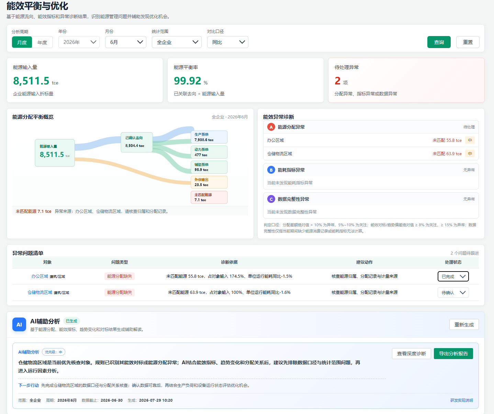

##### 3.3.1.3. 分析条件与平衡指标

###### 3.3.1.3.1. Inputs 输入

| 输入项 | 类型 | 是否必填 | 范围 | 备注 |
| --- | --- | --- | --- | --- |
| 分析周期 | 单选组 | 是 | 月度/年度 |  |
| 年份 | 年份选择器 | 是 | 当前分析年度 | 当前页面固定展示 2026 年；历史年度切换暂未接入 |
| 月份 | 月份选择器 | 否 | 1-12月 | 月度时必填 |

###### 3.3.1.3.2. Process 处理

1. 进入“能碳资产运营与策略 > 能效平衡与优化”页面，设置分析周期和月份；年份沿用页面当前分析年度，当前实现为 2026 年。能源平衡概览固定为全企业视角，能效指标固定采用同比口径。

2. 修改筛选条件后点击“查询”才应用新条件；切换月度/年度时同步控制月份筛选的显示。

3. 按分析周期读取统一数据快照：能源分配数据来自能流分析，能耗指标来自能耗指标计算，能效对标数据来自能效对比；月度模式使用所选月份，年度模式使用全年数据。

4. 点击“查询”后才应用当前筛选条件，三项 KPI、能源分配平衡概览、能效异常诊断、异常问题清单和 AI 分析同步刷新；点击“重置”恢复月度、2026 年、6 月、全企业、同比。

###### 3.3.1.3.3. Output 输出

输出三项 KPI：

能源输入量：全企业范围内的能源输入折标量。

能源平衡率 = 已确认去向 ÷ 能源输入量 × 100%；已确认去向 = 终端有效利用量 + 回收利用量 + 外部输出量；未匹配能源量 = max(能源输入量 - 已确认去向, 0)。

待处理对象：当前规则命中的、需要跟进的用能对象数量；全企业能源分配差额单独在左侧概览中提示，不归因到具体用能对象。

###### 3.3.1.3.4. Usage Limitation 约束与限制

- 能源平衡为管理口径，不等同于专业工艺热平衡；未匹配能源用于提示尚未明确归属或分配的管理差额，不直接等同于物理损失、转换损失或设备效率损失。
- AI结论用于提示排查方向，最终需结合现场确认。
##### 3.3.1.4. 能源平衡概览与能效异常诊断

###### 3.3.1.4.1. Inputs 输入

| 输入项 | 类型 | 是否必填 | 范围 | 备注 |
| --- | --- | --- | --- | --- |
| 页面筛选条件 | 系统参数 | 否 | 承接当前页面已选择的时间、范围和对象 | 展示类功能无独立输入 |

###### 3.3.1.4.2. Process 处理

1. 在当前筛选条件下读取能源分配平衡概览和能效异常诊断结果。

2. 右侧能效与能耗指标诊断摘要按 A 能效对标诊断、B 能耗指标变化、C 数据完整性问题分组，展示重点能效指标的当前值、同比/环比、对标结果和数据状态；能源分配仅保留全企业级提示。

3. 能源分配平衡概览以能源输入量为起点，展示已确认去向、生产系统、动力系统、辅助系统、外供输出和未匹配能源之间的管理关系。

4. 点击诊断摘要中的 A/B/C 分组详情，打开对应类型的诊断弹窗：A 展示目标/对标证据，B 展示同比/环比和月度趋势，C 展示数据缺失事实。异常问题清单负责建议动作和处理状态；弹窗不提供能流分析入口，能流分析仅由左侧能源分配平衡区域承接。复杂趋势、分项明细和来源追溯通过能耗指标/能效对标页面查看。

###### 3.3.1.4.3. Output 输出

输出三类异常诊断结果。每条结果至少包括对象、异常类型、触发值或诊断依据、优先级和待处理状态。

###### 3.3.1.4.4. Usage Limitation 约束与限制

- 能源分配：一期仅计算全企业级未匹配能源，不生成对象级能源分配异常；对象级差额率规则待对象级去向数据完整后启用。
- 能耗指标异常：平台默认筛查带为不利偏差 ≥ 15% 高风险、≥ 8% 关注；A 类目标超标本身仍是不达标，未配置对标目标不直接判定为对标异常。B 类月度同比/环比单月达到 8%–15% 时先作为趋势事实，连续两个周期达到 8% 才进入待处理；单月达到 15% 可直接进入高风险。实际应用应结合行业限额、企业目标、产量/工况归一化和数据质量调整。
- 数据完整性异常：当前期间没有能源消费记录，或能耗指标缺少能源数据分子、运营数据分母，或月度指标数据不完整。未配置对标目标不属于数据完整性异常。
##### 3.3.1.5. 异常问题清单与详情

###### 3.3.1.5.1. Inputs 输入

| 输入项 | 类型 | 是否必填 | 范围 | 备注 |
| --- | --- | --- | --- | --- |
| 用能单元 | 系统参数 | 是 | 当前列表选中对象 |  |

###### 3.3.1.5.2. Process 处理

1. 在当前筛选条件下查看规则命中的异常问题清单。

2. 选择目标对象或结果，执行查看详情、更新处理状态或跨模块跳转操作。

3. 展示“异常问题清单”，统一列出当前规则命中的用能单元问题和企业级能源分配问题；表格字段为对象、问题来源、问题类型、诊断依据、建议动作和处理状态。企业级能源分配异常对象固定为“全企业”，不得归因到具体用能单元。处理状态支持“待确认”“待处理”“已完成”，状态变更后保留在当前页面上下文中。

4. 诊断依据可引用未匹配能源、能源分配状态、能效对标偏差、能耗指标同比/环比以及数据完整性状态；建议动作仅用于安排核查或发现优化机会，不代表已确认现场原因或已生成节能方案。

###### 3.3.1.5.3. Output 输出

详情弹窗至少展示分析期间、用能单元类型和与当前 A/B/C 类型对应的事实证据：A 为目标/对标偏差，B 为同比/环比及月度趋势，C 为缺失数据说明。弹窗保留能效对标、能耗指标或数据补录入口，不重复展示能源分配状态、异常问题清单中的建议动作、处理状态或额外优先级标签；摘要文案必须区分数据事实和规则判断，不得直接生成确定性现场原因。

###### 3.3.1.5.4. Usage Limitation 约束与限制

- 能源平衡为管理口径，不等同于专业工艺热平衡。
- AI结论用于提示排查方向，最终需结合现场确认。
- 诊断弹窗中的对标偏差、变化率、月度趋势和数据完整性状态必须引用当前筛选条件下的统一数据快照；缺少数据时明确显示“待完善”“指标数据缺失”或“未配置目标”，不得生成确定性异常原因。
##### 3.3.1.6. AI深度分析与行动建议

###### 3.3.1.6.1. Inputs 输入

| 输入项 | 类型 | 是否必填 | 范围 | 备注 |
| --- | --- | --- | --- | --- |
| 当前分析条件和结果 | 系统参数 | 是 | 当前页面上下文 |  |
| 导出格式 | 系统参数 | 否 | HTML 报告/打印或另存为 PDF | 当前页面实际支持下载 HTML，以及浏览器打印或另存为 PDF |

###### 3.3.1.6.2. Process 处理

1. 在当前筛选条件下打开 AI 辅助分析区，或从对象详情进入结构化分析结果。

2. 点击“重新生成”更新当前数据快照对应的 AI 结果；点击“查看研判依据”或“查看深度诊断”查看结构化分析；点击“导出分析报告”进入报告预览，可下载 HTML 或打印/另存为 PDF。

3. 基于能源输入、能源分配、能耗指标、能效对标、同比/环比趋势和当前统计范围生成 AI 辅助分析；规则引擎负责异常识别、阈值判断、优先级和数值计算，AI 仅负责异常原因假设、跨指标解释、核查顺序、优化机会方向和下一步行动建议。

4. AI 分析结果包含核心研判、分析逻辑、证据链、重点异常对象、优先级、建议动作、待核实说明和能力边界；支持导出分析报告，页面摘要与报告使用同一分析结果和数据快照。

###### 3.3.1.6.3. Output 输出

AI 不确认具体设备故障、不直接测算节能量，也不替代现场诊断、专业审计、合规判断或企业最终决策；未匹配能源不包装为物理损失。

###### 3.3.1.6.4. Usage Limitation 约束与限制

- 能源平衡为管理口径，不等同于专业工艺热平衡。
- AI结论用于提示排查方向，最终需结合现场确认。
- 本功能版本边界：一期核心 / P0；研发范围：筛选与统一聚合｜KPI与异常规则｜异常诊断分组｜诊断任务状态｜A/B/C 类型详情弹窗｜跨模块跳转｜AI辅助分析与报告导出。
- AI输出仅作为辅助解释和建议，数值结论必须来源于规则计算或已确认数据。
- 导出内容必须与当前页面筛选条件、任务版本和数据权限一致。
#### 3.3.2. 用能分析与策略推荐

##### 3.3.2.1. Introduce 介绍

综合分析企业能源消费、能源成本、能耗强度和重点用能单元，识别能源结构变化、能耗与成本占比错配及优化优先级，生成可解释的用能管理和节能降碳策略建议。能耗总量、能源构成及明细查询由“能耗查询”承载，本页不重复展示能源消费结构环形图。

##### 3.3.2.2. UI Design UI设计

页面按照“经营结果—核心发现—问题对象—策略建议”的顺序组织，包含分析周期和范围筛选、能耗与成本摘要、能源—成本结构偏差、本期核心发现、重点问题对象与处理优先级、AI分析摘要和报告导出。结构偏差区直接比较各能源品种的能耗占比与企业级成本占比，不再单独重复展示能源成本结构排名；核心发现区按影响程度展示问题依据和建议方向。

图：当前前端原型——用能分析与策略推荐（2026 年 6 月）

##### 3.3.2.3. 分析条件与摘要

###### 3.3.2.3.1. Inputs 输入

| 输入项 | 类型 | 是否必填 | 范围 | 备注 |
| --- | --- | --- | --- | --- |
| 分析周期 | 单选组 | 是 | 月度/年度 |  |
| 年份 | 年份选择器 | 是 | 当前年份及历史年份 |  |
| 月份 | 月份选择器 | 否 | 1-12月 | 月度时必填 |
| 统计范围 | 下拉框 | 是 | 全企业/一级用能单元 |  |

###### 3.3.2.3.2. Process 处理

1. 进入“能碳资产运营与策略 > 用能分析与策略推荐”页面。

2. 设置本功能所需的筛选条件，点击“查询”或切换相应条件。

3. 按周期和范围展示能耗总量、能源成本和适用强度指标。

4. 筛选后页面各区域同步刷新。

###### 3.3.2.3.3. Output 输出

筛选后页面各区域同步刷新。

###### 3.3.2.3.4. Usage Limitation 约束与限制

- 能源成本一期按企业级维护，不强制分摊到用能单元。
- AI建议不承诺确定节能量、成本收益或减排收益。
- 本功能版本边界：一期核心 / P0；研发范围：后端查询｜指标聚合。
##### 3.3.2.4. 能源—成本结构偏差与核心发现

###### 3.3.2.4.1. Inputs 输入

| 输入项 | 类型 | 是否必填 | 范围 | 备注 |
| --- | --- | --- | --- | --- |
| 页面筛选条件 | 系统参数 | 否 | 承接当前页面已选择的时间、范围和对象 | 展示类功能无独立输入 |

###### 3.3.2.4.2. Process 处理

1. 进入“能碳资产运营与策略 > 用能分析与策略推荐”页面。

2. 选择目标对象或结果，执行对应查看或处理操作。

3. 按能源品种计算当前能耗占比，并与企业级能源成本占比进行双系列对照，以“成本占比－能耗占比”的百分点差异识别结构错配。

4. 结合高碳能源依赖、结构错配和重点用能单元集中度，按影响程度形成不超过三条“本期核心发现”，每条包含问题、量化依据和建议方向。

5. 用户点击“查看能耗明细”后，进入“能源监测与分析 > 能耗查询”查看能源构成、消费量及数据来源。

###### 3.3.2.4.3. Output 输出

输出能源品种、能耗占比、企业级成本占比、结构偏差和本期核心发现。无可靠成本分摊时，用能单元成本仅可按明确规则标识为估算值，不得作为实际成本展示。

###### 3.3.2.4.4. Usage Limitation 约束与限制

- 能源成本一期按企业级维护，不强制分摊到用能单元。
- AI建议不承诺确定节能量、成本收益或减排收益。
- 本功能版本边界：一期核心 / P0；研发范围：后端聚合｜图表。
##### 3.3.2.5. 重点单元与AI摘要

###### 3.3.2.5.1. Inputs 输入

| 输入项 | 类型 | 是否必填 | 范围 | 备注 |
| --- | --- | --- | --- | --- |
| 页面筛选条件 | 系统参数 | 否 | 承接当前页面已选择的时间、范围和对象 | 展示类功能无独立输入 |

###### 3.3.2.5.2. Process 处理

1. 进入“能碳资产运营与策略 > 用能分析与策略推荐”页面。

2. 在当前筛选范围和结果已加载的情况下，点击AI分析或导出报告。

3. 识别重点问题对象，按 P1/P2/P3 展示用能单元、主要问题、影响依据和建议动作；基础能耗与估算成本作为对象的辅助说明，不再作为表格主体。

4. AI不承诺确定收益，摘要与当前筛选数据一致。

###### 3.3.2.5.3. Output 输出

AI不承诺确定收益，摘要与当前筛选数据一致。

###### 3.3.2.5.4. Usage Limitation 约束与限制

- 能源成本一期按企业级维护，不强制分摊到用能单元。
- AI建议不承诺确定节能量、成本收益或减排收益。
- 本功能版本边界：一期简化 / P1；研发范围：排名计算｜AI调用。
- AI输出仅作为辅助解释和建议，数值结论必须来源于规则计算或已确认数据。
##### 3.3.2.6. 分析报告

###### 3.3.2.6.1. Inputs 输入

| 输入项 | 类型 | 是否必填 | 范围 | 备注 |
| --- | --- | --- | --- | --- |
| 当前分析条件和结果 | 系统参数 | 是 | 当前页面上下文 |  |
| 导出格式 | 系统参数 | 否 | Word/报告文件 |  |

###### 3.3.2.6.2. Process 处理

1. 进入“能碳资产运营与策略 > 用能分析与策略推荐”页面。

2. 选择当前记录或结果，点击查看、详情、生成或导出操作。

3. 导出当前范围的能耗、成本和策略分析报告。

4. 报告数值来自规则结果，AI仅生成文字解释。

###### 3.3.2.6.3. Output 输出

报告数值来自规则结果，AI仅生成文字解释。

###### 3.3.2.6.4. Usage Limitation 约束与限制

- 能源成本一期按企业级维护，不强制分摊到用能单元。
- AI建议不承诺确定节能量、成本收益或减排收益。
- 本功能版本边界：一期简化 / P1；研发范围：报告导出。
- 导出内容必须与当前页面筛选条件、任务版本和数据权限一致。
#### 3.3.3. 用能与碳排放预算管理

##### 3.3.3.1. Introduce 介绍

通过能源预算、碳排放预算两个Tab配置年度目标，监控累计执行、预测全年结果、识别风险，并提供预算调整和AI辅助建议。

##### 3.3.3.2. UI Design UI设计

页面包含年度和范围筛选、能源/碳排放Tab、目标预算配置、执行摘要、累计趋势与目标线、滚动预测、预算执行分析表、风险和AI建议。

图：当前前端原型——用能与碳排放预算管理（能源预算/碳排放预算）

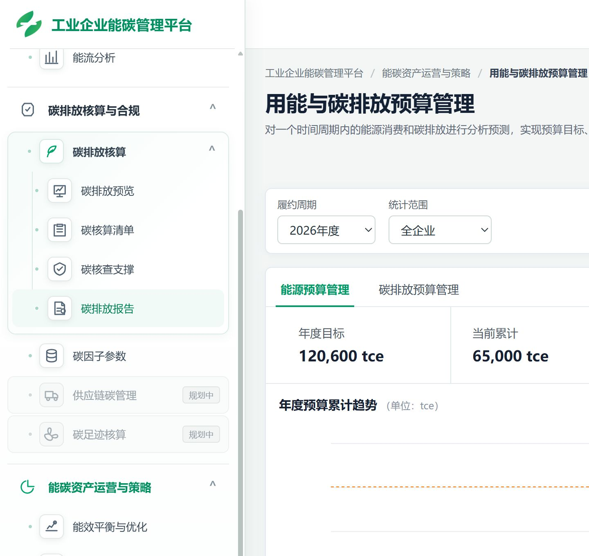

##### 3.3.3.3. 双Tab与目标配置

###### 3.3.3.3.1. Inputs 输入

| 输入项 | 类型 | 是否必填 | 范围 | 备注 |
| --- | --- | --- | --- | --- |
| 预算类型 | Tab/下拉框 | 是 | 能源消费预算/碳排放预算 |  |
| 预算年度 | 年份选择器 | 是 | 当前年份及未来年份 |  |
| 管理范围 | 下拉框 | 是 | 全企业/一级用能单元 |  |
| 年度目标 | 数字输入 | 是 | 大于或等于0 |  |
| 目标单位 | 只读 | 是 | tce或tCO₂e | 随预算类型 |
| 分解方式 | 下拉框 | 是 | 历史趋势/月度平均/自定义 |  |
| 说明 | 多行文本 | 否 | 0-500字符 |  |

###### 3.3.3.3.2. Process 处理

1. 进入“能碳资产运营与策略 > 用能与碳排放预算管理”页面。

2. 设置本功能所需的筛选条件，点击“查询”或切换相应条件。

3. 页面以“能源预算管理”和“碳排放预算管理”双 Tab 展示预算结果；提供管理周期、统计范围、目标预算配置入口，并展示年度目标、当前累计、预计全年、预测偏差和预算执行状态。

4. 同年度、范围和类型仅一个当前有效目标。

###### 3.3.3.3.3. Output 输出

同年度、范围和类型仅一个当前有效目标。

###### 3.3.3.3.4. Usage Limitation 约束与限制

- 能源预算和碳排放预算使用独立数据及单位。
- 企业目标不得自动平均分配为用能单元目标。
- 本功能版本边界：一期核心 / P0；研发范围：复杂表单｜CRUD｜规则校验。
##### 3.3.3.4. 执行摘要与趋势

###### 3.3.3.4.1. Inputs 输入

| 输入项 | 类型 | 是否必填 | 范围 | 备注 |
| --- | --- | --- | --- | --- |
| 页面筛选条件 | 系统参数 | 否 | 承接当前页面已选择的时间、范围和对象 | 展示类功能无独立输入 |

###### 3.3.3.4.2. Process 处理

1. 进入“能碳资产运营与策略 > 用能与碳排放预算管理”页面。

2. 选择目标对象或结果，执行对应查看或处理操作。

3. 展示年度目标、累计实际、预计全年、偏差和目标线。

4. 能源和碳排Tab使用独立数据及单位。

###### 3.3.3.4.3. Output 输出

能源和碳排Tab使用独立数据及单位。

###### 3.3.3.4.4. Usage Limitation 约束与限制

- 能源预算和碳排放预算使用独立数据及单位。
- 企业目标不得自动平均分配为用能单元目标。
- 本功能版本边界：一期核心 / P0；研发范围：后端聚合｜规则计算｜图表。
##### 3.3.3.5. 滚动预测与分析表

| 功能编号 | 研发范围 | 版本 / 优先级 |
| --- | --- | --- |
| AS-03-03 | 预测规则｜后端聚合｜明细表 | 一期简化 / P1 |

###### 3.3.3.5.1. Inputs 输入

| 输入项 | 类型 | 是否必填 | 范围 | 备注 |
| --- | --- | --- | --- | --- |
| 当前预算目标和实际数据 | 系统参数 | 是 | 当前年度与范围 |  |
| 预测依据 | 下拉框/系统参数 | 否 | 历史趋势/生产计划/规则模型 |  |

###### 3.3.3.5.2. Process 处理

1. 进入“能碳资产运营与策略 > 用能与碳排放预算管理”页面。

2. 选择目标对象或结果，执行对应查看或处理操作。

3. 根据实际、生产计划和历史趋势预测全年结果，并按企业和一级单元展示。

4. 预测保留时间和依据；企业目标不自动平均分配。

###### 3.3.3.5.3. Output 输出

预测保留时间和依据；企业目标不自动平均分配。

###### 3.3.3.5.4. Usage Limitation 约束与限制

- 能源预算和碳排放预算使用独立数据及单位。
- 企业目标不得自动平均分配为用能单元目标。
- 本功能版本边界：一期简化 / P1；研发范围：预测规则｜后端聚合｜明细表。
##### 3.3.3.6. 风险预警与AI建议

| 功能编号 | 研发范围 | 版本 / 优先级 |
| --- | --- | --- |
| AS-03-04 | 状态判断｜AI调用 | 一期简化 / P1 |

###### 3.3.3.6.1. Inputs 输入

| 输入项 | 类型 | 是否必填 | 范围 | 备注 |
| --- | --- | --- | --- | --- |
| 风险阈值 | 系统参数/配置 | 是 | 平台默认或企业配置 |  |
| 当前预算结果 | 系统参数 | 是 | 当前分析条件 |  |

###### 3.3.3.6.2. Process 处理

1. 进入“能碳资产运营与策略 > 用能与碳排放预算管理”页面。

2. 在当前筛选范围和结果已加载的情况下，点击AI分析或导出报告。

3. 根据预测偏差识别风险，并生成原因假设和调整建议。

4. AI不自动修改预算目标。

###### 3.3.3.6.3. Output 输出

AI不自动修改预算目标。

###### 3.3.3.6.4. Usage Limitation 约束与限制

- 能源预算和碳排放预算使用独立数据及单位。
- 企业目标不得自动平均分配为用能单元目标。
- 本功能版本边界：一期简化 / P1；研发范围：状态判断｜AI调用。
- AI输出仅作为辅助解释和建议，数值结论必须来源于规则计算或已确认数据。
##### 3.3.3.7. 预算调整留痕

| 功能编号 | 研发范围 | 版本 / 优先级 |
| --- | --- | --- |
| AS-03-05 | 权限｜审计留痕 | 一期预留 / P2 |

###### 3.3.3.7.1. Inputs 输入

| 输入项 | 类型 | 是否必填 | 范围 | 备注 |
| --- | --- | --- | --- | --- |
| 调整后目标 | 数字输入 | 是 | 大于或等于0 |  |
| 调整原因 | 多行文本 | 是 | 1-500字符 |  |
| 附件 | 文件 | 否 | PDF/Excel/Word/图片 |  |

###### 3.3.3.7.2. Process 处理

1. 进入“能碳资产运营与策略 > 用能与碳排放预算管理”页面。

2. 选择目标对象或结果，执行对应查看或处理操作。

3. 按权限调整预算目标，并保留调整前后值、原因、人员和时间。

4. 最新有效目标用于后续分析，历史记录不覆盖。

###### 3.3.3.7.3. Output 输出

最新有效目标用于后续分析，历史记录不覆盖。

###### 3.3.3.7.4. Usage Limitation 约束与限制

- 能源预算和碳排放预算使用独立数据及单位。
- 企业目标不得自动平均分配为用能单元目标。
- 本功能版本边界：一期预留 / P2；研发范围：权限｜审计留痕。
#### 3.3.4. 碳资产管理

##### 3.3.4.1. Introduce 介绍

对企业碳配额和CCER等履约资产进行台账管理，结合排放预测展示履约缺口趋势，并开展新周期履约需求预测和AI辅助建议。

##### 3.3.4.2. UI Design UI设计

页面包含履约周期和资产类型筛选、当前履约状态、资产台账、资产录入与凭证、履约缺口趋势、新周期履约需求预测弹窗、风险和AI报告。

图：当前前端原型——碳资产管理（履约周期与资产台账）

| 原型参考 | AS-04｜以最新高保真原型及前端实现为准 |
| --- | --- |

##### 3.3.4.3. 周期与履约概览

| 功能编号 | 研发范围 | 版本 / 优先级 |
| --- | --- | --- |
| AS-04-01 | 后端聚合｜规则计算 | 一期核心 / P0 |

###### 3.3.4.3.1. Inputs 输入

| 输入项 | 类型 | 是否必填 | 范围 | 备注 |
| --- | --- | --- | --- | --- |
| 履约周期 | 年份/周期选择器 | 是 | 当前及历史履约周期 |  |
| 企业范围 | 下拉框 | 是 | 当前履约主体 |  |
| 资产类型 | 下拉框 | 否 | 全部/配额/CCER |  |

###### 3.3.4.3.2. Process 处理

1. 进入“能碳资产运营与策略 > 碳资产管理”页面。

2. 选择目标对象或结果，执行对应查看或处理操作。

3. 按履约周期展示配额、CCER、预计排放和预计缺口。

4. 周期切换后概览、趋势和台账同步刷新。

###### 3.3.4.3.3. Output 输出

周期切换后概览、趋势和台账同步刷新。

###### 3.3.4.3.4. Usage Limitation 约束与限制

- 一期以企业级履约主体为主要范围。
- 新周期功能定位为内部履约需求预测，不模拟主管部门配额分配。
- 本功能版本边界：一期核心 / P0；研发范围：后端聚合｜规则计算。
##### 3.3.4.4. 资产台账与录入

| 功能编号 | 研发范围 | 版本 / 优先级 |
| --- | --- | --- |
| AS-04-02 | CRUD｜规则计算｜权限 | 一期核心 / P0 |

###### 3.3.4.4.1. Inputs 输入

| 输入项 | 类型 | 是否必填 | 范围 | 备注 |
| --- | --- | --- | --- | --- |
| 资产类型 | 单选组 | 是 | 配额/CCER |  |
| 所属周期 | 年份/周期 | 是 | 当前及未来周期 |  |
| 资产数量 | 数字输入 | 是 | 大于0 |  |
| 来源类型 | 下拉框 | 是 | 分配/购买/结转/其他 |  |
| 取得日期和有效期 | 日期 | 是 | 合法日期范围 |  |
| 凭证 | 文件 | 否 | PDF/图片/Excel/Word |  |

###### 3.3.4.4.2. Process 处理

1. 进入“能碳资产运营与策略 > 碳资产管理”页面。

2. 点击相应新增、编辑、配置或录入入口，填写并校验输入项。

3. 维护配额和CCER资产、数量、来源、有效期、状态及变动。

4. 新增或编辑后按期初+增加-减少计算余额。

###### 3.3.4.4.3. Output 输出

新增或编辑后按期初+增加-减少计算余额。

###### 3.3.4.4.4. Usage Limitation 约束与限制

- 一期以企业级履约主体为主要范围。
- 新周期功能定位为内部履约需求预测，不模拟主管部门配额分配。
- 本功能版本边界：一期核心 / P0；研发范围：CRUD｜规则计算｜权限。
##### 3.3.4.5. 详情、凭证与缺口趋势

| 功能编号 | 研发范围 | 版本 / 优先级 |
| --- | --- | --- |
| AS-04-03 | 文件管理｜明细查询｜图表 | 一期核心 / P1 |

###### 3.3.4.5.1. Inputs 输入

| 输入项 | 类型 | 是否必填 | 范围 | 备注 |
| --- | --- | --- | --- | --- |
| 资产记录 | 系统参数 | 是 | 当前选中记录 |  |

###### 3.3.4.5.2. Process 处理

1. 进入“能碳资产运营与策略 > 碳资产管理”页面。

2. 选择目标对象或结果，执行对应查看或处理操作。

3. 查看资产来源、变动历史、凭证和履约缺口趋势。

4. 趋势使用碳核算结果和内部预测数据。

###### 3.3.4.5.3. Output 输出

趋势使用碳核算结果和内部预测数据。

###### 3.3.4.5.4. Usage Limitation 约束与限制

- 一期以企业级履约主体为主要范围。
- 新周期功能定位为内部履约需求预测，不模拟主管部门配额分配。
- 本功能版本边界：一期核心 / P1；研发范围：文件管理｜明细查询｜图表。
- 文件类型、大小、权限和失败重试规则由统一文件服务控制。
##### 3.3.4.6. 新周期履约需求预测

| 功能编号 | 研发范围 | 版本 / 优先级 |
| --- | --- | --- |
| AS-04-04 | 预测规则｜复杂弹窗｜版本留痕 | 一期简化 / P0 |

###### 3.3.4.6.1. Inputs 输入

| 输入项 | 类型 | 是否必填 | 范围 | 备注 |
| --- | --- | --- | --- | --- |
| 预测周期 | 年份/周期选择器 | 是 | 下一履约周期 |  |
| 履约主体/范围 | 下拉框 | 是 | 企业级履约主体 |  |
| 历史基准排放 | 只读/数字 | 是 | 最近正式排放结果 |  |
| 预计业务变化 | 百分比输入 | 是 | 合理业务情景 |  |
| 预计减排量 | 数字输入 | 否 | 大于或等于0，tCO₂e |  |
| 预计可用资产 | 数字输入/情景值 | 否 | 配额及允许使用的CCER |  |

###### 3.3.4.6.2. Process 处理

1. 进入“能碳资产运营与策略 > 碳资产管理”页面。

2. 选择目标对象或结果，执行对应查看或处理操作。

3. 预测下一周期预计排放、可用资产和履约缺口。

4. 历史排放、业务变化和减排计划形成内部预测，不代表主管部门配额分配。

###### 3.3.4.6.3. Output 输出

历史排放、业务变化和减排计划形成内部预测，不代表主管部门配额分配。

###### 3.3.4.6.4. Usage Limitation 约束与限制

- 一期以企业级履约主体为主要范围。
- 新周期功能定位为内部履约需求预测，不模拟主管部门配额分配。
- 本功能版本边界：一期简化 / P0；研发范围：预测规则｜复杂弹窗｜版本留痕。
##### 3.3.4.7. 风险预警、AI与报告

| 功能编号 | 研发范围 | 版本 / 优先级 |
| --- | --- | --- |
| AS-04-05 | 状态判断｜AI调用｜报告导出 | 一期简化 / P1 |

###### 3.3.4.7.1. Inputs 输入

| 输入项 | 类型 | 是否必填 | 范围 | 备注 |
| --- | --- | --- | --- | --- |
| 当前履约结果 | 系统参数 | 是 | 当前周期和资产数据 |  |
| 风险阈值 | 系统参数/配置 | 是 | 平台默认或企业配置 |  |
| 导出格式 | 系统参数 | 否 | Word/报告文件 |  |

###### 3.3.4.7.2. Process 处理

1. 进入“能碳资产运营与策略 > 碳资产管理”页面。

2. 选择当前记录或结果，点击查看、详情、生成或导出操作。

3. 根据预计缺口提示风险并生成资产管理建议和报告。

4. AI不模拟主管部门配额分配，也不自动发起交易。

###### 3.3.4.7.3. Output 输出

AI不模拟主管部门配额分配，也不自动发起交易。

###### 3.3.4.7.4. Usage Limitation 约束与限制

- 一期以企业级履约主体为主要范围。
- 新周期功能定位为内部履约需求预测，不模拟主管部门配额分配。
- 本功能版本边界：一期简化 / P1；研发范围：状态判断｜AI调用｜报告导出。
- AI输出仅作为辅助解释和建议，数值结论必须来源于规则计算或已确认数据。
- 导出内容必须与当前页面筛选条件、任务版本和数据权限一致。
### 3.4. 数据管理

数据管理是通用能碳平台业务数据底座，包含用能单元、能源品种、能源数据、运营数据和重点设备五个子模块。数据通过稳定ID和引用关系支撑能源分析、碳核算及资产策略。

#### 3.4.1. 用能单元

##### 3.4.1.1. Introduce 介绍

维护企业一级用能单元及二级工序、系统或区域的树形主数据，为能源数据、运营数据、重点设备、能源回收、转换与外供记录提供统一的数据归属，并为能耗查询、能耗强度指标、能效对标及能流分析提供数据归属、汇总层级和分析对象基础。 能流分析基于企业、一级和二级用能单元的能源记录进行分层汇总；用能单元本身不维护能源转换场景或能流关系。能源转换、回收利用及外供等业务关系，不在本页面配置；由“能源数据 > 能源回收、转换与外供”按实际转换系统和业务记录维护。

用能单元使用稳定的 energyUnitId 作为系统关联键；名称仅用于页面展示，不作为跨模块关联依据。二级用能单元通过 parentEnergyUnitId 关联所属一级用能单元。

用能单元支持同级展示顺序维护：一级用能单元按企业内展示顺序排列；二级用能单元按各自父级下的展示顺序排列。系统使用 displayOrder 保存同级顺序，仅影响树形表格及相关选择控件的展示顺序，不改变 energyUnitId、parentEnergyUnitId、能源数据归属、运营数据归属、重点设备归属或能流计算结果。

一期仅支持两级结构：

- 一级用能单元：生产单元、公辅系统、建筑/区域等；
- 二级用能单元：一级单元下的工序、系统或区域；
- 不支持第三级及更深层级。
##### 3.4.1.2. UI Design UI设计

页面采用单栏树形表格，不设置独立左侧组织树。页面包含：

- 页面标题与一期层级说明；
- 关键字、年度、单元类型筛选区；
- 查询、重置操作；
- 新增一级用能单元按钮；
- 按“生产类/非生产类”分组展示的用能单元树形表格；
- 新增一级、添加下级、编辑、删除确认/删除拦截弹窗；
- 未筛选时支持直接拖拽表格行调整同级展示顺序；一级用能单元操作包括：添加下级、编辑、删除；二级用能单元操作包括：编辑、删除。
表格字段包括：用能单元、层级、单元类型、操作。

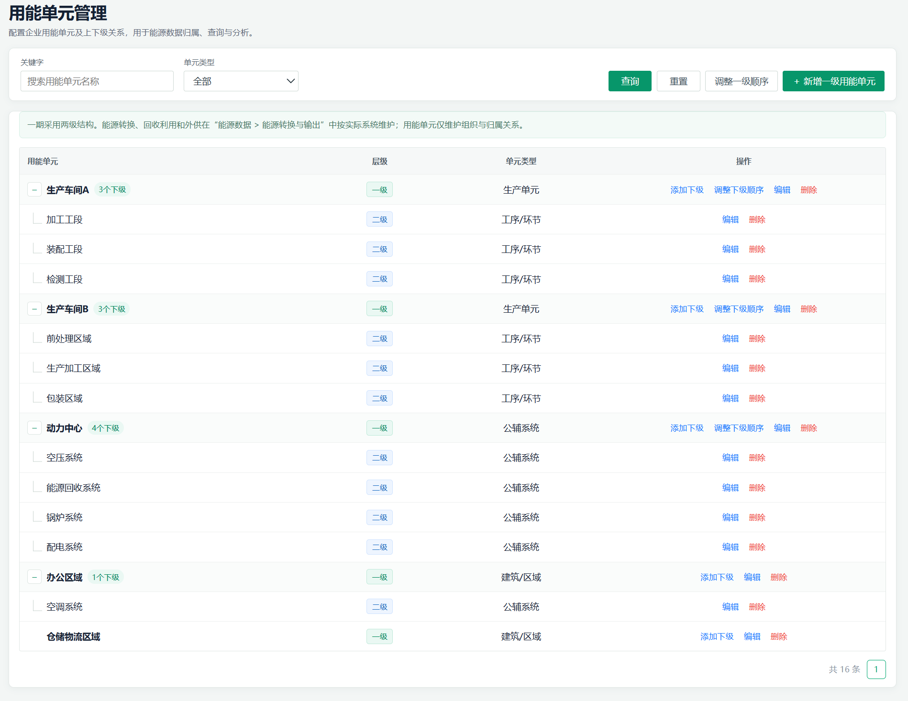

##### 3.4.1.3. 树形结构与查询

###### 3.4.1.3.1. Inputs 输入

| 输入项 | 类型 | 是否必填 | 范围 | 备注 |
| --- | --- | --- | --- | --- |
| 关键字 | 搜索框 | 否 | 0-50字符 | 按用能单元名称模糊搜索 |
| 年度 | 下拉框 | 否 | 当前年度及前两年 | 当前原型提供年度选择控件；用能单元树为主数据列表，年度不改变当前树形数据结果。 |
| 单元类型 | 下拉框 | 否 | 生产单元/工序/环节/公辅系统/建筑/区域/其他 | 选项来自单元类型字典 |
| 查询 | 按钮 | 否 | - | 按当前筛选条件刷新列表 |
| 重置 | 按钮 | 否 | - | 清空筛选条件并恢复完整列表 |

###### 3.4.1.3.2. Process 处理

1. 用户进入“数据管理 > 用能单元”页面。

2. 系统读取当前组织下的一级、二级用能单元。

3. 系统以树形表格展示一级用能单元及其下级工序、系统或区域。

4. 用户输入关键字、选择单元类型后，点击“查询”更新列表。

5. 用户点击“重置”后，系统清空筛选条件并恢复完整树形列表。

6. 用户可展开或收起存在下级记录的节点；一期通常由一级用能单元承载下级工序、系统或区域。页面按生产类、非生产类分组展示，生产类包括生产单元和工序/环节，其余类型归入非生产类。

7. 当二级节点命中关键字或单元类型筛选条件时，系统保留其所属一级用能单元作为必要父级上下文，并自动展示匹配的层级路径。

8. 查询与重置应真实更新列表结果，不得仅提示操作成功。

###### 3.4.1.3.3. Output 输出

- 展示当前组织下的一级、二级用能单元树；
- 展示各单元的层级、类型；
- 支持展示、收起、名称搜索和单元类型筛选；
- 一级节点可显示下级数量
###### 3.4.1.3.4. Usage Limitation 约束与限制

- 一期仅支持一级和二级用能单元，不支持第三级。
- 当前页面默认绑定已选择的组织，不额外提供组织切换控件。
- 一级、二级是正式数据层级，不仅是页面缩进关系。
- 一级分配数据与二级利用数据在分析页面按不同层级使用，不得重复累计为企业总量。
##### 3.4.1.4. 新增与编辑

###### 3.4.1.4.1. Inputs 输入

| 输入项 | 类型 | 是否必填 | 范围 | 备注 |
| --- | --- | --- | --- | --- |
| 单元类型 | 下拉框/系统默认展示 | 是 | 按新增或编辑场景确定 | 新增一级时，用户通过下拉框选择：生产单元、公辅系统、建筑/区域、其他。 添加下级时，系统根据所属一级用能单元类型自动带出默认类型，默认不展示下拉框；用户点击“修改类型”后，才展示与当前上级匹配的受限选项。 上级为生产单元时，默认“工序/环节”；上级为公辅系统时，默认“公辅系统”；上级为建筑/区域时，默认“建筑/区域”；上级为其他时，默认“其他”。 用户可点击“恢复默认”，恢复系统自动带出的类型。 编辑时保留单元类型下拉选择。层级用于表达父子归属和汇总关系，单元类型用于表达业务属性。 |
| 用能单元名称 | 文本框 | 是 | 当前原型为非空文本 | 同一父级范围内唯一；名称仅用于展示。 |
| 备注 | 多行文本 | 否 | 当前原型为可选文本 | 记录补充说明。 |
| 所属单元 | 只读文本 | 添加下级时必填 | 当前选中一级单元 | 新增一级时不展示；添加下级时自动带出，不允许修改 |
| 所属层级 | 只读文本 | 是 | 一级/二级 | 新增一级和编辑时不作为独立表单字段展示；添加下级时，系统在弹窗上下文区域自动展示所属单元及所属层级“二级”，不可修改。 |

###### 3.4.1.4.2. Process 处理

1. 用户点击“新增一级用能单元”，系统打开新增一级用能单元弹窗。

2. 用户选择单元类型，填写用能单元名称、备注。

3. 用户在某条一级记录上点击“添加下级”，系统打开添加下级用能单元弹窗。

4. 系统自动带出所属单元和所属层级“二级”，用户不可修改。

5. 系统根据所属一级用能单元的单元类型，自动带出二级用能单元默认类型。

6. 默认状态下，单元类型以“系统默认 + 类型名称”形式展示，用户无需选择。

7. 用户存在例外业务场景时，可点击“修改类型”；系统仅展示与当前上级类型匹配的候选类型。

8. 用户可点击“恢复默认”，撤销本次类型调整并恢复系统默认类型。

9. 系统校验必填项、同父级名称唯一性、层级限制及父子关系。

10. 校验通过后保存；新增一级时生成稳定的 energyUnitId，新增下级时写入对应的 parentEnergyUnitId。

11. 保存成功后，树形表格即时刷新；新增下级记录展示在对应父级下。

12. 用户点击“编辑”后，系统带出当前记录的类型、名称和备注。

13. 编辑时允许修改类型、名称和备注；不允许修改父级及层级。

14. 用户取消新增或编辑时，不保存本次填写内容。

###### 3.4.1.4.3. Output 输出

- 新增一级用能单元；
- 在指定一级单元下新增二级单元；
- 更新既有单元基础信息；
- 更新后的名称自动同步展示至关联页面；
- 名称变更不影响能源数据、运营数据、重点设备和能源回收、转换与外供记录的既有关联。
- 新增下级时自动形成与上级类型相匹配的默认业务类型；
###### 3.4.1.4.4. Usage Limitation 约束与限制

- 一期仅支持两级；二级节点不提供“添加下级”操作。
- 新增下级不得跨父级挂接。
- 同一父级下不允许存在同名用能单元；不同父级下允许存在同名二级单元。
- 用能单元名称变更不影响能源数据、运营数据、重点设备和能源转换记录，因为关联使用energyUnitId。
- 不设置泛化status字段；历史数据已引用的单元通过删除拦截保护。
- 当前功能版本边界：一期核心 / P0；研发范围：CRUD｜表单校验｜层级关系维护。
- 添加下级时，单元类型候选项必须受所属一级用能单元类型约束；不得默认展示全部二级类型
- 默认类型仅用于简化录入，不改变 energyUnitId、parentEnergyUnitId、层级关系及跨模块数据引用。
##### 3.4.1.5. 同级顺序调整

###### 3.4.1.5.1. Inputs 输入

| 输入项 | 类型 | 是否必填 | 范围 | 备注 |
| --- | --- | --- | --- | --- |
| 可拖拽用能单元行 | 表格行 | 否 | 未设置关键字和单元类型筛选时的一级、二级用能单元 | 拖拽到同级目标行调整展示顺序；存在筛选条件时不启用拖拽。 |

###### 3.4.1.5.2. Process 处理

1. 用户在未设置关键字和单元类型筛选时，按住用能单元表格整行开始拖拽。

2. 用户将行拖拽到同一父级的目标用能单元行，系统校验源行和目标行属于同级。

3. 跨父级拖拽不执行排序，并提示只能在同级用能单元之间调整顺序。

4. 校验通过后，系统按拖拽后的同级列表顺序更新各记录的 displayOrder，并刷新列表。

5. 排序不改变父子关系、稳定 ID、能源数据归属或能流计算结果。

###### 3.4.1.5.3. Output 输出

- 支持通过拖拽调整企业一级用能单元的展示顺序；
- 支持通过拖拽调整同一父级下二级用能单元的展示顺序；
- 新增一级或二级用能单元默认追加至对应同级列表末尾；
- 排序更新后，不改变任何用能单元的稳定 ID、父子关系及跨模块引用。
###### 3.4.1.5.4 Usage Limitation 约束与限制

- 仅允许在同级范围内调序，不支持跨父级移动二级用能单元。
- 调序不改变 parentEnergyUnitId、unitLevel、单元类型及名称。
- 调序不代表工艺流程配置，也不表达能源流向、工艺前后关系或设备运行依赖。
- 若后续需要维护正式工艺路线、工序依赖或生产流程，应新增独立工艺关系模型，不复用 displayOrder。
- 一期采用表格行直接拖拽排序，不提供独立的上移/下移按钮或排序弹窗。
##### 3.4.1.6. 删除拦截

###### 3.4.1.6.1. Inputs 输入

| 输入项 | 类型 | 是否必填 | 范围 | 备注 |
| --- | --- | --- | --- | --- |
| 用能单元 | 系统参数 | 是 | 当前选中记录 | 使用 energyUnitId 作为删除校验对象 |
| 删除确认 | 确认框 | 条件必填 | 确认/取消 | 仅在不存在下级和业务引用时展示 |

###### 3.4.1.6.2. Process 处理

1. 用户在列表操作列点击“删除”。

2. 系统检查当前用能单元是否存在下级用能单元。

3. 系统检查当前用能单元是否被能源数据、运营数据、重点设备等业务数据引用。

4. 存在下级用能单元或业务引用时，系统阻止删除，并展示“存在以下关联内容，为保证历史数据和分析结果完整，暂不支持删除”的说明及关联类型、数量。

5. 用户关闭拦截弹窗后不修改数据；需先处理关联内容后才能再次尝试删除。

6. 删除拦截弹窗展示当前检测到的关联类型及数量，不展示引用记录名称或跨页面跳转入口。

7. 不存在下级和业务引用时，弹出二次确认框。

8. 用户确认后删除记录并刷新树形表格；取消则不修改数据。

###### 3.4.1.6.3. Output 输出

- 返回可删除、不可删除的明确结果；
- 不可删除时展示阻断说明，并列出当前检测到的下级用能单元、能源消费数据、运营数据、重点设备档案和能源流转关系数量。
- 可删除时从当前组织用能单元列表中移除记录；
- 删除成功后，不影响其他用能单元的层级关系；仅允许删除不存在下级及任何业务引用的记录。
###### 3.4.1.6.4. Usage Limitation 约束与限制

- 一期采用“无引用可物理删除、有引用禁止删除”的规则，不采用逻辑删除或停用流程。
- 存在下级用能单元时不得删除父级。
- 不得因删除用能单元导致已有关联能源数据、运营数据、设备或转换记录失去归属。
- 跨模块引用均通过 energyUnitId 建立，不依赖用能单元名称。
- 删除校验必须覆盖当前正式使用的“能源回收、转换与外供”数据来源，而非仅校验历史转换关系表；转换单元、回收来源单元均应纳入引用检查。
#### 3.4.2. 能源品种

##### 3.4.2.1. Introduce 介绍

维护当前组织使用的能源品种主数据，包括能源分析类别、能源品种、计量单位、折标系数、折标单位和备注，为能源数据、能源成本、重点设备及能源回收、转换与外供提供统一引用基础。

能源品种使用稳定的 energyTypeId 作为跨模块关联键；能源品种名称仅用于展示。新增时支持从预置能源中选择，也支持新增自定义能源品种。

##### 3.4.2.2. UI Design UI设计

页面包含年度、关键字、能源分析类别筛选区，以及查询、重置、新增能源品种按钮；支持新增、编辑、删除确认及删除引用拦截。年度用于当前页面的业务年度上下文，能源品种主数据本身不按年度生成多版本列表。

新增弹窗支持按能源分析类别选择系统预置能源品种，或选择“其他（自定义）”后录入自定义能源品种及其参数。

表格字段包括：能源分析类别、能源品种、计量单位、折标系数、折标单位、操作。能源回收品种由“能源回收、转换与外供”页面维护和使用，不在本页面的能源品种列表及分析类别筛选项中展示。

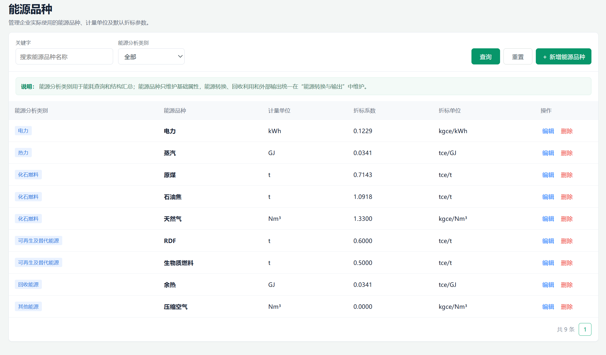

##### 3.4.2.3. 能源品种筛选与新增

###### 3.4.2.3.1. Inputs 输入

| 输入项 | 类型 | 是否必填 | 范围 | 备注 |
| --- | --- | --- | --- | --- |
| 年度 | 下拉框 | 是 | 当前年度及历史年度 | 作为当前页面业务年度上下文；能源品种主数据不按年度拆分版本 |
| 关键词 | 搜索框 | 否 | 0-50字符 | 按能源品种名称模糊筛选 |
| 能源分析类别 | 下拉框 | 否 | 电力 / 热力 / 化石燃料 / 可再生及替代能源 / 其他能源 | 用于能耗查询和结构汇总的分组维度；回收能源由独立页面维护，不在本页展示 |
| 新增能源品种 | 主按钮 | 否 | - | 打开新增能源品种弹窗 |
| 查询 | 按钮 | 否 | - | 按当前年度、关键字和能源分析类别刷新列表 |
| 重置 | 按钮 | 否 | - | 清空条件并恢复完整列表 |

###### 3.4.2.3.2. Process 处理

1. 用户进入“数据管理 > 能源品种”页面。

2. 系统展示当前组织已维护的能源品种列表。

3. 用户填写关键字、选择能源分析类别后点击“查询”，系统按当前条件刷新列表；用户点击“重置”，系统清空筛选条件并恢复完整列表。筛选条件变更本身不自动触发查询。

4. 用户点击“新增能源品种”，选择能源分析类别。

5. 用户可从该类别下的预置能源品种选择；选择后系统自动带出计量单位、折标系数和折标单位。

6. 用户选择“其他（自定义）”时，手工填写能源品种名称、计量单位、折标系数、折标单位和备注。

7. 校验能源品种名称唯一性后保存，并刷新列表。

###### 3.4.2.3.3. Output 输出

展示当前组织已维护的能源品种及其能源分析类别、计量单位、折标系数和折标单位；新增预置能源时自动带出对应参数，新增自定义能源时保存用户填写的参数。

###### 3.4.2.3.4. Usage Limitation 约束与限制

- 页面当前仅展示非回收能源品种；回收能源来源、转换产出及外供关系统一在“能源回收、转换与外供”页面维护，本页不重复维护或展示。

##### 3.4.2.4. 自定义能源与参数维护

###### 3.4.2.4.1. Inputs 输入

| 输入项 | 类型 | 是否必填 | 范围 | 备注 |
| --- | --- | --- | --- | --- |
| 能源分析类别 | 下拉框 | 是 | 分析类别字典 | 切换类别后刷新可选预置能源 |
| 能源品种 | 下拉框 | 是 | 当前分析类别下的预置能源 | 选择预置项后自动带出参数 |
| 自定义能源品种名称 | 文本框 | 条件必填 | 1-50字符 | 仅选择“其他（自定义）”时展示；当前组织内唯一 |
| 计量单位 | 文本框 | 是 | 单位字典或规范单位 | 预置能源自动带出且只读；自定义能源允许填写 |
| 折标系数 | 数字输入 | 是 | 大于等于0 | 预置能源自动带出计量单位、折标系数和折标单位；其中计量单位、折标单位只读，折标系数允许按企业实际维护。自定义能源可维护。折标系数为 0 时，表示当前不参与折标计算或暂未配置折标参数，具体业务说明可在备注中填写。 |
| 折标单位 | 文本框 | 是 | 与计量单位兼容 | 预置能源自动带出且只读；自定义能源允许填写 |
| 备注 | 多行文本 | 否 | 0-200字符 | 补充说明 |

###### 3.4.2.4.2. Process 处理

1. 进入“数据管理 > 能源品种”页面。

2. 点击相应新增、编辑、配置或录入入口，填写并校验输入项。

3. 用户可新增自定义能源，并维护计量单位、折标系数、折标单位和备注。

4.用户选择预置能源后，系统自动带出默认参数；用户可在不改变能源品种关联键的前提下维护折标系数及备注。选择“其他（自定义）”后，才允许录入自定义能源名称、计量单位和折标单位。

5. 编辑能源品种时，系统保留原 energyTypeId，关联的能源数据、能源成本、重点设备及能源回收、转换与外供记录不因名称修改而失效。

###### 3.4.2.4.3. Output 输出

保存新增或编辑后的能源品种基础属性，并供能源数据、能源成本、重点设备及能源回收、转换与外供页面按 energyTypeId 引用。

###### 3.4.2.4.4. Usage Limitation 约束与限制

- 一期不提供折标系数历史版本查询、按历史版本回溯计算或版本切换功能；如后续纳入该能力，需补充生效时间、版本号及能源记录参数快照规则。
##### 3.4.2.5. 引用校验与删除保护

###### 3.4.2.5.1. Inputs 输入

| 输入项 | 类型 | 是否必填 | 范围 | 备注 |
| --- | --- | --- | --- | --- |
| 能源品种 | 系统参数 | 是 | 当前选中记录 | 使用 energyTypeId 执行引用校验 |
| 删除确认 | 确认框 | 条件必填 | 确认/取消 | 仅在不存在业务引用时展示 |

###### 3.4.2.5.2. Process 处理

1.用户在能源品种列表中点击“删除”。

2.系统检查当前能源品种是否被以下业务数据引用：

- 能源数据；
- 能源成本；
- 重点设备的主要能源品种；
- 能源回收、转换与外供记录的投入或产出能源品种。
3. 存在业务引用时，系统阻止删除，并展示引用类型、引用数量及“去处理”入口；用户可跳转至能源数据、能源成本、重点设备或能源回收、转换与外供页面处理引用，不执行删除。

4.不存在业务引用时，系统展示二次确认弹窗。

5.存在业务引用时，用户可选择“停用该品种”；停用后保留历史业务数据和 energyTypeId，能源品种在列表中标记为“已停用”。

6.不存在业务引用时，用户确认后物理删除能源品种；取消后不发生变化。

###### 3.4.2.5.3. Output 输出

存在业务引用时返回删除拦截信息，并支持查看引用去向或停用当前能源品种；不存在业务引用时删除当前能源品种，并刷新能源品种列表。

###### 3.4.2.5.4. Usage Limitation 约束与限制

- 已被业务记录引用的能源不得物理删除。
- 删除拦截弹窗展示跨模块引用类型和引用数量，并提供反向跳转入口；当前版本不提供引用记录的进一步明细查询。
#### 3.4.3. 重点设备

##### 3.4.3.1. Introduce 介绍

维护企业重点设备基础档案和所属用能单元，为设备能源数据维护、设备用能分析和设备级能效对标提供主数据基础。设备能源数据统一在“能源数据 > 重点设备”中维护。重点设备不等同于企业全量设备台账，仅维护具有显著用能、独立计量条件、能效分析或节能优化价值的设备；同类小型设备可按系统或设备组归集管理。

##### 3.4.3.2. UI Design UI设计

页面包含关键字、一级用能单元、具体用能单元、能源分析类别和主要能源品种查询，支持设备档案新增、编辑、设备能源数据维护、删除及删除保护。新增、编辑采用分组表单布局，分为“设备信息”“归属信息”“备注”三个区域。设备信息支持设备名称、设备类型和主要能源品种填写；归属信息按“归属层级 → 所属一级用能单元 → 所属用能单元”的顺序连续填写，不使用左右交错布局；备注为选填项。重点设备列表按用能单元树形层级展示：一级用能单元作为可展开、收起的父节点，并展示该节点下的设备数量；一级单元下区分直属设备和二级用能单元，二级用能单元展示其下设备数量及设备明细。树节点与用能单元页面使用一致的展开/收起按钮、缩进和连接线。设备明细行不重复展示所属用能单元信息，归属关系由上级树节点表达。

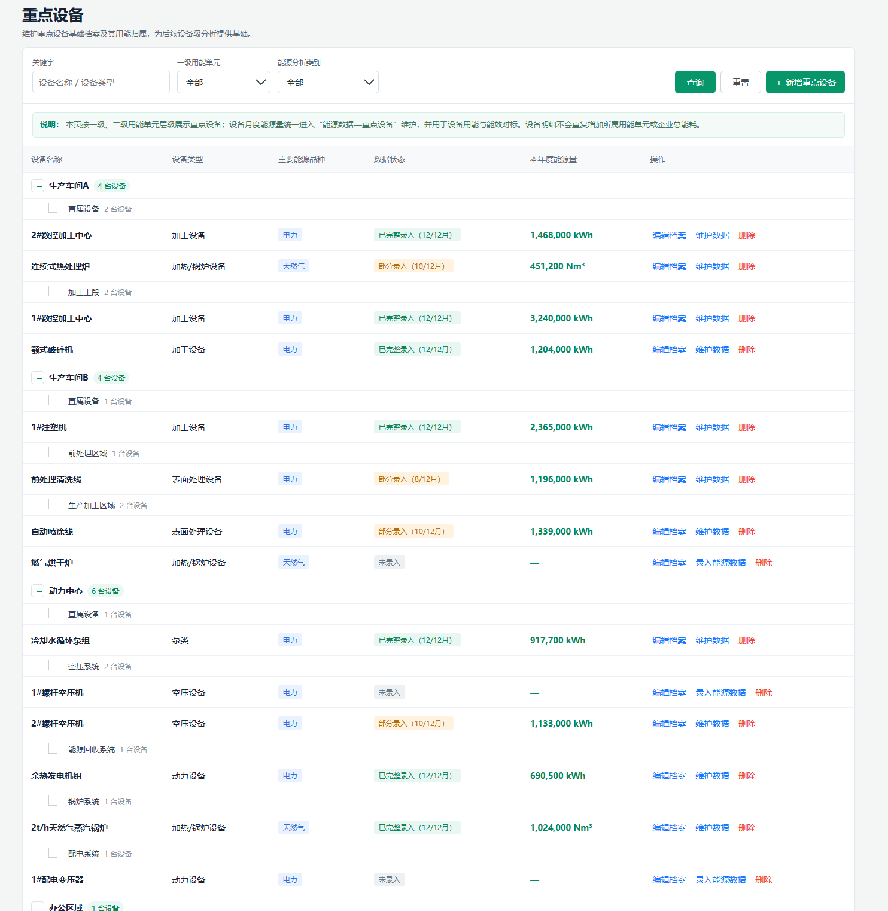

##### 3.4.3.3. 设备查询与档案维护

###### 3.4.3.3.1. Inputs 输入

| 输入项 | 类型 | 是否必填 | 范围 | 备注 |
| --- | --- | --- | --- | --- |
| 关键字 | 文本框/搜索框 | 否 | 设备名称、设备类型 | 支持模糊查询 |
| 一级用能单元 | 下拉框 | 否 | 已有一级用能单元 | 选择后联动具体用能单元 |
| 具体用能单元 | 下拉框 | 否 | 所选一级用能单元下的用能单元 | 级联筛选 |
| 能源分析类别 | 下拉框 | 否 | 电力、热力、化石燃料等 | 选择后联动能源品种 |
| 主要能源品种 (查询条件) | 下拉框 | 否 | 查询主要能源品种 | 用于设备能源数据及能效对标 |
| 归属层级 | 下拉框 | 是 | 一级用能单元/二级用能单元 | 新增、编辑时使用 |
| 所属一级用能单元 | 下拉框 | 条件必填 | 已有一级用能单元 | 归属二级用能单元时必填 |
| 所属用能单元 | 下拉框 | 是 | 已有用能单元 | 当归属层级为一级用能单元时，直接选择一级用能单元；当归属层级为二级用能单元时，需先选择所属一级用能单元，再选择其下二级用能单元。前置条件未完成时，该字段不可选。 |
| 设备类型 | 下拉框 | 是 | 动力设备、泵类、风机、空压设备、制冷/空调设备、加热/锅炉设备、输送设备、加工设备、表面处理设备、检测设备、其他（自定义）。 | 选择“其他”时填写自定义类型 |
| 自定义设备类型 | 文本框 | 条件必填 | 自定义设备类型 | 设备类型为“其他”时必填 |
| 设备名称 | 文本框 | 是 | 1-100字符 | 当前实现为企业内不可重复 |
| 主要能源品种（必填字段） | 下拉框 | 是 | 设备主要能源品种 | 设备的主要用能品种 |
| 备注 | 多行文本框 | 否 | — | 设备补充说明 |

###### 3.4.3.3.2. Process 处理

1. 进入“数据管理 > 重点设备”页面。

2. 设置关键字、用能单元、能源分析类别和主要能源品种等筛选条件，点击“查询”后展示结果；筛选条件之间支持级联。

3. 系统仅展示存在符合查询条件设备的用能单元节点，并按“一级用能单元 → 直属设备/二级用能单元 → 设备明细”组织结果。

4. 用户可点击一级用能单元节点的展开、收起按钮查看或隐藏其下设备；设备明细继承所在树节点的归属上下文，不重复展示所属用能单元字段。

5. 查询并维护重点设备名称、设备类型、主要能源品种、备注及所属用能单元。

6. 点击新增或编辑时，系统按“设备信息、归属信息、备注”分组展示表单。

7. 选择“一级用能单元”时，直接选择所属用能单元；选择“二级用能单元”时，系统展示“所属一级用能单元”，用户选择后方可选择所属用能单元。备注为选填字段。

8. 支持新增、编辑、删除，以及跳转至设备能源数据页面进行能源数据录入和维护；一期不展示无数据支撑的实时运行参数。

###### 3.4.3.3.3. Output 输出

1. 输出按用能单元层级组织的重点设备列表。

2. 一级用能单元节点展示设备总数量，并支持展开、收起；其下区分直属设备和二级用能单元，二级用能单元展示设备数量及设备明细。

3. 设备明细展示设备名称、设备类型、主要能源品种、设备能源数据状态、本年度能源量及操作入口，不重复展示所属用能单元。

4. 支持新增、编辑、删除及进入设备能源数据维护页面；输出结构化设备档案表单，并根据归属层级动态展示或隐藏所属一级用能单元字段。

###### 3.4.3.3.4. Usage Limitation 约束与限制

- 本页面维护重点设备档案，并展示已关联的设备能源数据状态及本年度能源量；不在本页面录入设备能源数据，也不展示无数据支撑的实时运行参数。
- 树形分组仅用于设备档案的组织、定位和浏览，不对设备能源量进行分组汇总，也不改变设备能源数据的归属关系。
- 重点设备页不承载全量设备台账；重点设备纳入范围由企业按用能规模、计量条件和管理需要确定。
- 设备档案本身不直接产生能效指标；设备关联能源数据后，才可作为设备级能效对标的实际数据来源。
- 设备能源数据不在重点设备档案页面重复录入，统一在能源数据台账中维护。
- 本功能版本边界：设备档案CRUD｜主数据查询｜设备能源数据入口｜数据状态展示｜删除引用校验
##### 3.4.3.4. 设备能源数据与能效对标联动

###### 3.4.3.4.1. Inputs 输入

| 输入项 | 类型 | 是否必填 | 范围 | 备注 |
| --- | --- | --- | --- | --- |
| 设备记录 | 系统参数 | 是 | 当前选中设备 |  |

###### 3.4.3.4.2. Process 处理

1. 进入“数据管理 > 重点设备”页面。

2. 在当前结果中识别需要补充或联动的对象，点击对应入口。

3. 从重点设备列表进入设备能源数据维护页面，系统携带当前设备ID、设备名称、所属用能单元和设备类型。设备能源数据通过设备ID与设备档案关联，并用于设备级能效对标。

4. 无设备能源数据的设备不生成有效的设备级能效对标结果；配置设备能源数据及对应指标目标后，设备可参与能效对标。

###### 3.4.3.4.3. Output 输出

输出设备能源数据维护入口、设备能源数据录入状态、本年度能源量及设备级能效对标所需的设备对象数据。

###### 3.4.3.4.4. Usage Limitation 约束与限制

- 本页面不录入设备能源数据，设备能源数据统一在“能源数据 > 重点设备”中维护；本页面仅展示设备能源数据状态和年度汇总结果，不展示无数据支撑的实时运行参数。
- 设备档案本身不产生能效指标，设备实际用能数据来源于能源数据台账，设备档案与能源数据通过设备ID关联。
- 本功能版本边界：一期核心 / P0；研发范围：设备档案CRUD｜主数据查询｜设备能源数据入口｜数据状态展示｜删除引用校验。
##### 3.4.3.5. 删除保护

###### 3.4.3.5.1. Inputs 输入

| 输入项 | 类型 | 是否必填 | 范围 | 备注 |
| --- | --- | --- | --- | --- |
| 设备记录 | 系统参数 | 是 | 当前选中设备 |  |
| 确认操作 | 确认框 | 是 | 删除/取消 |  |

###### 3.4.3.5.2. Process 处理

1. 进入“数据管理 > 重点设备”页面。

2. 选择目标设备，点击“删除”并进行二次确认。系统检查设备是否关联能源数据或设备指标目标。

3. 无关联数据时执行物理删除；存在设备能源数据或指标目标引用时，禁止删除，并提示用户进入对应模块处理关联数据。

4. 已引用设备不得物理删除。

###### 3.4.3.5.3. Output 输出

已关联设备能源数据或指标目标的设备不得物理删除，并展示关联类型及关联数量。

###### 3.4.3.5.4. Usage Limitation 约束与限制

- 本页面不录入设备能源数据，设备能源数据统一在“能源数据 > 重点设备”中维护；本页面仅展示设备能源数据状态和年度汇总结果，不展示无数据支撑的实时运行参数。
- 设备档案本身不产生能效指标。
- 当前版本不支持软删除和设备停用；设备删除校验基于设备ID执行；删除校验范围包括设备能源数据和设备指标目标。
#### 3.4.4. 能源数据

##### 3.4.4.1. Introduce 介绍

维护企业、一级/二级用能单元及重点设备的能源消费数据，维护企业级能源成本，以及能源回收、转换与外供记录，为能耗查询、能耗强度指标、能效对标、能流分析和策略分析提供基础数据。

能源量数据仅维护“能源消费”记录；能源回收来源、能源转换与利用结果、能源外供登记分别在“能源回收、转换与外供”页面维护，避免重复录入和重复汇总。

##### 3.4.4.2. UI Design UI设计

“数据管理 > 能源数据”下分为“能源消费”“能源成本”“能源回收、转换与外供”三个独立子页面，通过侧边导航/路由进入，不在同一内容页内切换 Tab。

- 能源消费：能源量数据按“全部层级、企业、一级用能单元、二级用能单元、重点设备”页签查看。“全部层级”仅用于汇总查看，不提供新增入口，并提示用户切换至具体层级页签后录入。在企业、一级用能单元、二级用能单元或重点设备页签点击新增时，归属对象类型由当前页签自动带入并锁定，用户无需在弹窗内重新选择归属对象类型；回收能源不在能源消费页录入。
- 能源成本：维护企业级能源品种月度成本，并自动汇总年度成本；
- 能源回收、转换与外供：按业务事实分别维护回收能源来源、转换与利用结果、外供登记；转换产出的外供在外供登记中关联转换记录，企业级直接转供仅用于有独立外供计量的特殊场景。
- 当前一期不在本页面提供正式 Excel 导出和完整来源追溯抽屉。
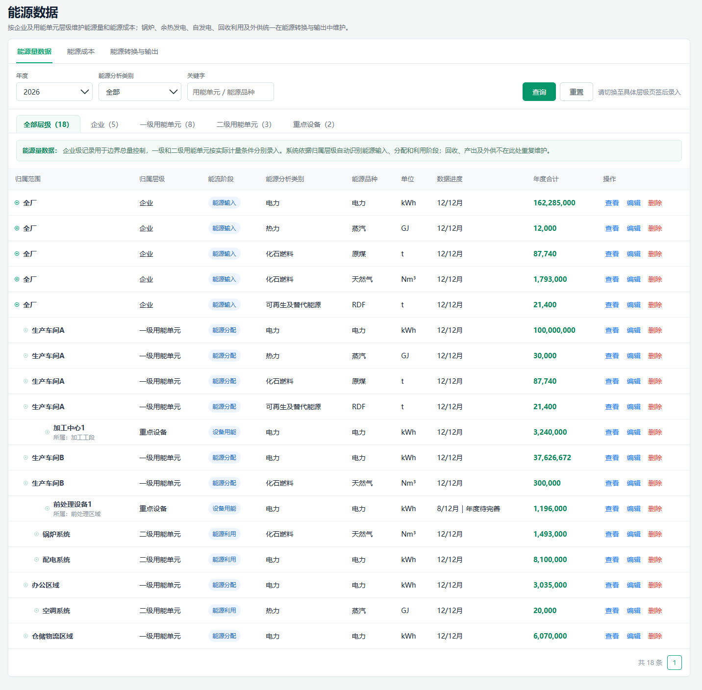

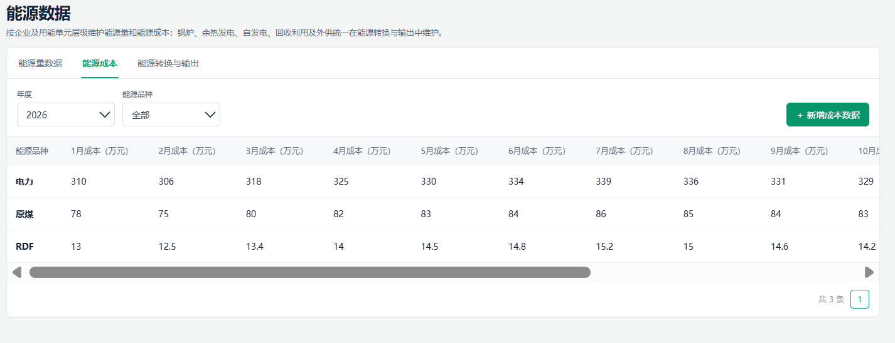

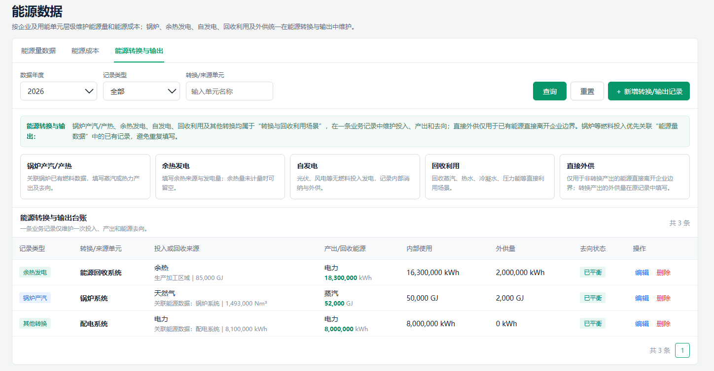

##### 3.4.4.3. 能源量查询与维护

###### 3.4.4.3.1. Inputs 输入

| 输入项 | 类型 | 是否必填 | 范围 | 备注 |
| --- | --- | --- | --- | --- |
| 年度 | 年份选择器 | 否 | 当前年份及历史年份 | 用于筛选；新增记录默认使用当前筛选年度。 |
| 能源分析类别 | 下拉框 | 否 | 电力、热力、化石燃料、可再生及替代能源、其他能源 | 用于筛选和分析汇总分组；回收能源不在能源消费页提供，统一在“能源回收、转换与外供”中维护。 |
| 关键字 | 搜索框 | 否 | 0-50字符 | 搜索归属对象或能源品种名称。 |
| 层级页签 | 页签 | 否 | 全部层级 / 企业 / 一级用能单元 / 二级用能单元 / 重点设备 | 用于按归属层级查看记录。 |
| 归属对象类型 | 只读文本 | 是 | 企业 / 一级用能单元 / 二级用能单元 / 重点设备 | 由当前层级页签自动带入并锁定，不支持在弹窗内切换。 |
| 归属范围 | 下拉框/只读文本 | 是 | 全厂 / 当前层级可选对象 | 企业页签自动带出“全厂”；一级页签选择一级用能单元；二级页签先选择所属一级用能单元，再选择其下级二级用能单元；重点设备页签选择重点设备。。 |
| 所属一级用能单元 | 下拉框 | 二级录入时必填 | 已维护的一级用能单元 | 仅二级用能单元页签展示；选择后仅展示该一级单元下已维护的二级用能单元。 |
| 能源品种 | 下拉框 | 是 | 当前组织已维护的能源品种 | 使用 energyTypeId 关联。选择后自动展示能源分析类别和计量单位。 |
| 月度数据 | 数字输入组 | 否 | 1–12 月非负数 | 月度填报时展示；至少填写一个大于 0 的月份，未填写月份按 0 处理。 |
| 年度总量补录 | 数字输入 | 条件必填 | 大于 0，且不小于已填月份合计 | 当月度数据未覆盖 12 个月，或仅取得年度台账时填写；12 个月均已填报时自动显示年度合计并只读。 |
| 查询 | 按钮 | 否 | - | 按当前关键字和能源分析类别刷新列表 |
| 重置 | 按钮 | 否 | - | 清空条件并恢复完整列表 |

###### 3.4.4.3.2. Process 处理

1. 进入“数据管理 > 能源数据”页面。

2. 用户输入年度、能源分析类别、关键字后，点击“查询”按当前条件刷新列表；点击“重置”恢复默认筛选条件。切换层级页签时，系统切换当前层级的数据视图和录入上下文。

3. 月度明细展示 1–12 月实际填报值；未填报月份展示“—”。当存在年度总量补录时，同时展示“年度总量（补录）”；当 12 个月均已填报时，展示系统自动汇总的“年度合计”。

4. 用户切换至企业、一级用能单元、二级用能单元或重点设备页签后点击“新增能源数据”。系统根据当前页签自动锁定归属对象类型。

5. 企业页签自动带出“全厂”；一级页签仅可选择一级用能单元；二级页签先选择所属一级用能单元，再选择其下已配置的二级用能单元；重点设备页签仅可选择已维护的重点设备。

6. 用户选择能源品种后，系统自动带出能源分析类别、计量单位及当前归属对象。

7. 用户填写已取得的月度数据；如月度数据不足 12 个月，可补录年度总量。系统不自动分摊缺失月份。

8. 系统校验年度总量不得小于已填写月份合计。

9. 系统按“年度 + 归属对象类型 + 归属对象 ID + 能源品种”校验重复记录。

###### 3.4.4.3.3. Output 输出

1. 表格展示归属范围、归属层级、能源分析类别、能源品种、单位、数据进度、年度合计及操作；当前能源消费页不展示“能流阶段”列。

2. 用户点击“查看”后，在当前列表行下展开 1–12 月明细及年度合计。

3. 企业、一级用能单元、二级用能单元及全部层级页签展示：归属范围、归属层级、能源分析类别、能源品种、单位、数据进度、年度合计及操作。

4. 重点设备页签展示：重点设备、所属用能单元、设备类型、能源分析类别、能源品种、数据进度、年度合计及操作；不重复展示能流阶段和计量单位字段。数据进度用于展示已填报月份数量，以及是否已补录年度总量，例如“8/12月｜年度已补录”。

###### 3.4.4.3.4. Usage Limitation 约束与限制

- 12 个月均已填报时，年度合计由月度数据自动汇总；月度数据未完整时，可展示年度总量补录，不自动补齐或分摊缺失月份。
- 重点设备能源数据用于设备级分析，是所属用能单元能源消费的明细拆分，不得再次计入企业或用能单元综合能耗总量。
- 删除能源记录前，需校验是否已被能源回收、转换与外供记录作为投入能源引用；存在引用时禁止删除。
- 能源成本一期不强制分摊到用能单元。
- “全部层级”页签仅用于跨层级查看，不支持新增能源数据。 二级用能单元、重点设备的可选对象必须来自已维护的用能单元及重点设备主数据，不允许手工输入名称创建归属对象。
- 本功能版本边界：一期核心 / P0；研发范围：CRUD｜月度表单｜规则计算。
##### 3.4.4.4. 月度明细查看

###### 3.4.4.4.1. Inputs 输入

| 输入项 | 类型 | 是否必填 | 范围 | 备注 |
| --- | --- | --- | --- | --- |
| 当前能源记录 | 系统参数 | 是 | 当前选中记录 | 点击列表“查看”时传入。 |

###### 3.4.4.4.2. Process 处理

1. 用户在“能源量数据”列表中点击“查看”。

2. 系统在当前记录下方展开月度明细。

3. 月度填报记录展示 1–12 月能源量及年度合计；年度填报记录展示年度录入值。

4. 用户再次点击“收起”或切换其他记录时，收起当前月度明细。

###### 3.4.4.4.3. Output 输出

展示当前能源记录的归属对象、能源品种、单位、1–12 月能源量及年度合计。

###### 3.4.4.4.4. Usage Limitation 约束与限制

- 月度填报记录的年度合计由月度数据自动汇总；年度填报记录仅展示年度值。
- 一期不提供本页面正式 Excel 导出。
- 一期不提供独立的数据来源追溯抽屉。
- 折标计算由下游分析页面根据能源品种参数统一执行，本页面不单独展示折标结果。
- 本功能版本边界：一期核心 / P0；研发范围：月度明细查看。
##### 3.4.4.5. 月度能源成本维护

图：能源成本页面原型，展示年度与能源品种筛选、1–12 月成本、年度合计及新增/编辑/删除操作。

###### 3.4.4.5.1. Inputs 输入

| 输入项 | 类型 | 是否必填 | 范围 | 备注 |
| --- | --- | --- | --- | --- |
| 年度 | 年份选择器 | 否 | 当前年份及历史年份 | 用于列表筛选；新增成本数据时自动使用当前筛选年度，弹窗内不重复提供年度选择。 |
| 能源品种 | 下拉框 | 是 | 当前组织已维护的能源品种 | 页面筛选时非必填，默认“全部”；新增或编辑成本数据时必填，使用 energyTypeId 关联当前组织已维护的能源品种。 |
| 月度成本 | 数字输入组 | 条件必填 | 1-12月非负数，单位万元；已取得月份可填 0 | 按实际已取得月份填报；未填月份保留为空并在列表中展示“—”。 |
| 年度总成本补录 | 数字输入 | 条件必填 | 大于 0，且不小于已填月份成本合计，单位万元 | 月度未填报任何月份时必填；月度部分填报时可补录，月度完整时不需要填写。 |
| 年度合计 | 只读数值 | 是 | 自动计算或采用年度总成本补录 | 月度完整时由 1–12 月成本自动汇总；月度不完整且已补录年度总成本时采用补录值，否则展示已填月份成本之和。 |

###### 3.4.4.5.2. Process 处理

1. 进入“数据管理 > 能源数据”页面。

2. 用户切换年度或能源品种后，列表即时筛选，不设置单独的查询、重置按钮。

3. 用户点击“新增成本数据”后，系统继承当前列表筛选的年度；新增弹窗仅维护能源品种及月度成本，不允许在弹窗内切换年度。

4. 用户按实际已取得月份填写月度成本；已填月份允许填写 0，未取得月份可以留空。月度成本未覆盖 12 个月时，用户可补录年度总成本；系统不会自动分摊或补齐缺失月份。

5. 用户按企业、年度和能源品种维护能源采购成本；12 个月均已填报时系统自动计算年度合计，月度不完整且已补录年度总成本时使用补录值，否则以已填月份成本之和作为年度合计。

6. 当存在年度总成本补录时，系统校验其不得小于已填写月份成本合计。

7. 同一年度、同一能源品种仅允许维护一条成本记录；一期不强制分摊到用能单元，支持新增、编辑、删除和按当前筛选条件即时查看。

###### 3.4.4.5.3. Output 输出

表格按能源品种展示 1–12 月成本及年度合计，金额单位统一为万元；支持新增、编辑、删除及分页查看，不提供月度详情展开、来源追溯或本页正式导出。

###### 3.4.4.5.4. Usage Limitation 约束与限制

- 12 个月均已填报时，能源成本年度合计由 1–12 月成本自动汇总；月度不完整且存在年度总成本补录时取补录值，否则取已填月份成本之和，不自动分摊缺失月份。
- 月度成本列表中，未填报月份展示“—”；已填报月份即使金额为 0，也按已填报月份展示 0.00。
- 一期仅维护企业级能源采购成本，不分摊至用能单元或重点设备。
- 同一年度、同一能源品种仅允许维护一条成本记录。
- 本功能版本边界：一期核心 / P0；研发范围：CRUD｜月度成本汇总。
- 能源成本仅作为企业级采购成本台账，不参与用能单元、工序或重点设备的成本自动分摊。
- 一期成本记录支持物理删除；不建设成本数据引用校验、成本分摊、成本追溯或成本版本管理能力。
##### 3.4.4.6. 能源回收、转换与外供

###### 3.4.4.6.1. Inputs 输入

| 输入项 | 类型 | 是否必填 | 范围 | 备注 |
| --- | --- | --- | --- | --- |
| 数据年度 | 下拉框 | 列表筛选否；新增/编辑必填 | 当前年份及历史年份 | 列表中作为筛选条件，点击“查询”后生效；新增、编辑弹窗中为记录所属年度。 |
| 页面页签/业务场景 | 页签/场景选择 | 是 | 能源回收 / 转换与利用 / 能源外供；锅炉产汽/产热 / 余热发电 / 空压产气/压缩空气 / 回收能源直接利用 | 页面按业务事实分三个页签；新增转换记录先选择常规能源转换、回收能源转换或回收能源直接利用路径，再选择具体场景。 |
| 转换/来源单元 | 列表搜索框 / 弹窗动态选择或只读展示 | 列表否；转换与回收利用场景必填 | 当前组织已维护的适用二级系统 | 列表中为按系统名称筛选的关键字搜索框。新增、编辑弹窗中根据记录类型展示“转换系统 / 回收系统 / 发电系统”；候选仅一项时自动带出并只读，候选多项时由用户选择。直接外供场景固定展示“企业边界”。 |
| 查询 | 按钮 | 否 | - | 按当前关键字和记录类型刷新列表 |
| 重置 | 按钮 | 否 | - | 清空条件并恢复完整列表 |
| 关联能源记录 | 系统自动关联 / 条件下拉框 | 常规转换或直接外供时必填 | 当前年度、当前转换系统或企业级的已有能源数据 | 候选唯一时自动带出并只读，候选多项时由用户选择；无可用记录时提供前往“能源消费”补录入口。 |
| 回收能源/介质 | 下拉框 | 是 | 余热 / 回收蒸汽 / 冷凝水 / 回收热水 / 可燃尾气 / 压力能 | 适用于余热发电、回收利用。 |
| 回收能源来源 | 回收来源台账 | 新增回收来源必填；回收转换时必填 | 余热、回收蒸汽、冷凝水、回收热水、可燃尾气、压力能 | 在“能源回收”页维护产生设备、二级/一级用能单元、月度/年度来源量；余热发电和回收能源直接利用关联一条来源台账。 |
| 产出能源 | 系统默认展示 | 转换与回收利用场景必填 | 蒸汽 / 电力 / 压缩空气 / 回收热水等当前组织能源品种 | 锅炉产汽/产热、余热发电、空压产气/压缩空气、回收能源直接利用按场景自动带出能源分析类别、能源品种及单位。直接外供不维护独立产出能源。 |
| 逐月产出量 | 数字输入组 + 年度总量补录 | 转换与回收利用场景必填 | 1-12月非负数；年度总量大于0 | 按实际取得月份填写；月度不完整时必须补录年度总量，12个月完整时年度合计只读。 |
| 企业确认的转换损失 | 数字输入 | 否 | 大于等于0 | 转换记录中按有计量、检修记录或工艺依据时填写；无依据时不要求估算。 |
| 能源外供登记 | 独立登记表单 | 外供登记必填 | 转换产出外供 / 企业级能源直接转供 | 在“能源外供”页维护来源关联、月度外供量或年度总量补录、接收方、依据凭证和备注。 |

###### 3.4.4.6.2. Process 处理

1. 进入“数据管理 > 能源数据”页面。

2. 用户在“能源回收”“转换与利用”或“能源外供”页签选择年度并输入来源/单元关键字后，点击“查询”刷新当前台账；点击“重置”恢复默认条件。

3. 在“能源回收”页点击“新增回收能源来源”，在“转换与利用”页点击“新增转换与利用记录”，在“能源外供”页点击“新增供能登记”。新增转换记录先选择业务路径和具体场景。

4. 系统根据场景筛选适用转换系统；候选唯一时自动带出，候选多个时由用户选择。回收来源必须先在能源回收台账中登记，直接外供固定归属企业边界。

5. 系统按记录类型展示对应录入区：

锅炉产汽/产热、空压产气/压缩空气：关联当前年度、当前系统的已有能源消费记录；候选唯一时自动关联，候选多项时由用户选择；

余热发电、回收能源直接利用：关联一条已登记的回收能源来源，并填写逐月产出/利用量；

能源外供：转换产出外供关联转换记录；企业级直接转供关联企业级能源消费记录，并填写逐月外供量或年度外供总量。当前无可关联数据时，提示用户前往“能源消费”补录。

6. 用户按实际取得月份填写产出、利用或外供量；月度数据不完整时补录年度总量，系统不自动分摊缺失月份。转换损失仅在有明确依据时由企业确认。

7. 系统根据转换产出、外供登记和企业确认损失计算厂内可供分配、未分配或超分配结果；直接外供校验外供量不得超过关联企业级来源记录年度总量。相关结果供能流分析和能源平衡使用，不要求在录入页手工维护内部使用量。

###### 3.4.4.6.3. Output 输出

1. 保存回收能源来源、能源转换与利用记录及能源外供登记，形成来源、产出、厂内利用和外部输出之间的明确关系。

2. 常规转换关联既有能源消费记录；回收转换关联回收能源来源台账；转换产出不在“能源消费”中重复新增。外供量在“能源外供”登记，转换产出外供从对应转换产出的厂内可供分配量中扣除。

保存后的记录供能流分析、能源平衡表及流向明细读取。

3. “能源回收”列表展示产生设备、二级/一级用能单元、回收能源、数据进度和年度总量；“转换与利用”列表展示转换单元、投入能源、能源来源、来源单元、产出能源和厂内可供分配；“能源外供”列表展示来源类型、来源能源/转换、外供量、接收方和操作。

###### 3.4.4.6.4. Usage Limitation 约束与限制

- 本功能版本边界：一期核心 / P0；研发范围：关系维护｜规则校验｜跨模块数据。
- 回收来源、转换与利用、能源外供分别维护，删除回收来源前需校验是否已被转换记录引用；存在引用时禁止删除。
- 转换场景同一年度、同一记录类型、同一转换系统仅允许维护一条记录；已存在时提示并提供编辑已有记录入口。
- 直接外供仅可关联企业级能源消费记录；转换产出外供仅可关联已有转换记录。外供量按来源、年度和单位校验，不得超过可供量或企业级来源年度总量。
- 删除转换记录不删除其引用的能源消费或回收来源记录；删除转换记录会同步移除其下属的转换产出外供登记。
- 月度数据不完整时必须补录年度总量；系统不自动分摊缺失月份。企业确认损失为空不代表系统自动认定无损失。
#### 3.4.5. 运营数据

##### 3.4.5.1. Introduce 介绍

维护产品产量、动力中心供能量、办公建筑面积、货物吞吐量等运行指标，以及工业总产值、工业增加值等经济指标；页面按全部层级、企业、一级用能单元和二级用能单元查看，为能耗强度、能效对标、用能分析和策略分析提供业务分母及经营背景。

##### 3.4.5.2. UI Design UI设计

页面包含年度、指标类别和关键字查询，以及全部层级、企业、一级用能单元、二级用能单元页签。“全部层级”用于跨层级查看符合筛选条件的运营记录，不提供新增入口；该页签不对不同层级的指标进行自动汇总。

用户切换至具体层级页签后，方可新增运营数据。列表展示归属范围、指标类别、指标名称、产品、单位、年度值和操作；月度填报记录支持展开查看月度明细，支持编辑和删除。能耗强度指标页面可带年度、归属层级和指标口径进入运营数据补录，保存或关闭后可返回能耗强度指标页面。当前版本不包含引用查看和导出功能。

新增、编辑弹窗展示数据年度；新增记录自动继承当前查询年度，编辑记录保留原记录年度。

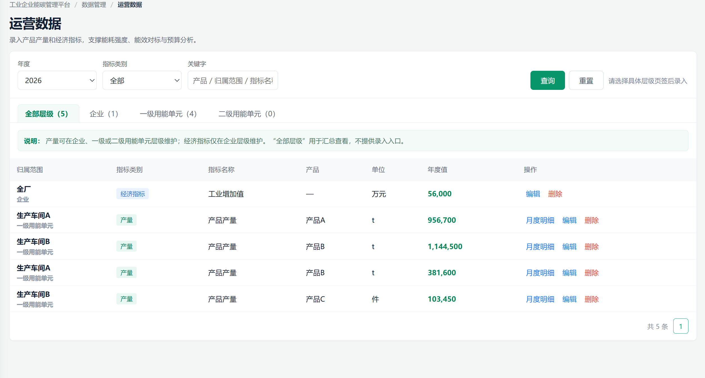

##### 3.4.5.3. 查询与指标分类

###### 3.4.5.3.1. Inputs 输入

| 输入项 | 类型 | 是否必填 | 范围 | 备注 |
| --- | --- | --- | --- | --- |
| 年度 | 年份选择器 | 是 | 当前年份及历史年份 |  |
| 指标类别 | 下拉框 | 否 | 产量/运行指标/经济指标 |  |
| 关键词 | 搜索框 | 否 |  | 产品名称、归属范围或指标名称 |
| 归属层级页签 | 页签 | 否 | 全部层级/企业/一级用能单元/二级用能单元 | 默认“全部层级”；新增运营数据时，必须切换至企业、一级用能单元或二级用能单元页签。 |

###### 3.4.5.3.2. Process 处理

1. 进入“数据管理 > 运营数据”页面。

2. 设置本功能所需的筛选条件，点击“查询”或切换相应条件。

3. 系统按年度、指标类别、关键字及归属层级页签查询运营数据；各层级页签数量同步当前年度、指标类别和关键字筛选条件。

4. 产量和运行指标可在企业、一级或二级用能单元层级维护；经济指标仅在企业层级维护。

5. 二级用能单元仅用于具备独立产量口径的工序或区域级产品产量；未形成独立产量口径的二级用能单元无需维护。

6. 月度填报的产量和运行指标记录可点击“月度明细”展开查看 1—12 月数据；经济指标及办公建筑面积等年度填报指标以年度单值展示。

###### 3.4.5.3.3. Output 输出

输出归属范围、指标类别、指标名称、产品、单位、年度值及操作。月度产量和运行指标记录支持展开查看月度明细；经济指标及年度填报的运行指标展示年度值。

###### 3.4.5.3.4. Usage Limitation 约束与限制

- 产品产量和运行指标可在企业、一级用能单元或二级用能单元层级维护；非企业层级记录需关联对应的用能单元。经济指标仅在企业层级维护，归属范围固定为全厂。
- 一级和二级用能单元页签按用能单元分组展示；即使当前筛选条件下没有记录，也展示该用能单元的空状态和新增入口。
- 全部层级页签仅用于查看，不提供新增入口。
- 经济指标仅支持企业层级维护，归属范围固定为全厂，不支持分摊至一级或二级用能单元。
- 同一产品、同一年度只能选择“企业汇总口径”或“用能单元拆分口径”之一维护，不能同时维护。若已按用能单元拆分维护，则不允许再手工维护企业汇总值；若已维护企业汇总值，则不允许再录入该产品的用能单元拆分数据。
- 本功能版本边界：一期核心 / P0；研发范围：分层查询｜产品产量和运行指标维护｜经济指标年度维护｜月度/年度值汇总｜口径唯一性校验。
##### 3.4.5.4. 产品产量维护

###### 3.4.5.4.1. Inputs 输入

| 输入项 | 类型 | 是否必填 | 范围 | 备注 |
| --- | --- | --- | --- | --- |
| 指标类别 | 下拉框/只读字段 | 是 | 产量 | 从产量页签新增时默认锁定 |
| 指标名称 | 只读字段 | 是 | 产品产量 | 当前页面固定为“产品产量”，需通过产品字段关联产品主数据 |
| 产品 | 下拉框 | 条件必填 | 已有产品/新增自定义产品 | 选择产品产量时必填，同一产品同一年度须遵循企业汇总口径与用能单元拆分口径互斥规则。 |
| 自定义产品名称 | 文本框 | 条件必填 | 1-100字符 | 选择“新增自定义产品”时填写 |
| 归属层级 | 下拉框/只读字段 | 是 | 企业/一级用能单元/二级用能单元 | 从具体层级页签新增时自动带入并锁定；企业、一级和二级用能单元均可维护产品产量。 |
| 所属一级用能单元 | 下拉框 | 条件必填 | 已有一级用能单元 | 二级层级时必填 |
| 归属范围 | 下拉框/只读字段 | 条件必填 | 全厂或已有用能单元 | 企业层级固定为全厂 |
| 计量单位 | 输入框/只读字段 | 是 | 产品主数据单位或自定义单位 | 选择已有产品时自动带出 |
| 数据年度 | 系统只读字段 | 是 | 当前查询年度 | 新增时自动带入当前查询年度；编辑时保留原记录年度 |
| 月度值 | 数字输入 | 是 | 1—12月，大于或等于0 | 可只填部分月份；至少填写一个大于0的月份。月度未填满时需补录年度汇总值，填满时系统自动汇总年度值 |

###### 3.4.5.4.2. Process 处理

1. 进入“数据管理 > 运营数据”页面。

2. 点击相应新增或编辑入口，填写并校验输入项。

3. 维护产品产量的月度数据；月度未填满时补录年度汇总值，月度填满时年度值由系统自动计算。

4. 产品产量可在企业、一级或二级用能单元层级维护。选择已有产品时，系统自动带出产品计量单位；新增自定义产品时，可同步维护产品名称、类别和计量单位。

5. 当归属二级用能单元时，需先选择所属一级用能单元；月度值自动汇总为年度值。

6. 保存前，系统校验同一产品、同一年度不存在企业汇总口径与用能单元拆分口径同时维护的情况。同一产品可在多个用能单元拆分维护，但同一年度、同一归属范围、同一产品仅允许存在一条产品产量记录。

###### 3.4.5.4.3. Output 输出

输出产品产量记录及其归属范围、产品、计量单位、月度明细和年度汇总值。非企业层级记录关联对应一级或二级用能单元；月度值自动汇总为年度值。

###### 3.4.5.4.4. Usage Limitation 约束与限制

- 产品产量可在企业、一级或二级用能单元维护；二级用能单元仅适用于具备独立产量口径的工序或区域。
- 产品产量采用企业汇总口径或用能单元拆分口径二选一维护，不允许两类口径并存。
- 本功能版本边界：一期核心 / P0；研发范围：CRUD｜月度表单｜产品主数据关联｜归属层级级联｜口径唯一性校验。
##### 3.4.5.5. 运行指标维护

###### 3.4.5.5.1. Inputs 输入

运行指标包括动力中心供能量、办公建筑面积、货物吞吐量和运营量等页面预置指标。除办公建筑面积按年度静态基数填报外，其余运行指标按月度填报；指标名称和计量单位由指标预置定义，不能在录入弹窗中自定义。

###### 3.4.5.5.2. Process 处理

1. 运行指标可在企业、一级或二级用能单元层级维护，具体层级页签新增时自动带入对应的指标口径和归属范围。

2. 动力中心供能量、货物吞吐量和运营量支持月度明细及年度合计；办公建筑面积仅录入年度值，不设置月度明细。

3. 运行指标保存时执行年度、归属范围和指标口径唯一性校验，保存后更新列表及相关分析数据。

###### 3.4.5.5.3. Usage Limitation 约束与限制

- 运行指标的可选范围以页面预置指标为准，不提供自定义运行指标名称或计量单位。
- 办公建筑面积按年度静态基数填报；其他运行指标采用月度填报，月度未填满时需补录年度汇总值。

##### 3.4.5.6. 经济指标维护

###### 3.4.5.6.1. Inputs 输入

| 输入项 | 类型 | 是否必填 | 范围 | 备注 |
| --- | --- | --- | --- | --- |
| 数据年度 | 系统只读字段 | 是 | 当前查询年度或原记录年度 | 新增时自动带入当前查询年度。 |
| 经济指标 | 下拉框 | 是 | 工业总产值、工业增加值 | 选择经济指标后，系统自动将归属层级固定为企业、归属范围固定为全厂、录入方式固定为年度填报。 |
| 年度值 | 数字输入 | 是 | 大于0 | 页面预置经济指标的计量单位为万元。 |

###### 3.4.5.6.2. Process 处理

1. 进入“数据管理 > 运营数据”页面。

2. 点击相应新增或编辑入口，填写并校验输入项。

3. 维护工业总产值和工业增加值等企业级年度数据。

4. 经济指标不支持分摊至一级或二级用能单元。

###### 3.4.5.6.3. Output 输出

输出企业级经济指标年度值，归属范围固定为全厂。工业总产值和工业增加值的计量单位为万元。

###### 3.4.5.6.4. Usage Limitation 约束与限制

- 本功能版本边界：一期核心 / P0；研发范围：CRUD｜唯一性校验。
- 经济指标仅支持企业层级年度填报，不支持月度填报及用能单元分摊，也不提供自定义经济指标。
##### 3.4.5.7. 月度明细、编辑与删除

###### 3.4.5.7.1. Inputs 输入

| 输入项 | 类型 | 是否必填 | 范围 | 备注 |
| --- | --- | --- | --- | --- |
| 运营记录 | 系统参数 | 是 | 当前选中记录 | — |
| 操作类型 | 系统参数 | 是 | 查看月度明细/编辑/删除 | 月度记录才支持查看月度明细 |

###### 3.4.5.7.2. Process 处理

1. 用户在运营数据列表中选择目标记录。

2. 对月度填报的产量和运行指标记录，可点击“月度明细”展开 1—12 月明细；年度填报指标不提供月度明细。

3. 用户可编辑运营记录；保存后系统重新计算年度值。

4. 用户删除记录时，系统提示删除将影响相关能耗强度、能效对标和分析结果；用户二次确认后删除记录，相关分析按最新数据重新计算。

###### 3.4.5.7.3. Output 输出

输出月度明细、编辑结果或删除结果。

###### 3.4.5.7.4. Usage Limitation 约束与限制

- 产品级数据需关联所属用能单元；二级用能单元记录同时记录所属一级用能单元。
- 经济指标默认企业级，不强制分摊到用能单元。
- 月度明细仅适用于月度填报的产量和运行指标记录。
- 当前版本不提供引用查看和导出能力；支持从能耗强度指标页面带条件进入运营数据补录并返回。
- 删除运营数据会影响依赖该记录的能耗强度、能效对标和分析结果；当前版本仅提供影响提示，不提供引用拦截或恢复机制。
- 本功能版本边界：一期核心 / P0；研发范围：月度明细｜编辑｜删除｜年度值自动汇总。
## 4. Performance Requirements 性能需求

- 页面加载：普通列表或详情页面首次加载目标不超过3秒；超过1000条数据的聚合页面目标不超过5秒。
- 查询响应：简单查询目标不超过2秒；多表聚合、能流图、核算汇总和预测类查询目标不超过5秒。
- 分页与大数据量：列表默认10条/页，支持10、20、50条/页；后端应采用分页查询，禁止一次返回全部大表数据。
- 导出性能：10万条以内Excel/CSV导出目标不超过10秒；超大导出可采用异步任务并提示进度。
- 文件上传：支持供应商和核查材料多文件上传，单文件大小和总量由统一文件服务配置；上传过程应展示进度和失败原因。
- 并发支持：一期支持不少于50个用户同时在线操作，关键写操作需保证事务一致性。
- AI分析：AI结果生成采用异步或流式响应，页面需展示生成状态；超时不影响规则计算和基础业务操作。
## 5. Quality Attributes 质量需求

- 计算准确性：规则计算结果应与公式复算一致；金额、能源量、排放量和比例按统一精度和舍入规则展示。
- 数据一致性：同一筛选条件、task_id、version下，摘要、图表、台账、导出和下游引用结果必须一致。
- 可用性：系统目标年度可用性不低于99.5%；非关键AI能力异常不得阻断核心查询、录入和核算流程。
- 安全性：支持角色与数据权限控制；敏感数据、文件和凭证按权限访问，关键传输和存储采用安全机制。
- 可追溯性：活动数据、因子版本、核算快照、资产变动、预算调整、文件上传和删除移除操作均需保留审计信息。
- 可扩展性：用能单元类型、能源品种、运营指标、排放源、因子参数、核算标准和预测规则应支持配置或扩展。
- 可维护性：前后端统一使用稳定业务ID、状态字典、错误码和日志规范，避免以页面显示名称作为唯一关联条件。
- 兼容性：支持主流Chromium内核浏览器，重点适配1440px至1920px桌面屏幕。
## 6. Other Requirements 其他需求

- 多企业与数据隔离：支持集团或平台下多企业数据隔离；本期业务分析主要以单企业为上下文。
- 多核算方法：组织温室气体核算方法和排放源规则应支持按企业适用标准配置，不在通用页面中写死单一行业。
- 版本管理：正式核算快照、报告、因子和预算调整需保留历史版本，新的配置不得自动覆盖历史结果。
- 数据备份：核心业务数据库和文件材料按运维策略定期备份，并具备恢复机制。
- 通知提醒：缺失数据、上传失败、预算风险、履约风险等可通过站内消息提示；邮件等外部通知作为后续扩展。
- 页面布局：主内容区采用合理最大宽度和响应式栅格，不简单将卡片无限拉宽；宽屏优先提高横向信息组织效率。
- 文案边界：AI建议、预算预测和履约需求预测必须标明内部管理属性，不得表达为保证收益、第三方认证或主管部门最终结论。
## 7. External Interface 外部接口

| 接口类别 | 一期状态 | 接口说明 | 关键约束 |
| --- | --- | --- | --- |
| 统一身份与权限 | 按项目环境 | 对接统一用户、角色和组织权限服务。 | 接口需返回企业上下文、角色和数据权限。 |
| DCS/ERP/MES/IoT数据接口 | 预留 | 接收能源量、生产运营和设备数据。 | 数据需映射至用能单元、能源品种、期间和来源记录。 |
| API/SQL数据接入 | 预留 | 通过定时任务或前置机同步外部业务数据。 | 幂等、重试、失败日志和数据版本需统一管理。 |
| Excel文件导入 | 局部支持 | 一期用于供应商模板上传；通用能源数据批量导入作为后续扩展。 | 模板版本、字段类型、必填项和错误行必须可定位。 |
| 文件存储接口 | 一期核心 | 存储核查材料、资产凭证、供应商文件和交付凭证。 | 支持权限、文件哈希、上传人、时间、下载和删除留痕。 |
| 报告导出接口 | 一期简化 | 生成Excel、Word、PDF或ZIP文件。 | 导出内容绑定筛选条件、任务和版本。 |
| AI模型接口 | 一期简化 | 向大模型提供结构化指标和必要上下文，返回分析摘要和建议。 | 不得将敏感原始文件无控制传递；需记录提示版本和生成时间。 |
| 政府报送或交易接口 | 不在一期 | 与主管部门报送系统或交易系统的正式对接。 | 需单独立项、认证和安全评审。 |

## 8. Appendix 附录

### 附录A：核心公式与口径

- 折标量 = 能源实物量 × 折标系数；综合能耗 = 各能源折标量之和。
- 单位产品综合能耗 = 同期间、同分析对象综合能耗 ÷ 产品产量。
- 单位业务量能耗 = 同期间、同分析对象综合能耗 ÷ 业务量。
- 单位产值综合能耗 = 企业综合能耗 ÷ 工业总产值。
- 对标偏差率 =（当前值 - 目标值）÷ 目标值 × 100%，达标判断需结合指标方向。
- 管理口径能源平衡差异 = 输入量 + 自产能源产出量 - 内部利用量 - 外部输出量。
- 固定燃烧排放 = 活动数据 × 低位发热量 × 单位热值含碳量 × 碳氧化率 × 44/12。
- 购入电力排放 = 购入电量 × 适用电力排放因子；逸散排放 = 逸散量 × GWP。
- 预算执行率 = 当前累计 ÷ 年度目标；预测偏差 = 预计全年 - 年度目标。
- 碳资产期末余额 = 期初余额 + 增加量 - 减少量。
- 预计履约缺口 = 预计全年排放 - 可用配额 - 允许使用的CCER。
- 新周期预计排放 = 历史基准排放 + 业务变化影响 - 预计减排量；该结果仅用于内部规划。
### 附录B：数据与状态说明

| 对象 | 状态 | 说明 |
| --- | --- | --- |
| 通用数据 | 暂无数据 | 当前筛选范围没有有效记录，不按0参与计算。 |
| 能耗强度指标 | 可计算 | 能源分子和运营分母完整、同范围、同期间且单位兼容。 |
| 能耗强度指标 | 待补充 | 分子或分母缺失、为0或对象关系未建立。 |
| 能效对标 | 达标/未达标 | 当前值与有效目标值按指标方向比较后的状态。 |
| 核算任务 | 草稿 | 清单可编辑，尚未生成正式快照。 |
| 核算任务 | 正式 | 已确认并形成只读快照，可用于核查支撑和报告。 |
| 核查材料 | 已准备/待补充/待复核 | 反映材料准备情况，不代表第三方核查结论。 |
| 预算 | 正常/预警/超目标 | 按执行或预测偏差阈值判断。 |
| 碳资产 | 盈余/缺口风险 | 按预计排放与可用履约资产比较。 |
| AI分析 | 已生成/生成中/失败 | AI异常不影响基础业务结果。 |

### 附录C：页面功能结构树

通用工业企业能碳SaaS平台

├── 能源监测与分析

│ ├── 能耗查询（EM-01）

│ ├── 能耗强度指标（EM-02）

│ ├── 能效对标（EM-03）

│ └── 能流分析（EM-04）

├── 碳排放核算与合规

│ ├── 碳排放核算

│ │ ├── 碳排放预览（CA-01）

│ │ ├── 碳核算清单（CA-02）

│ │ ├── 碳核查支撑（CA-03）

│ │ └── 碳排报告（CA-04）

│ ├── 碳因子与参数库（CA-05）

│ └── 供应链碳管理

│ ├── 供应商数据采集（CA-06）

│ ├── 碳足迹交付管理（CA-07）

│ └── 碳足迹核算（CA-08，规划中）

├── 能碳资产运营与策略

│ ├── 能效平衡与优化（AS-01）

│ ├── 用能分析与策略推荐（AS-02）

│ ├── 用能与碳排放预算管理（AS-03）

│ └── 碳资产管理（AS-04）

└── 数据管理

├── 用能单元（DM-01）

├── 能源品种（DM-02）

├── 能源数据（DM-03）

├── 运营数据（DM-04）

└── 重点设备（DM-05）

### 附录D：功能清单关联说明

正文每个功能项均保留功能编号、研发范围和版本/优先级，编号与《通用工业企业能碳SaaS研发评审版功能清单V1.1》一致。数据与接口、规则与公式、复杂交互与验收等详细信息仍以功能清单对应附表为补充研发依据。
